---
## Front matter
title: "Операционные системы"
subtitle: "Отчет по лабораторной работе №2"
author: "Матюшкин Денис Владимирович(НПИбд-02-21)"

## Generic otions
lang: ru-RU
toc-title: "Содержание"

## Bibliography
bibliography: bib/cite.bib
csl: pandoc/csl/gost-r-7-0-5-2008-numeric.csl

## Pdf output format
toc: true # Table of contents
toc-depth: 2
fontsize: 12pt
linestretch: 1.5
papersize: a4
documentclass: scrreprt
## I18n polyglossia
polyglossia-lang:
  name: russian
  options:
	- spelling=modern
	- babelshorthands=true
polyglossia-otherlangs:
  name: english
## I18n babel
babel-lang: russian
babel-otherlangs: english
## Fonts
mainfont: PT Serif
romanfont: PT Serif
sansfont: PT Sans
monofont: PT Mono
mainfontoptions: Ligatures=TeX
romanfontoptions: Ligatures=TeX
sansfontoptions: Ligatures=TeX,Scale=MatchLowercase
monofontoptions: Scale=MatchLowercase,Scale=0.9
## Biblatex
biblatex: true
biblio-style: "gost-numeric"
biblatexoptions:
  - parentracker=true
  - backend=biber
  - hyperref=auto
  - language=auto
  - autolang=other*
  - citestyle=gost-numeric
## Pandoc-crossref LaTeX customization
figureTitle: "Рис."
tableTitle: "Таблица"
listingTitle: "Листинг"
lofTitle: "Список иллюстраций"
lotTitle: "Список таблиц"
lolTitle: "Листинги"
## Misc options
indent: true
header-includes:
  - \usepackage{indentfirst}
  - \usepackage{float} # keep figures where there are in the text
  - \floatplacement{figure}{H} # keep figures where there are in the text
---

# Цель работы:

- Изучить идеологию и применение средств контроля версий. 
- Освоить умения по работе с git.

# Ход работы:

1. Создадим учетную версию на https://github.com и заполним основные данные (рис. [-@fig:001]). Примечание: я ранее регистрировался на данном сайте, поэтому не буду повторяться.

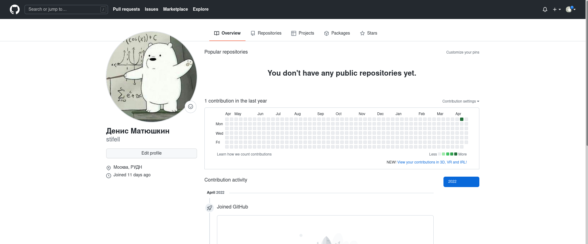{ #fig:001 width=70% }

2. Установим программное обеспечение git-flow через терминал (рис. [-@fig:002]).

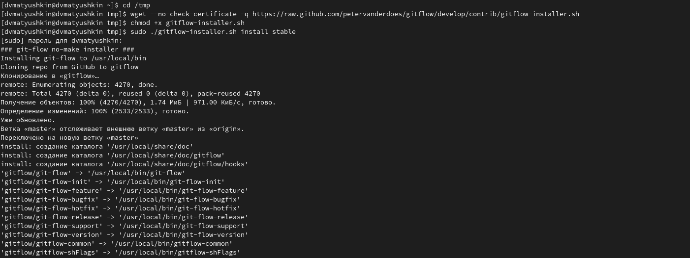{ #fig:002 width=70% }

3. Установим программное обеспечение gh через терминал (рис. [-@fig:003]).

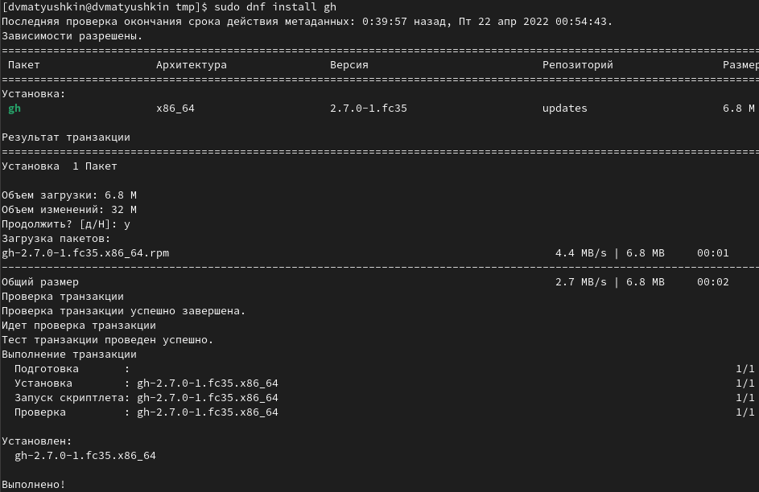{ #fig:003 width=70% }

4. Совершим базовую настройку git (рис. [-@fig:004]):
	1) Зададим имя и email владельца репозитория.
	2) Настроим utf-8 в выводе сообщений git.
	3) Настроим верификацию и подписание коммитов git. 
	4) Зададим имя начальной ветки (будем называть её master).
	5) Зададим параметр autocrlf и safecrlf.

{ #fig:004 width=70% }

5. Создадим ключ SSH (рис. [-@fig:005]): 
	1) по алгоритму rsa с ключём размером 4096 бит; 
	2) по алгоритму ed25519.

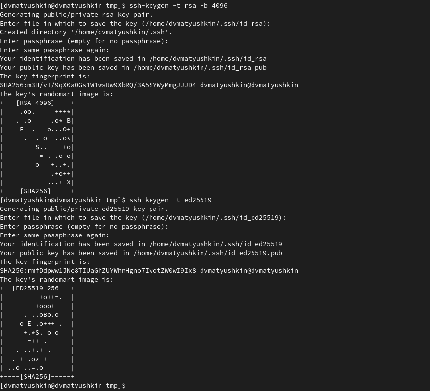{ #fig:005 width=70% }

6. Создадим ключ GPG (рис. [-@fig:006] и рис. [-@fig:007]). Выберем опции, описанные в лабораторной:
	– тип RSA and RSA; 
	- размер 4096; 
	– выберите срок действия; значение по умолчанию — 0 
	– GPG запросит личную информацию, которая сохранится в ключе.
	– Имя. 
	– Адрес электронной почты.

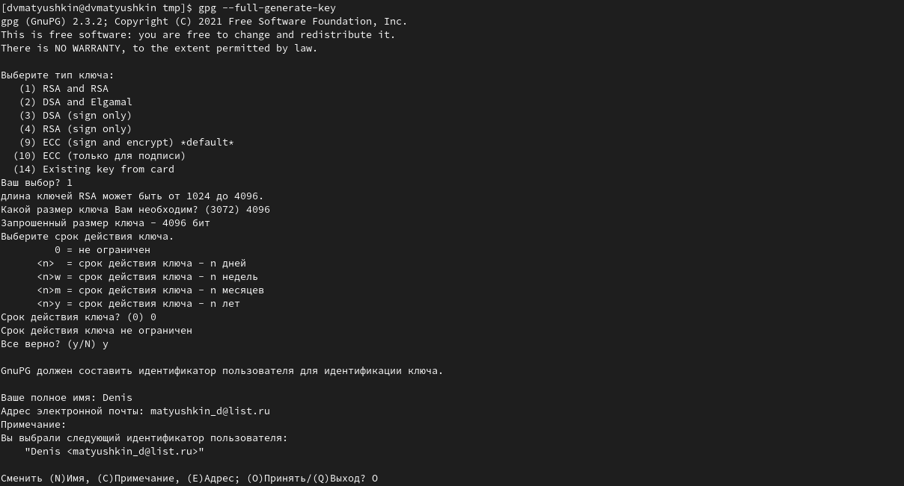{ #fig:006 width=70% }

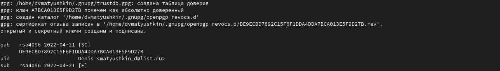{ #fig:007 width=70% }

7. Выводим список ключей и копируем отпечаток приватного ключа (рис. [-@fig:008]). Отпечаток ключа – A7BCA013E5F9D27B

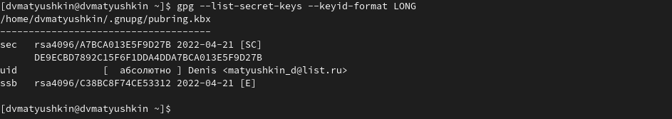{ #fig:008 width=70% }

8. Скопируем наш сгенерированный GPG ключ в буфер обмена (рис. [-@fig:009]) и вставим его в настройках личнего кабинета Github (рис. [-@fig:011]).

{ #fig:009 width=70% }

9. Сгенерированный SSH ключ и скопируем его в буфер обмена (рис. [-@fig:010]) и вставим его в настройках личнего кабинета Github (рис. [-@fig:011]).

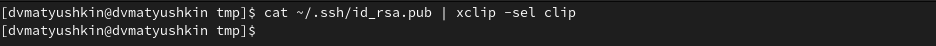{ #fig:010 width=70% }

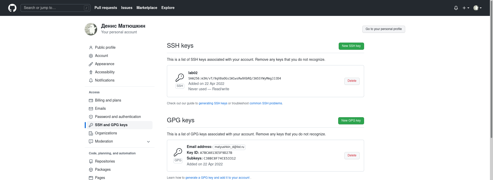{ #fig:011 width=70% }

10. Настроим автоматические подписи коммитов Git. Используя введенный email, укажем Git применять его при подписи коммитов (рис. [-@fig:012]).

{ #fig:012 width=70% }

11. Настроим gh. Для начала необходимо авторизоваться, можно через браузер (рис. [-@fig:013]).

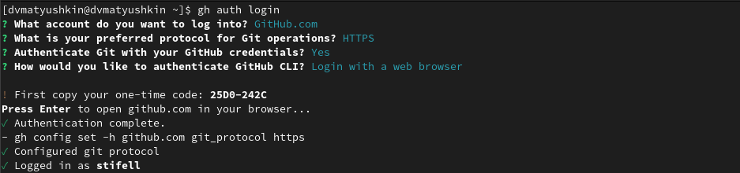{ #fig:013 width=70% }

12. Создадим репозитория курса на основе шаблона. Для этого создадим каталоги work/study/2021-2022/”Операционные системы” (рис. [-@fig:014])

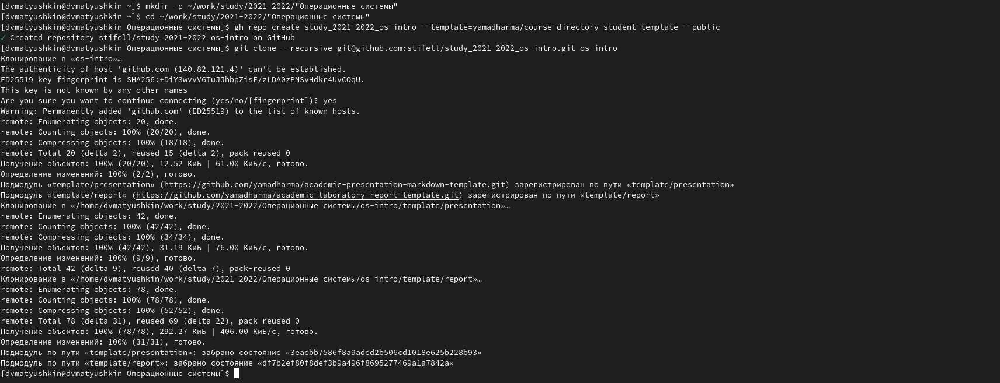{ #fig:014 width=70% }

13. Настроим каталог курса (рис. [-@fig:015], рис. [-@fig:016] и рис. [-@fig:017]). Для этого:
	1) Перейдем в каталог курса.
	2) Удалим лишние файлы.
	3) Создадим необходимые каталоги.
	4) Отправим файлы на сервер.

{ #fig:015 width=70% }

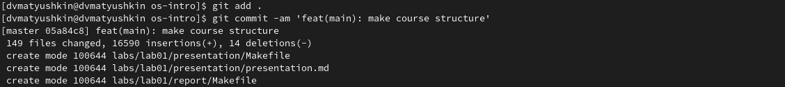{ #fig:016 width=70% }

{ #fig:017 width=70% }

# Заключение:

В ходе этой лабораторной работы мы изучили идеологию и применение средств контроля версий. Освоили умения по работе с git.

# Контрольные вопросы: 

1. **Что такое системы контроля версий (VCS) и для решения каких задач они предназначаются?**
Системы контроля версий (Version Control System, VCS) – система, использующаяся для хранения и управления своим программным продуктом более удобным способом (разработкой). Применяются при работе нескольких человек над одним проектом. Обычно основное дерево проекта хранится в локальном или удалённом репозитории, к которому настроен доступ для участников проекта. При внесении изменений в содержание проекта система контроля версий позволяет их фиксировать, совмещать изменения, произведённые разными участниками проекта, производить откат к любой более ранней версии проекта, если это требуется.

2. **Объясните следующие понятия VCS и их отношения: хранилище, commit, история, рабочая копия.**
Хранилище-система, которая обеспечивает хранение всех существовавших вариантов файлов Commit-фиксация изменений. История-список предыдущих ревизий. Рабочая копия-копия другой ветки. Команде commit можно передать сообщение, описывающее изменения в ревизии. Она также записывает идентификатор пользователя, текущее время и временную зону, плюс список измененных файлов и их содержимого. Сообщение, описывающее изменения, определяется через опцию -m, или – message. Можно также вводить сообщения, состоящие из нескольких строк; в большинстве оболочек вы можете сделать это оставив открытую кавычку в конце строки. commit -m "добавлен первый файл.

3. **Что представляют собой и чем отличаются централизованные и децентрализованные VCS? Приведите примеры VCS каждого вида.**
Системы контроля версий. Централизованная система контроля версий Subversion и децентрализованная система контроля версий Mercurial. Существуют СКВ централизованные, в которых имеется один репозиторий, в который собираются изменения со всех рабочих копий разработчиков, и децентрализованные, когда репозиториев много, и они могут обмениваться изменениями между собой. централизованные СКВ - Репозиторий один. У каждого разработчика своя рабочая копия. Время от времени разработчик может затягивать к себе в рабочую копию новые изменения из репозитория, или проталкивать свои изменения из своей рабочей копии в репозиторий. Прочие особенности централизованных СКВ зависят от реализации.

4. **Опишите действия с VCS при единоличной работе с хранилищем.** 
Создание хранилища (git init). Настройка хранилища. Коммиты нужных файлов (git add , git commit). Пуш файлов (git push). В случае неработоспособности отменить вернуть рабочее состояние исходя из хранимых в хранилище прошлых версий.

5. **Опишите порядок работы с общим хранилищем VCS.**
Создание хранилища (git init).  Проведение работы локально. Добавление в коммит различных файлов (git add , git commit), коммит ресурсов. Пуш файлов (git push).  В случае неработоспособности можно вернуть всё обратно. Если кто-то другой изменил репозиторий - пул ветки.

6. **Каковы основные задачи, решаемые инструментальным средством git?**
Предоставление удаленного доступа к коду, хранение всех версий продукта, предоставление возможности отката в случае неработоспособности кода.

7. **Назовите и дайте краткую характеристику командам git.**
- создание основного дерева репозитория: git init 
- получение обновлений (изменений) текущего дерева из центрального репозитория: git pull 
- отправка всех произведённых изменений локального дерева в центральный репозиторий: git push
- просмотр списка изменённых файлов в текущей директории: git status 
- просмотр текущих изменения: git diff 
- сохранение текущих изменений: – добавить все изменённые и/или созданные файлы и/или каталоги: git add 
- добавить конкретные изменённые и/или созданные файлы и/или каталоги: git add имена_файлов 
- удалить файл и/или каталог из индекса репозитория (при этом файл и/или каталог остаётся в локальной директории): git rm имена_файлов 
- сохранение добавленных изменений: – сохранить все добавленные изменения и все изменённые файлы: git commit -am 'Описание коммита' – сохранить добавленные изменения с внесением комментария через встроенный редактор: git commit 
- создание новой ветки, базирующейся на текущей: git checkout -b имя_ветки 
- переключение на некоторую ветку: git checkout имя_ветки (при переключении на ветку, которой ещё нет в локальном репозитории, она будет создана и связана с удалённой) 
- отправка изменений конкретной ветки в центральный репозиторий: git push origin имя_ветки 
- слияние ветки с текущим деревом: git merge --no-ff имя_ветки 
- удаление ветки: – удаление локальной уже слитой с основным деревом ветки: git branch -d имя_ветки – принудительное удаление локальной ветки git branch -D имя_ветки
- удаление ветки с центрального репозитория: git push origin :имя_ветки.

8. **Приведите примеры использования при работе с локальным и удалённым репозиториями.** 
Локальные репозитории могут быть полезны когда разработчик один. Удаленные - когда работает целая команда. Так же это может быть и для одного человека - он может иметь доступ к хранилищу удаленно. 
Как и обычно мы должны создать репозиторий, загрузить его. Тут уже либо у себя, либо удаленно. После этого человек может работать у себя локально и загружать данные на удаленный репозитории. Используя при этом команды commit, add, push , pull и другие

9. **Что такое и зачем могут быть нужны ветви (branches)?**
Ветви - отдельные области основного хранилища. Ветви могут быть полезны во многих случаях. Начиная от того, что различные модули программы разрабатываются на одной ветке, заканчивая тем, что ветки могут быть для будущего "код ревью". Так же могут быть какие-то экспериментальные ветви. Применений множество. Но единый смысл - возможность распараллелить хранилище

 10. **Как и зачем можно игнорировать некоторые файлы при commit?** 
Можно установить специальные настройки в .gitignore. Это может быть полезно, если  при работе с файлами могут появляться временные файлы, которые загружать в хранилище нет необходимости.

