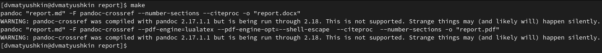

---
## Front matter
title: "Операционные системы"
subtitle: "Лабораторная работа №3"
author: "Матюшкин Денис Владимирович (НПИбд-02-21)"

## Generic otions
lang: ru-RU
toc-title: "Содержание"

## Bibliography
bibliography: bib/cite.bib
csl: pandoc/csl/gost-r-7-0-5-2008-numeric.csl

## Pdf output format
toc: true # Table of contents
toc-depth: 2
fontsize: 12pt
linestretch: 1.5
papersize: a4
documentclass: scrreprt
## I18n polyglossia
polyglossia-lang:
  name: russian
  options:
	- spelling=modern
	- babelshorthands=true
polyglossia-otherlangs:
  name: english
## I18n babel
babel-lang: russian
babel-otherlangs: english
## Fonts
mainfont: PT Serif
romanfont: PT Serif
sansfont: PT Sans
monofont: PT Mono
mainfontoptions: Ligatures=TeX
romanfontoptions: Ligatures=TeX
sansfontoptions: Ligatures=TeX,Scale=MatchLowercase
monofontoptions: Scale=MatchLowercase,Scale=0.9
## Biblatex
biblatex: true
biblio-style: "gost-numeric"
biblatexoptions:
  - parentracker=true
  - backend=biber
  - hyperref=auto
  - language=auto
  - autolang=other*
  - citestyle=gost-numeric
## Pandoc-crossref LaTeX customization
figureTitle: "Рис."
tableTitle: "Таблица"
listingTitle: "Листинг"
lofTitle: "Список иллюстраций"
lotTitle: "Список таблиц"
lolTitle: "Листинги"
## Misc options
indent: true
header-includes:
  - \usepackage{indentfirst}
  - \usepackage{float} # keep figures where there are in the text
  - \floatplacement{figure}{H} # keep figures where there are in the text
---

# Цель работы

- Научиться оформлять отчёты с помощью легковесного языка разметки Markdown.

# Ход работы

1. Перед началом работы с Markdown скачаем и установим pandoc (рис. [-@fig:001]). А [pandoc-citeproc](https://github.com/jgm/pandoc/releases) и [pandoc-crossref](https://github.com/lierdakil/pandoc-crossref/releases) скачаем и разархивируем в нужные каталоги в /usr. 

{ #fig:001 width=70% }

2. Также для работы нам необходим pdflatex, скачаем его и установим (рис. [-@fig:002]).

{ #fig:002 width=70% }

3. После установки необходимых программ начем оформлять отчёт по предыдущей лабораторной работе в формате Markdown (рис. [-@fig:003] и рис. [-@fig:004]). Шаблон нам дан в ранее созданном репозитории.

{ #fig:003 width=70% }

{ #fig:004 width=70% }

4. Оформив весь отчет в виде Markdown, мы должны его конвертировать в формат docx и pdf. Для этого перейдем каталог лабораторной и пропишем *make* (рис. [-@fig:005]). Makefile нам ранее был дан для упрощения жизни. Терминал ругается из-за несоответсвии с нужной версии, но в итоге все правильно компилируется.

{ #fig:005 width=70% }

5. Перейдем каталог лабораторной, проверим конвертированные файлы (рис. [-@fig:006]).

{ #fig:006 width=70% }

# Заключение 

В ходе этой лабораторной работы мы научились оформлять отчёты с помощью легковесного языка разметки Markdown.

