---
## Front matter
title: "Операционные системы"
subtitle: "Лабораторная работа №4"
author: "Матюшкин Денис Владимирович (НПИбд-02-21)"

## Generic otions
lang: ru-RU
toc-title: "Содержание"

## Bibliography
bibliography: bib/cite.bib
csl: pandoc/csl/gost-r-7-0-5-2008-numeric.csl

## Pdf output format
toc: true # Table of contents
toc-depth: 2
fontsize: 12pt
linestretch: 1.5
papersize: a4
documentclass: scrreprt
## I18n polyglossia
polyglossia-lang:
  name: russian
  options:
	- spelling=modern
	- babelshorthands=true
polyglossia-otherlangs:
  name: english
## I18n babel
babel-lang: russian
babel-otherlangs: english
## Fonts
mainfont: PT Serif
romanfont: PT Serif
sansfont: PT Sans
monofont: PT Mono
mainfontoptions: Ligatures=TeX
romanfontoptions: Ligatures=TeX
sansfontoptions: Ligatures=TeX,Scale=MatchLowercase
monofontoptions: Scale=MatchLowercase,Scale=0.9
## Biblatex
biblatex: true
biblio-style: "gost-numeric"
biblatexoptions:
  - parentracker=true
  - backend=biber
  - hyperref=auto
  - language=auto
  - autolang=other*
  - citestyle=gost-numeric
## Pandoc-crossref LaTeX customization
figureTitle: "Рис."
tableTitle: "Таблица"
listingTitle: "Листинг"
lofTitle: "Список иллюстраций"
lotTitle: "Список таблиц"
lolTitle: "Листинги"
## Misc options
indent: true
header-includes:
  - \usepackage{indentfirst}
  - \usepackage{float} # keep figures where there are in the text
  - \floatplacement{figure}{H} # keep figures where there are in the text
---

# Цель работы

- Приобретение практических навыков взаимодействия пользователя с системой посредством командной строки.

# Ход работы

1. Определим полное имя вашего домашнего каталога с помощью команды *pwd* (рис. [-@fig:001]).

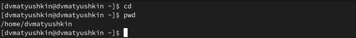{ #fig:001 width=70% }

2. Перейдем в каталог */tmp* и выводим на экран содержимое каталога, используя команду *ls* с разными аргументами  (рис. [-@fig:002]). Аргументы: 1) -а - выводит все файлы, включая скрытые; 2) -F - выводит файлы и их тип данных.

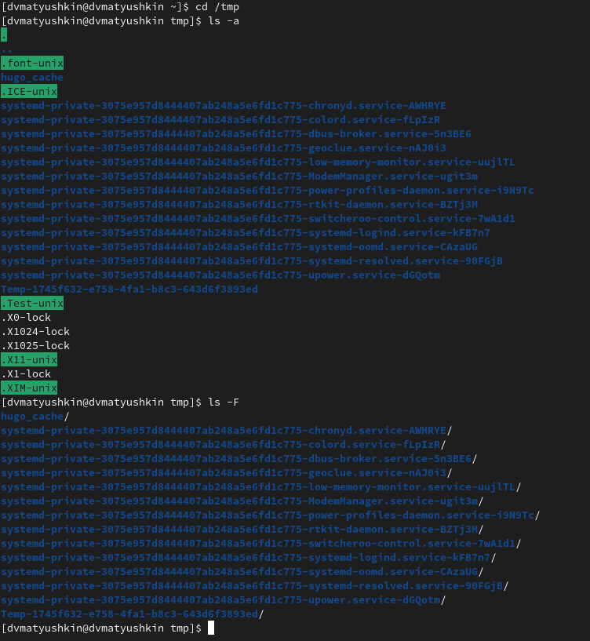{ #fig:002 width=70% }

3. Определим, есть ли в каталоге /var/spool подкаталог с именем *cron* (рис. [-@fig:003]). Подкаталога с таким именем не существует. 

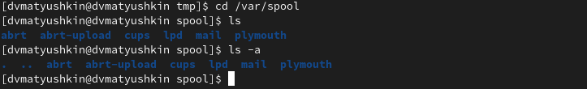{ #fig:003 width=70% }

4. Перейдем домашний каталог и выведем на экран его содержимое. Определим, кто является владельцем файлов и подкаталогов (рис. [-@fig:004]). Владелец - **dvmatyushkin**

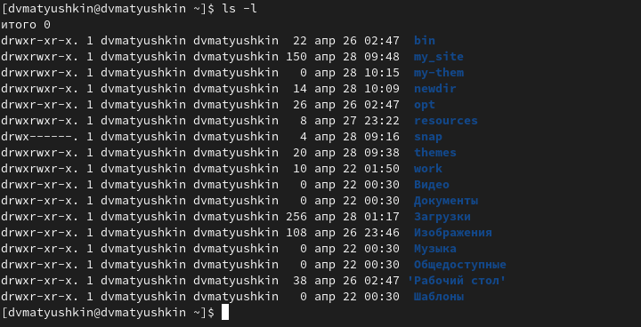{ #fig:004 width=70% }

5. В домашнем каталоге создадим новый каталог с именем *newdir*. В каталоге ~/newdir создадим новый каталог с именем morefun. В домашнем каталоге создадим одной командой три новых каталога с именами letters, memos, misk. Для этого просто отделив имена каталогов пробелом. Затем удалим эти каталоги одной командой, таким же образом отделив их пробелом (рис. [-@fig:005]).

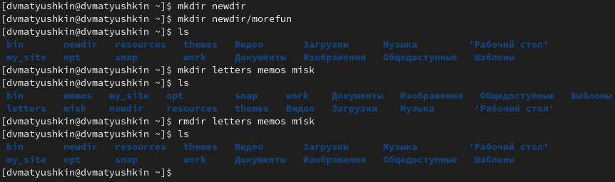{ #fig:005 width=70% }

6. Попробуем удалить ранее созданный каталог ~/newdir командой *rm*. Проверим, был ли каталог удалён (рис. [-@fig:006]).
Каталог не удалился, т.к. мы задали команду без нужного аргумента.

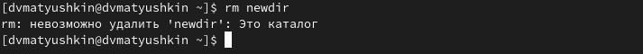{ #fig:006 width=70% }

7. Удалим каталог ~/newdir/morefun из домашнего каталога. Проверим, был ли каталог удалён (рис. [-@fig:007]).

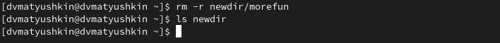{ #fig:007 width=70% }

8. С помощью команды *man* определим, какую опцию команды *ls* нужно использовать для просмотра содержимое не только указанного каталога, но и подкаталогов, входящих в него (рис. [-@fig:008]). 
Нужная опция - -R.

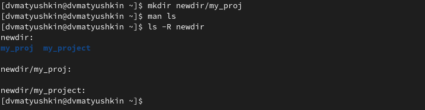{ #fig:008 width=70% }

9. С помощью команды *man* определим набор опций команды *ls*, позволяющий отсортировать по времени последнего изменения выводимый список содержимого каталога с развёрнутым описанием файлов (рис. [-@fig:009]).
Нужная опция - -t.

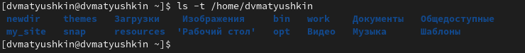{ #fig:009 width=70% }

10. Используем команду man для просмотра описания следующих команд: cd, pwd, mkdir, rmdir, rm. Поясним основные опции этих команд:

**cd:**
-L - Переходит по символическим ссылкам. Данное поведение используется по умолчанию.
-P - Разыменовывает символические ссылки. В данном случае, если осуществляется переход на символическую ссылку, которая указывает на директорию, то в результате команда cd изменит текущую рабочую директорию на директорию, указанную в качестве параметра (то есть ссылка будет разыменована).
-P -e - Выводит ошибку, если директория, в которую осуществляется переход, не найдена.

**pwd:**
-L - Не разыменовывает символические ссылки. Если путь содержит символические ссылки, то выводит их без преобразования в исходный путь.
-P - Преобразовывает символические ссылки в исходные имена. Если путь содержит символические ссылки, то они будут преобразованы в названия исходных директорий, на которые указывают.

**mkdir:**
-p - Создает все директории, которые указаны внутри пути. Если какая-либо директория существует, то предупреждение об этом не выводится.
-v - Выводить сообщение о каждой создаваемой директории.

**rmdir:**
-v - Выводит диагностику на каждый процесс с каталогами.
-s - Удаляет всеБ что внутри каталога включительно.

**rm:**
-r - Рекурсивно удаляет всё, что есть в каталоге.
-i - Выводит запрос на подтверждение удаления каждого файла.

11. Используя информацию, полученную при помощи команды history (рис. [-@fig:010]), выполним модификацию и исполнение нескольких команд из буфера команд (рис. [-@fig:011]).

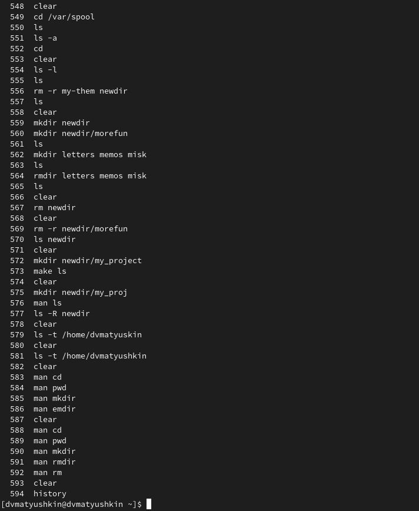{ #fig:010 width=70% }

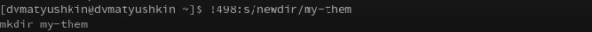{ #fig:011 width=70% }

# Заключение 

- В ходе этой лабораторной работы мы приобрели практические навыки взаимодействия пользователя с системой посредством командной строки.

# Контрольные вопросы

1. **Что такое командная строка?**
- Это специальная программа, которая позволяет управлять компьютером путем прямого воздействия на ядро ОС от ввода текстовых команд с клавиатуры.

2. **При помощи какой команды можно определить абсолютный путь текущего каталога? Приведите пример**
- При помощи команды pwd. Например pwd ~/ - абсолютный пусть домашнего каталога 

3. **При помощи какой команды и каких опций можно определить только тип файлов и их имена в текущем каталоге? Приведите примеры.** 
- С помощь команды ls и ключа -F. Например: ls -F

4. **Каким образом отобразить информацию о скрытых файлах? Приведите примеры.** 
- Файл считается скрытым, если его название начинается с  «.». Например, «.myfile». Обычно такие файлы используются приложениями для хранения настроек, конфигураций и другой информации, которую нужно скрыть от пользователя. Чтобы увидеть скрытые файлы можно использовать команду ls с ключом -a. Для дополнительных данных можно использовать дополнительные ключи, например: ls -aF

5. **При помощи каких команд можно удалить файл и каталог? Можно ли это сделать одной и той же командой? Приведите примеры.** 
- Пустой каталог можно удалить командой rmdir. Каталог и файл можно удалить командой rm (в случае с первым с ключом -r). Например rm -r home. Так же содержимое каталога удаляется если использовать ключ -s. Наример: rmdir -s

6. **Каким образом можно вывести информацию о последних выполненных пользователем командах работы?**
- Использовать команду history

7. **Как воспользоваться историей команд для их модифицированного выполнения? Приведите примеры.**
- Выполнить команду history. Посмотреть на номер интересующей и выполнить команду !<номер команды>. Например: !498:/s/newdir/dir

8. **Приведите примеры запуска нескольких команд в одной строке.** 
- Например: cd / ; ls

 9. **Дайте определение и приведите примера символов экранирования.**
 - Символ экранирования - символ, который из символа вносящего логику в команду(специального), превращает его в обычный символ не влияющий на логику программы. Например !1:s/\//etc 
 
10. **Охарактеризуйте вывод информации на экран после выполнения команды ls с опцией -l.** 
- Выводится подробный список, в котором будет отображаться владелец, группа, дата создания, размер и другие
параметры

11. **Что такое относительный путь к файлу? Приведите примеры использования относительного и абсолютного пути при выполнении какой-либо команды.**
- Относительный путь - путь, который начинается, указывает на другой путь относительно своего местонахождения. Например мы находимся в корневом каталоге. Для того чтобы попасть в каталок etc мы можем указать относительный путь (cd etc) либо полный (cd /etc). В данном случае разница нет. Но если нам нужно будет перейти в каталог домашний, мы не сможем использовать относительные пути. Ибо мы находимся в другой локации, нужно использовать абсолютный.

12. **Как получить информацию об интересующей вас команде?**
- Ввести команду man <интересующая команда>.

13. **Какая клавиша или комбинация клавиш служит для автоматического дополнения вводимых команд?**
- Клавиша Tab, если нет слов начинающихся на букву/часть, ничего не дополняет, сообщает нас об этом звуком.

