---
## Front matter
lang: ru-RU
title: Лабораторная работа №5
author: Матюшкин Денис Владимирович (НПИбд-02-21)
institute: RUDN University, Moscow, Russian Federation
date: 05.04.2022

## Formatting
toc: false
slide_level: 2
theme: metropolis
header-includes: 
 - \metroset{progressbar=frametitle,sectionpage=progressbar,numbering=fraction}
 - '\makeatletter'
 - '\beamer@ignorenonframefalse'
 - '\makeatother'
aspectratio: 43
section-titles: true
## Pandoc-crossref LaTeX customization
figureTitle: "Рис."
---

# Цель работы

- Ознакомление с файловой системой Linux, её структурой, именами и содержаниемкаталогов. Приобретение практических навыков по применению команд для работыс файлами и каталогами, по управлению процессами (и работами), по проверке использования диска и обслуживанию файловой системы.

# Ход работы

## 1. Выполним все примеры, приведённые в первой части описания лабораторной работы:
- Скопируем файл *abc1* в файл *april* и в файл *may*.
- Скопируем файлы в *april* и *may* каталог *monthly*.
- Скопируем файл *monthly/may* в файл с именем *june* (1-3 действия - рис. [-@fig:001]).

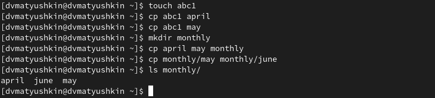{ #fig:001 width=100% }

## 1.2 Выполним все примеры, приведённые в первой части описания лабораторной работы:

- Скопируем каталог *monthly* в каталог *monthly.00* (рис. [-@fig:002]).
		
{ #fig:002 width=100% }

## 1.3 Выполним все примеры, приведённые в первой части описания лабораторной работы:	

- Изменим название файла *april* на *july* в домашнем каталоге.
- Переместим файл *july* в каталог *monthly.00* (5-6 действия - рис. [-@fig:003]).

{ #fig:003 width=100% }

- Переименуем каталог *monthly.00* в *monthly.01* (рис. [-@fig:004]).

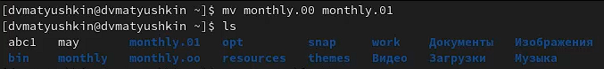{ #fig:004 width=100% }

## 1.4 Выполним все примеры, приведённые в первой части описания лабораторной работы:

- Переместить каталог *monthly.01* в каталог reports.
- Переименовать каталог *reports/monthly.01* в *reports/monthly* (8-9 действия - рис. [-@fig:005])

{ #fig:005 width=100% }

## 1.5 Выполним все примеры, приведённые в первой части описания лабораторной работы:

- Создадим файл *may* с правом выполнения владельца. После лишим права на выполнение этого файла (рис. [-@fig:006]).

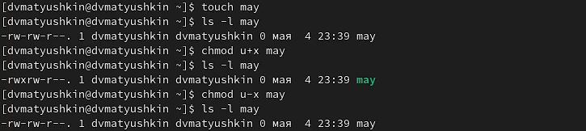{ #fig:006 width=100% }

## 1.6 Выполним все примеры, приведённые в первой части описания лабораторной работы:

- Создадим каталог *monthly* с запретом на чтение для членов группы и всех остальных пользователей (рис. [-@fig:007]).

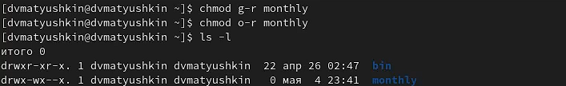{ #fig:007 width=100% }

## 1.7 Выполним все примеры, приведённые в первой части описания лабораторной работы:

- Создадим файл *abc1* с правом записи для членов группы (рис. [-@fig:008]).

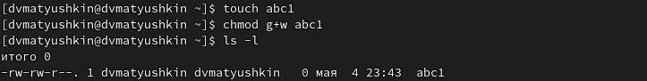{ #fig:008 width=100% }

## 2. Копирование файла в домашнем каталоге
- Скопируйте файл /usr/include/sys/io.h в домашний каталог и назовите его *equipment* (рис. [-@fig:009]).

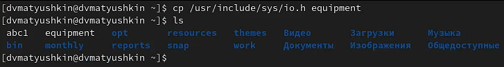{ #fig:009 width=100% }

## 3. Перемещение файлов
- В домашнем каталоге создим директорию ~/ski.plases. Переместим файл equipment в каталог ~/ski.plases. Переименуем файл ~/ski.plases/equipment в ~/ski.plases/equiplist (рис. [-@fig:010]).

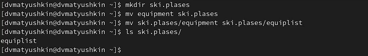{ #fig:010 width=100% }

## 4. Создание файла и каталога
- Создадим в домашнем каталоге файл *abc1* и скопируем его в каталог ~/ski.plases, назовем его *equiplist2* (рис. [-@fig:011]).

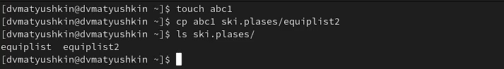{ #fig:011 width=100%}

- Создадим каталог с именем *equipment* в каталоге ~/ski.plases (рис. [-@fig:012]).

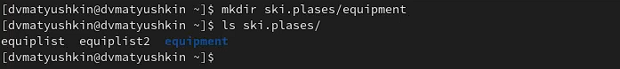{ #fig:012 width=100%}

## 5. Перемещение файла в каталог 
- Переместим файлы *~/ski.plases/equiplist* и *equiplist2* в каталог ~/ski.plases/equipment (рис. [-@fig:013]).

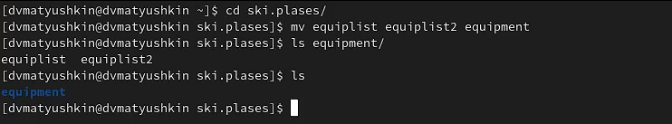{ #fig:013 width=100%}

## 6.  Создание и перемещение каталога
- Создадим и переместим каталог *~/newdir* в каталог ~/ski.plases и назовите его plans (рис. [-@fig:014]).

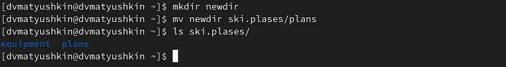{ #fig:014 width=100%}

## 7. Создание нескольких каталогов и файлов
- Создадим каталоги *australia* и *play* и файлы *my_os* и *feathers* (рис. [-@fig:015]).

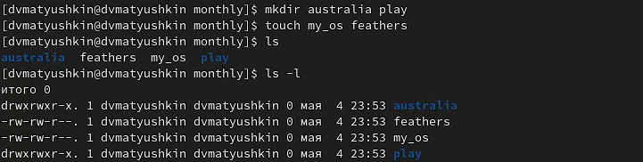{ #fig:015 width=100%}

## 8. Изменение права доступа файлов и каталогов
- Присвоим созданным файлам и каталогам выделенные права доступа: (рис. [-@fig:016]).
    - drwxr--r-- 744 australia
    - drwx--x--x 711 play
    - -r-xr--r-- 544 my_os
    - -rw-rw-r-- 664 feathers

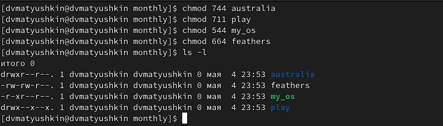{ #fig:016 width=100%}

## 9. Просмотр содержмиого файла
- Просмотрим содержимое файла */etc/password* (рис. [-@fig:017]).

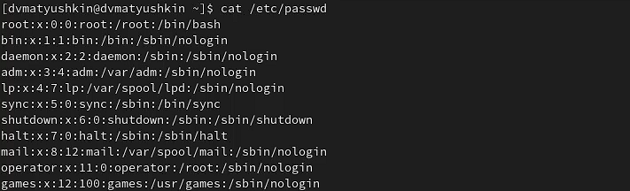{ #fig:017 width=100%}

## 10. Копирование файла
- Скопируем файл *~/feathers* в файл *~/file.old* (рис. [-@fig:018]).

{ #fig:018 width=100%}

## 11. Перемещение файла
- Переместим файл *~/file.old* в каталог *~/play* (рис. [-@fig:019]).

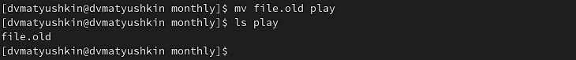{ #fig:019 width=100%}

## 12. Копирование каталога в каталог
- Скопируем каталог *~/play* в каталог *~/fun* (рис. [-@fig:020]).

{ #fig:020 width=100%}

## 13. Перемещение каталога
- Переместим каталог *~/fun* в каталог *~/play* и назовите его *games* (рис. [-@fig:021]).

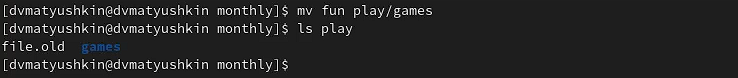{ #fig:021 width=100%}

## 14. Лишение права чтения файла
- Лишим владельца файла *~/feathers* права на чтение (рис. [-@fig:022]).

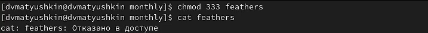{ #fig:022 width=100%}

## 15. Дарование права доступа
- Попытаемся скопировать файл ~/feathers. Дадим владельцу файла ~/feathers право на чтение (рис. [-@fig:023]).

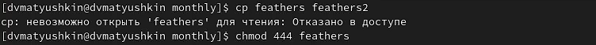{ #fig:023 width=100%}

## 16. Присвоение новый прав доступа
- Лишим владельца каталога ~/play права на выполнение, при переходе в каталог система отказывает в доступе. Дадим владельцу каталога ~/play право на выполнение, теперь при переходе в каталог все по стандарту (рис. [-@fig:024]).

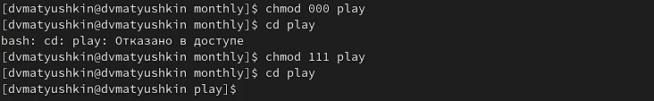{ #fig:024 width=100%}

## 17. Использование команды *man*
- Прочитаем man по командам mount, fsck, mkfs, kill и кратко их охарактеризуем, приведя примеры.

# Заключение 

- В ходе этой лабораторной работы мы ознакомились с файловой системой Linux, её структурой, именами и содержаниемкаталогов. Приобрели практические навыки по применению команд для работыс файлами и каталогами, по управлению процессами (и работами), по проверке использования диска и обслуживанию файловой системы.

## {.standout}

Спасибо за внимание!

