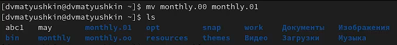
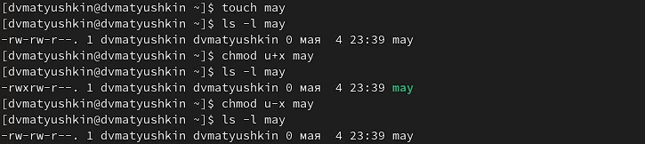
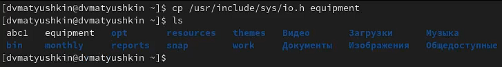
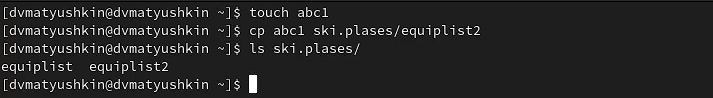
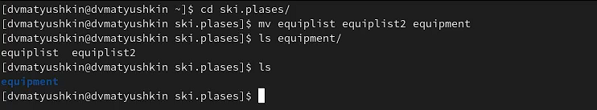
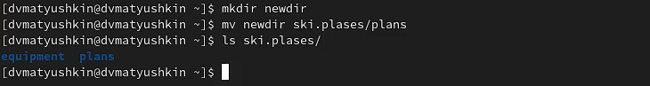
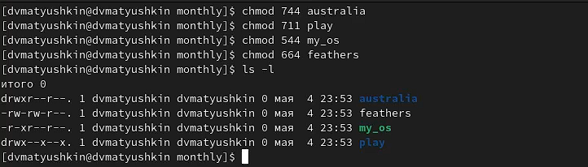
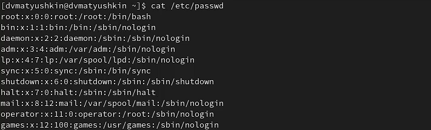
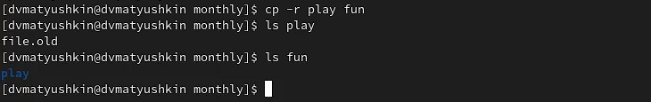
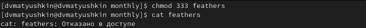

---
## Front matter
title: "Операционные системы"
subtitle: "Лабораторная работа №5"
author: "Матюшкин Денис Владимирович (НПИбд-02-21)"

## Generic otions
lang: ru-RU
toc-title: "Содержание"

## Bibliography
bibliography: bib/cite.bib
csl: pandoc/csl/gost-r-7-0-5-2008-numeric.csl

## Pdf output format
toc: true # Table of contents
toc-depth: 2
fontsize: 12pt
linestretch: 1.5
papersize: a4
documentclass: scrreprt
## I18n polyglossia
polyglossia-lang:
  name: russian
  options:
	- spelling=modern
	- babelshorthands=true
polyglossia-otherlangs:
  name: english
## I18n babel
babel-lang: russian
babel-otherlangs: english
## Fonts
mainfont: PT Serif
romanfont: PT Serif
sansfont: PT Sans
monofont: PT Mono
mainfontoptions: Ligatures=TeX
romanfontoptions: Ligatures=TeX
sansfontoptions: Ligatures=TeX,Scale=MatchLowercase
monofontoptions: Scale=MatchLowercase,Scale=0.9
## Biblatex
biblatex: true
biblio-style: "gost-numeric"
biblatexoptions:
  - parentracker=true
  - backend=biber
  - hyperref=auto
  - language=auto
  - autolang=other*
  - citestyle=gost-numeric
## Pandoc-crossref LaTeX customization
figureTitle: "Рис."
tableTitle: "Таблица"
listingTitle: "Листинг"
lofTitle: "Список иллюстраций"
lotTitle: "Список таблиц"
lolTitle: "Листинги"
## Misc options
indent: true
header-includes:
  - \usepackage{indentfirst}
  - \usepackage{float} # keep figures where there are in the text
  - \floatplacement{figure}{H} # keep figures where there are in the text
---

# Цель работы

- Ознакомление с файловой системой Linux, её структурой, именами и содержаниемкаталогов. Приобретение практических навыков по применению команд для работыс файлами и каталогами, по управлению процессами (и работами), по проверке использования диска и обслуживанию файловой системы.

# Ход работы

1. Выполним все примеры, приведённые в первой части описания лабораторной работы:
- Скопируем файл *abc1* в файл *april* и в файл *may*.
- Скопируем файлы в *april* и *may* каталог *monthly*.
- Скопируем файл *monthly/may* в файл с именем *june* (1-3 действия - рис. [-@fig:001]).

{ #fig:001 width=100% }

- Скопируем каталог *monthly* в каталог *monthly.00* (рис. [-@fig:002]).
		
{ #fig:002 width=100% }
		
- Изменим название файла *april* на *july* в домашнем каталоге.
- Переместим файл *july* в каталог *monthly.00* (5-6 действия - рис. [-@fig:003]).

{ #fig:003 width=100% }

- Переименуем каталог *monthly.00* в *monthly.01* (рис. [-@fig:004]).

{ #fig:004 width=100% }

- Переместить каталог *monthly.01* в каталог reports.
- Переименовать каталог *reports/monthly.01* в *reports/monthly* (8-9 действия - рис. [-@fig:005])

{ #fig:005 width=100% }

- Создадим файл *may* с правом выполнения владельца. После лишим права на выполнение этого файла (рис. [-@fig:006]).

{ #fig:006 width=100% }

- Создадим каталог *monthly* с запретом на чтение для членов группы и всех остальных пользователей (рис. [-@fig:007]).

{ #fig:007 width=100% }

- Создадим файл *abc1* с правом записи для членов группы (рис. [-@fig:008]).

{ #fig:008 width=100% }

2. Скопируйте файл /usr/include/sys/io.h в домашний каталог и назовите его *equipment* (рис. [-@fig:009]).

{ #fig:009 width=100% }

3. В домашнем каталоге создим директорию ~/ski.plases. Переместим файл equipment в каталог ~/ski.plases. Переименуем файл ~/ski.plases/equipment в ~/ski.plases/equiplist (рис. [-@fig:010]).

{ #fig:010 width=100% }

4. Создадим в домашнем каталоге файл *abc1* и скопируем его в каталог ~/ski.plases, назовем его *equiplist2* (рис. [-@fig:011]).

{ #fig:011 width=100%}

5. Создадим каталог с именем *equipment* в каталоге ~/ski.plases (рис. [-@fig:012]).

{ #fig:012 width=100%}

6. Переместим файлы *~/ski.plases/equiplist* и *equiplist2* в каталог ~/ski.plases/equipment (рис. [-@fig:013]).

{ #fig:013 width=100%}

7. Создадим и переместим каталог *~/newdir* в каталог ~/ski.plases и назовите его plans (рис. [-@fig:014]).

{ #fig:014 width=100%}

8. Создадим каталоги *australia* и *play* и файлы *my_os* и *feathers* (рис. [-@fig:015]).

{ #fig:015 width=100%}

9. Присвоим созданным файлам и каталогам выделенные права доступа: (рис. [-@fig:016]).
- drwxr--r-- 744 australia
- drwx--x--x 711 play
- -r-xr--r-- 544 my_os
- -rw-rw-r-- 664 feathers

{ #fig:016 width=100%}

10. Просмотрим содержимое файла */etc/password* (рис. [-@fig:017]).

{ #fig:017 width=100%}

11. Скопируем файл *~/feathers* в файл *~/file.old* (рис. [-@fig:018]).

{ #fig:018 width=100%}

12. Переместим файл *~/file.old* в каталог *~/play* (рис. [-@fig:019]).

{ #fig:019 width=100%}

13. Скопируем каталог *~/play* в каталог *~/fun* (рис. [-@fig:020]).

{ #fig:020 width=100%}

14. Переместим каталог *~/fun* в каталог *~/play* и назовите его *games* (рис. [-@fig:021]).

{ #fig:021 width=100%}

15. Лишим владельца файла *~/feathers* права на чтение. При попытке чтения файла система отказывает в доступе (рис. [-@fig:022]).

{ #fig:022 width=100%}

16. Попытаемся скопировать файл ~/feathers. Дадим владельцу файла ~/feathers право на чтение (рис. [-@fig:023]).

{ #fig:023 width=100%}

17. Лишим владельца каталога ~/play права на выполнение, при переходе в каталог система отказывает в доступе. Дадим владельцу каталога ~/play право на выполнение, теперь при переходе в каталог все по стандарту (рис. [-@fig:024]).

{ #fig:024 width=100%}

18. Прочитаем man по командам mount, fsck, mkfs, kill и кратко их охарактеризуем, приведя примеры.

- mount - с помощью команды mount можно подключить сетевой диск, раздел жесткого диска или USB-накопитель. **Некоторые параметры:**
    -V -  Выводит информацию о версии программы,
    -v - Подробно информирует о выполняемых действиях.
    **Пример:**  sudo mount - список примонтированных устройств.
    
- fsck -  команда взаимодействующая с соответствующей файловой системой. Fsck как правило, имеет три режима работы: 
    1. Проверка на наличие ошибок и подсказывает пользователю интерактивное решение, как решить индивидуальные проблемы;
    2. Проверка на наличие ошибок и постарается автоматически исправить все ошибки;
    3. Проверка на наличие ошибок без возможности восстановить их, но тогда выдаст ошибки на стандартный вывод.
    * **Некоторые параметры:**
    * -r - Интерактивный ремонт файловой системы (спросит подтверждение),
    * -T - Не показывать название при запуске.
    * **Пример:** fdisk -l - выполним проверку, чтобы узнать какие диски и какие разделы у имеются.

- mkfs -  используется для создания файловой системы на некотором устройстве. В качестве аргумента filesys для файловой системы может выступать или название устройства (например, /dev/hda1, /dev/sdb2) или точка монтирования (например, /, /usr, /home)/ **Некоторые параметры:** 
    * -c - перед созданием файловой системы проверяет наличие сбойных блоков на устройстве, 
    * -v - подробно комментирует происходящее.
    * **Пример:**  mkfs -t ext2 /dev/hdb1 - создание файловой системы типа ext2 в разделе /dev/hdb1

- kill - завершает процесс или послает им сигнал. kill <PID>. PID можно получить командой ps axu | grep "то что мы ищем".
    * **Например:**  kill 5099 (убьет процесс с PID 5099)

# Контрольные вопросы

1. **Дайте характеристику каждой файловой системе, существующей на жёстком диске компьютера, на котором вы выполняли лабораторную работу.**

- EXT4:
    - увеличение максимального объёма одного раздела диска до 260 при размере блока 4 кибибайт
    - увеличение размера одного файла до 244 байт
    - введение механизма пространственной (extent) записи файлов, уменьшающего фрагментацию и повышающего производительность. Суть механизма заключается в том, что новая информация добавляется в конец области диска, выделенной заранее по соседству с областью, занятой содержимым файла.

2. **Приведите общую структуру файловой системы и дайте характеристику каждой директории первого уровня этой структуры**

| Имя каталога | Описание каталога                                                                                                          |
|--------------|----------------------------------------------------------------------------------------------------------------------------|
| `/`          | Корневая директория, содержащая всю файловую                                                                               |
| `/bin `      | Основные системные утилиты, необходимые как в однопользовательском режиме, так и при обычной работе всем пользователям     |
| `/etc`       | Общесистемные конфигурационные файлы и файлы конфигурации установленных программ                                           |
| `/home`      | Содержит домашние директории пользователей, которые, в свою очередь, содержат персональные настройки и данные пользователя |
| `/media`     | Точки монтирования для сменных носителей                                                                                   |
| `/root`      | Домашняя директория пользователя  `root`                                                                                   |
| `/tmp`       | Временные файлы                                                                                                            |
| `/usr`       | Вторичная иерархия для данных пользователя                                                                                 |

3. **Какая операция должна быть выполнена, чтобы содержимое некоторой файловой системы было доступно операционной системе?**

- Необходимо примонтировать файловую систему командой *mount*.

4. **Назовите основные причины нарушения целостности файловой системы. Как устранить повреждения файловой системы?**

- К повреждению файловой системы может привести сбой питания компьютера. В этот момент может проходить запись в файл, который как итог, завершится не закончив запись. Так же к нарушению целостности файловой системы может привести неправильный код программиста. Как пример: гонка потоков которые могут произвести к нарушению целостности. В качестве устранения проблем файловой системы можно применять профилактирующие методы: поставить на компьютер бесперебойный блок питания. Так же можно навредить использовав команды неправильно. При нарушении целостности - использовать восстанавливающие средства: команды командной строки Linux.

5. **Как создаётся файловая система?**

- Для создания файловых систем в Linux используется команда *mkfs*. Фактически команда *mkfs* представляет собой внешний интерфейс к нескольким командам для работы с файловой системой, таким как mkfs.ext3 для ext3 и mkfs.reiserfs – для ReiserFS.

6. **Дайте характеристику командам для просмотра текстовых файлов.**

- cat - выводит содержимое файла полностью.
- less - она позволяет осуществлять постраничный просмотр файлов (длина страницы соответствует размеру экрана)
- head -  по умолчанию она выводит первые 10 строк файла. Формат команды: head [-n] имя-файла, где n — количество выводимых строк. 
- tail -  выводит несколько последних строк файла. Формат команды: tail [-n] имя-файла, где n — количество выводимых строк

7. **Приведите основные возможности команды cp в Linux.**

- *cp* позволяет полностью копировать файлы и директории. Так же, при определенных параметрах может:
    * -n - не перезаписывать существующие файлы; 
    * -L - копировать не символические ссылки, а то, на что они указывают; 
    * -p - сохранять владельца, временные метки и флаги доступа при копировании;

8. **Приведите основные возможности команды mv в Linux.**

- mv - используется для перемещения или переименования файлов. Ключи, использующиеся с mv: 
    * –f, не запрашивать подтверждения операций; 
    * –i, выводить запрос на подтверждение операции, когда существует файл, в который происходит переименование или перемещение; 
    * –, завершает список ключей. Применяется для использования с файлами, имена которых начинаются на "-".

9. **Что такое права доступа? Как они могут быть изменены?**

- Права доступа - совокупность правил, регламентирующих порядок и условия доступа субъекта к объектам информационной системы. Изменить права доступа можно командой *chmod*.

# Вывод: 

- В ходе этой лабораторной работы мы ознакомились с файловой системой Linux, её структурой, именами и содержаниемкаталогов. Приобрели практические навыки по применению команд для работыс файлами и каталогами, по управлению процессами (и работами), по проверке использования диска и обслуживанию файловой системы.
