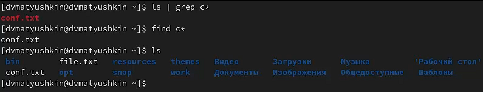
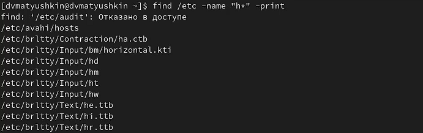
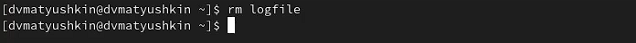
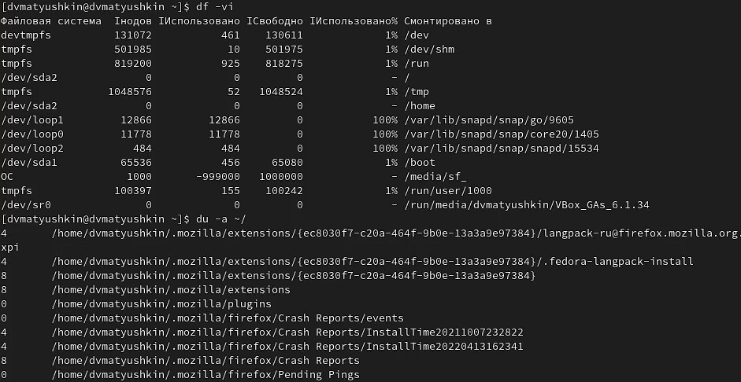
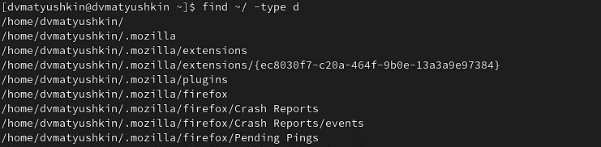

---
## Front matter
lang: ru-RU
title: Лабораторная работа №6
author: Матюшкин Денис Владимирович (НПИбд-02-21)
institute: RUDN University, Moscow, Russian Federation
date: 05.04.2022

## Formatting
toc: false
slide_level: 2
theme: metropolis
header-includes: 
 - \metroset{progressbar=frametitle,sectionpage=progressbar,numbering=fraction}
 - '\makeatletter'
 - '\beamer@ignorenonframefalse'
 - '\makeatother'
aspectratio: 43
section-titles: true
## Pandoc-crossref LaTeX customization
figureTitle: "Рис."
---

# Цель работы

- Ознакомление с инструментами поиска файлов и фильтрации текстовых данных. Приобретение практических навыков: по управлению процессами (и заданиями), по проверке использования диска и обслуживанию файловых систем.

# Ход работы

## 1. Вход в систему
- Осуществим вход в систему, используя соответствующее имя пользователя.

## 2. Запись файла
- Запишием в файл *file.txt* названия файлов, содержащихся в каталоге */etc*. Допишем в этот же файл названия файлов, содержащихся в вашем домашнем каталоге (рис. [-@fig:001]).

{ #fig:001 width=100% }

## 3. Запись файла из данных другого файла
- Выведем имена всех файлов из *file.txt*, имеющих расширение *.conf*, после чего запишим их в новый текстовой файл *conf.txt* (рис. [-@fig:002]).

{ #fig:002 width=100% }

## 4. Поиск файлов 
- Определим двумя методами, какие файлы в вашем домашнем каталоге имеют имена, начинавшиеся с символа *с* (рис. [-@fig:003]):
    - ls | grep c
    - find c*

{ #fig:003 width=100% }

## 5. Вывод списка фалйов
- Выведем на экран (по странично) имена файлов из каталога */etc*, начинающиеся с символа *h* (рис. [-@fig:004]).

{ #fig:004 width=100% }

## 6. Работа с фоновыми процессами
- Запустим в фоновом режиме процесс, который будет записывать в файл *~/logfile* файлы, имена которых начинаются с *log* (рис. [-@fig:005]).

{ #fig:005 width=100% }

## 7. Удаление созданного файла
- Удалим файл *~/logfile* (рис. [-@fig:006]).

{ #fig:006 width=100% }

## 8. Работа с фоновыми процессами
- Запустим из консоли в фоновом режиме редактор *gedit* (рис. [-@fig:007]).

{ #fig:007 width=100% }

## 9. Использвание команды ps для определение идентификатора
- Определите идентификатор процесса *gedit*, используя команду *ps*, конвейер и фильтр *grep*. Это можно сделать командой *ps aux | grep gedit*. После чего командой *kill* завершим процесс *gedit* (рис. [-@fig:008]).

{ #fig:008 width=100% }

## 10. Команды df и du 
- Выполним команды *df* и *du*, предварительно получив более подробную информацию об этих командах, с помощью команды *man* (рис. [-@fig:009]).

{ #fig:009 width=100% }

## 11. Вывод имен всех директорий
- Воспользовавшись справкой команды find, выведем имена всех директорий, имеющихся в вашем домашнем каталоге (рис. [-@fig:010]).

{ #fig:010 width=100% }

# Вывод: 

- В ходе этой лабораторной работы мы ознакомились с инструментами поиска файлов и фильтрации текстовых данных. Приобрели практические навыки: по управлению процессами (и заданиями), по проверке использования диска и обслуживанию файловых систем.

## {.standout}

Спасибо за внимание!

