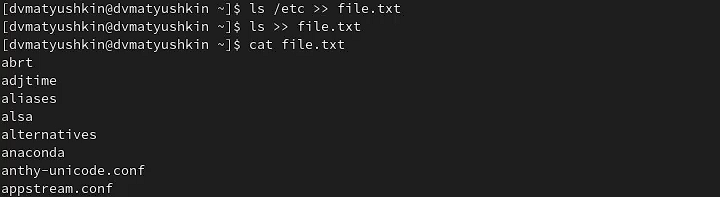
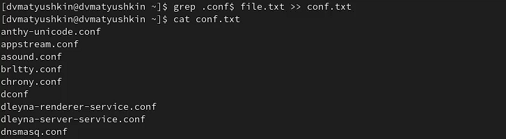
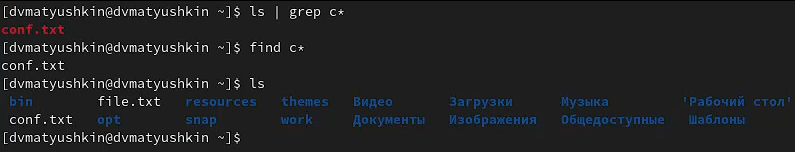
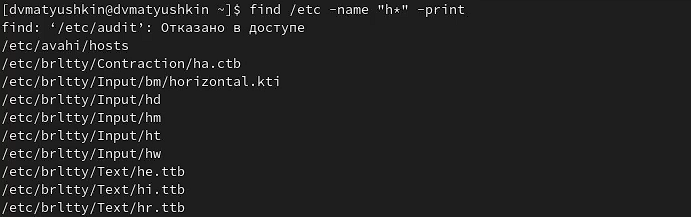
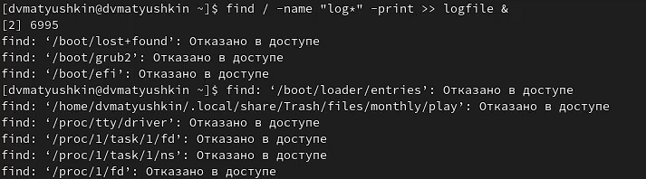
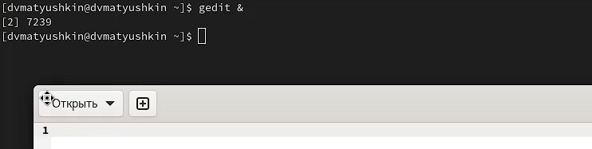
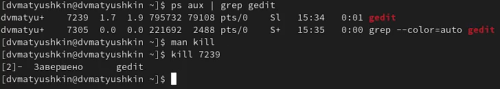
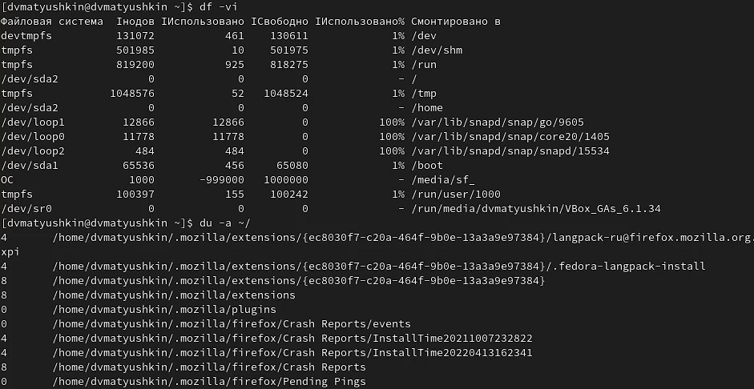
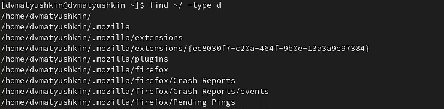

---
## Front matter
title: "Операционные системы"
subtitle: "Лабораторная работа №6"
author: "Матюшкин Денис Владимирович (НПИбд-02-21)"

## Generic otions
lang: ru-RU
toc-title: "Содержание"

## Bibliography
bibliography: bib/cite.bib
csl: pandoc/csl/gost-r-7-0-5-2008-numeric.csl

## Pdf output format
toc: true # Table of contents
toc-depth: 2
fontsize: 12pt
linestretch: 1.5
papersize: a4
documentclass: scrreprt
## I18n polyglossia
polyglossia-lang:
  name: russian
  options:
	- spelling=modern
	- babelshorthands=true
polyglossia-otherlangs:
  name: english
## I18n babel
babel-lang: russian
babel-otherlangs: english
## Fonts
mainfont: PT Serif
romanfont: PT Serif
sansfont: PT Sans
monofont: PT Mono
mainfontoptions: Ligatures=TeX
romanfontoptions: Ligatures=TeX
sansfontoptions: Ligatures=TeX,Scale=MatchLowercase
monofontoptions: Scale=MatchLowercase,Scale=0.9
## Biblatex
biblatex: true
biblio-style: "gost-numeric"
biblatexoptions:
  - parentracker=true
  - backend=biber
  - hyperref=auto
  - language=auto
  - autolang=other*
  - citestyle=gost-numeric
## Pandoc-crossref LaTeX customization
figureTitle: "Рис."
tableTitle: "Таблица"
listingTitle: "Листинг"
lofTitle: "Список иллюстраций"
lotTitle: "Список таблиц"
lolTitle: "Листинги"
## Misc options
indent: true
header-includes:
  - \usepackage{indentfirst}
  - \usepackage{float} # keep figures where there are in the text
  - \floatplacement{figure}{H} # keep figures where there are in the text
---

# Цель работы

- Ознакомление с инструментами поиска файлов и фильтрации текстовых данных. Приобретение практических навыков: по управлению процессами (и заданиями), по проверке использования диска и обслуживанию файловых систем.

# Ход работы

1. Осуществим вход в систему, используя соответствующее имя пользователя.

2. Запишием в файл *file.txt* названия файлов, содержащихся в каталоге */etc*. Допишем в этот же файл названия файлов, содержащихся в вашем домашнем каталоге (рис. [-@fig:001]).

{ #fig:001 width=100% }

3. Выведем имена всех файлов из *file.txt*, имеющих расширение *.conf*, после чего запишим их в новый текстовой файл *conf.txt* (рис. [-@fig:002]).

{ #fig:002 width=100% }

4. Определим двумя методами, какие файлы в вашем домашнем каталоге имеют имена, начинавшиеся с символа *с* (рис. [-@fig:003]):
    - ls | grep c
    - find c*

{ #fig:003 width=100% }

5. Выведем на экран (по странично) имена файлов из каталога */etc*, начинающиеся с символа *h* (рис. [-@fig:004]).

{ #fig:004 width=100% }

6. Запустим в фоновом режиме процесс, который будет записывать в файл *~/logfile* файлы, имена которых начинаются с *log* (рис. [-@fig:005]).

{ #fig:005 width=100% }

7. Удалим файл *~/logfile* (рис. [-@fig:006]).

{ #fig:006 width=100% }

8. Запустим из консоли в фоновом режиме редактор *gedit* (рис. [-@fig:007]).

{ #fig:007 width=100% }

9. Определите идентификатор процесса *gedit*, используя команду *ps*, конвейер и фильтр *grep*. Это можно сделать командой *ps aux | grep gedit*. После чего командой *kill* завершим процесс *gedit* (рис. [-@fig:008]).

{ #fig:008 width=100% }

10. Выполним команды *df* и *du*, предварительно получив более подробную информацию об этих командах, с помощью команды *man* (рис. [-@fig:009]).

{ #fig:009 width=100% }

11. Воспользовавшись справкой команды find, выведем имена всех директорий, имеющихся в вашем домашнем каталоге (рис. [-@fig:010]).

{ #fig:010 width=100% }

# Контрольные вопросы

1. **Какие потоки ввода вывода вы знаете?**
    - stdin — стандартный поток ввода (по умолчанию: клавиатура), файловый дескриптор 0. 
    - stdout — стандартный поток вывода (по умолчанию: консоль), файловый дескриптор 1.
    - stderr — стандартный поток вывода сообщений об ошибках (по умолчанию: консоль) файловый дескриптор 2.

2. **Объясните разницу между операцией > и >>.**
    - ">"  - перезапись информации в файл
    - ">>" - добавление информации, а не ее перезапись

3. **Что такое конвейер?**
- Конвейер (pipe) служит для объединения простых команд или утилит в цепочки, в ко торых результат работы предыдущей команды передаётся последующей. Пример: ls -la |sort > sortilg_list

4. **Что такое процесс? Чем это понятие отличается от программы?**
- Программа - это сценарий, хранящийся на диске или, по-видимому, предыдущий этап процесса. Наоборот, процесс является событием программы в процессе выполнения.

5. **Что такое PID и GID?**
    - PID - идентификатор процесса.
    - GID - идентификационный номер группы данного процесса.
    
6. **Что такое задачи и какая команда позволяет ими управлять?**
-  Запущенные фоном программы называются задачами. Ими можно управлять с помощью команды jobs, которая выводит список запущенных в данный момент задач. Для завершения задачи необходимо выполнить команду kill <PID>

7. **Найдите информацию об утилитах top и htop. Каковы их функции?**
    - top — Консольная команда, которая выводит список работающих в системе процессов и информацию о них. По умолчанию она в реальном времени сортирует их по нагрузке на процессор.
    - htop — Продвинутый монитор процессов. Он был задуман заменить стандартную программу top. Htop показывает динамический список системных процессов, список обычно выравнивается по использованию ЦПУ. В отличие от top, htop показывает все процессы в системе. Также показывает время непрерывной работы, использование процессоров и памяти.

8. **Назовите и дайте характеристику команде поиска файлов. Приведите примеры использования этой команды.**
    - find - команда для поиска файлов и каталогов на основе специальных условий. Ее можно использовать в различных обстоятельствах, например, для поиска файлов по разрешениям, владельцам, группам, типу, размеру и другим подобным критериям.
    - Пример: find / -name "с*" -print
9. **Можно ли по контексту (содержанию) найти файл? Если да, то как?**
- Для поиска файла по содержимому проще всего воспользоваться командой grep.
- Пример:  grep -lir 'Цель работы' /home/dvmatyushkin/work/study/2021-2022/Операционные системы/os-intro/labs/lab06/report

10. **Как определить объем свободной памяти на жёстком диске?**
- Командой: df -vi

11. **Как определить объем вашего домашнего каталога?**
- Командой: du -sh ~/

12. **Как удалить зависший процесс?**
- Командой: kill <PID>

# Вывод: 

- В ходе этой лабораторной работы мы ознакомились с инструментами поиска файлов и фильтрации текстовых данных. Приобрели практические навыки: по управлению процессами (и заданиями), по проверке использования диска и обслуживанию файловых систем.
