---
## Front matter
lang: ru-RU
title: Лабораторная работа №7
author: Матюшкин Денис Владимирович (НПИбд-02-21)
institute: RUDN University, Moscow, Russian Federation
date: 13.04.2022

## Formatting
toc: false
slide_level: 2
theme: metropolis
header-includes: 
 - \metroset{progressbar=frametitle,sectionpage=progressbar,numbering=fraction}
 - '\makeatletter'
 - '\beamer@ignorenonframefalse'
 - '\makeatother'
aspectratio: 43
section-titles: true
## Pandoc-crossref LaTeX customization
figureTitle: "Рис."
---

# Цель работы

- Освоение основных возможностей командной оболочки Midnight Commander. Приобретение навыков практической работы по просмотру каталогов и файлов; манипуляций с ними.

# Ход работы

# Задание по mc

## 1. Midnight Commander
- Изучим информацию о mc, вызвав в командной строке man mc.

## 2. Запуск mc
- Запустим из командной строки mc, изучим его структуру и меню (рис. [-@fig:001]).

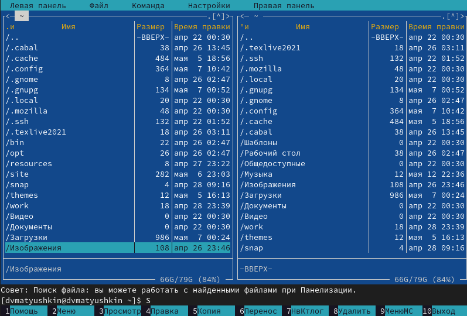{ #fig:001 width=70% }

## 3. Знакомство с mc 
- Выполним несколько операций в mc, используя управляющие клавиши (операции с панелями; выделение/отмена выделения файлов т.п.)

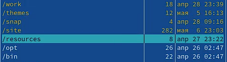{ #fig:002 width=70% }

## 4. Команды левой/правой панели
- Выполним основные команды меню левой (или правой) панели. Оценим степень подробности вывода информации о файлах (рис. [-@fig:003]).

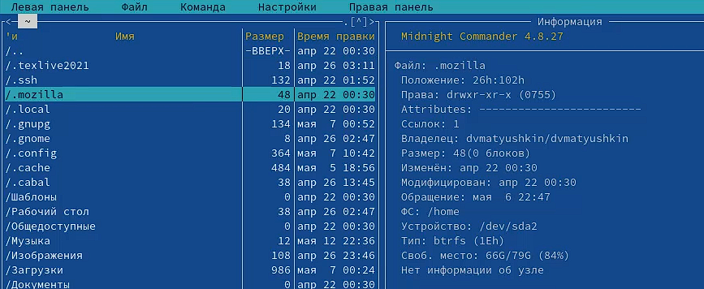{ #fig:003 width=70% }

## 5.1 Подменю Файл
- Используя возможности подменю *Файл*, выполним:
1. просмотр содержимого текстового файла и редактирование содержимого текстового файла, без сохранения результатов редактирования (рис. [-@fig:004]).
2. создание каталога (рис. [-@fig:005]).
3. копирование в файлов в созданный каталог (рис. [-@fig:006]).

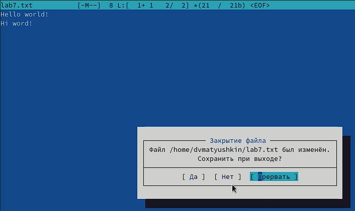{ #fig:004 width=70% }

## 5.2 Подменю Файл
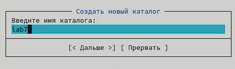{ #fig:005 width=70% }

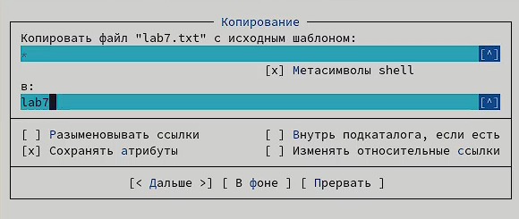{ #fig:006 width=70% }

## 6.1  Подменю Команда
- С помощью соответствующих средств подменю *Команда* осуществим:
1. поиск в файловой системе файла с заданными условиями (например, файла с расширением .c или .cpp, содержащего строку main); (рис. [-@fig:007])
2. переход в домашний каталог.
3. анализ файла меню и файла расширений (рис. [-@fig:008] и рис. [-@fig:009]).

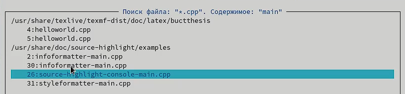{ #fig:007 width=70% }

## 6.2 Подменю Команда
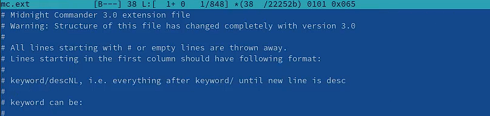{ #fig:008 width=70% }

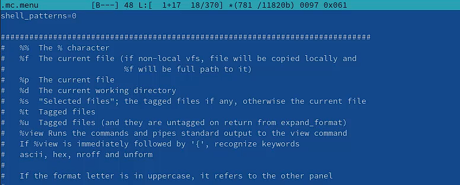{ #fig:009 width=70% }

## 7.
- Вызовим подменю *Настройки*. Освоим операции, определяющие структуру экрана mc (Full screen, Double Width, Show Hidden Files и т.д.) (рис. [-@fig:010]).

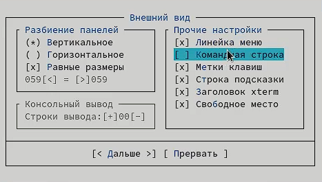{ #fig:010 width=70% }

# Задание по встроенному редактору mc

## 1. Создание файла
- Создадим текстовой файл *text.txt* и откроем этот файл с помощью встроенного в mc редактора (рис. [-@fig:011]).

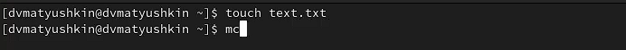{ #fig:011 width=70% }

## 2. Текст
- Вставим в открытый файл небольшой фрагмент текста, скопированный из любого другого файла или Интернета (рис. [-@fig:012]).

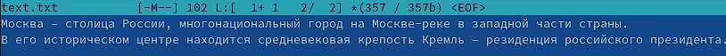{ #fig:012 width=70% }

## 3.1 Работа с текстовым файлом 
- Проделаем с текстом следующие манипуляции, используя горячие клавиши:

1. Удалим строку текста.
2. Выделим фрагмент текста (строка 4) и скопируем его на новую строку (рис. [-@fig:013]).
3. Выделим фрагмент текста (строка 3) и перенесем его на новую строку (рис. [-@fig:013]).
4. Сохраним файл (рис. [-@fig:014]).
5. Отменим последнее действие.
6. Перейдем в начало и конец файла (нажав комбинацию клавиш) и напишием некоторый текст (рис. [-@fig:015]).
7. Сохраним и закроем файл.

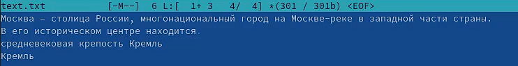{ #fig:013 width=70% }

## 3.2 Работа с текстовым файлом 
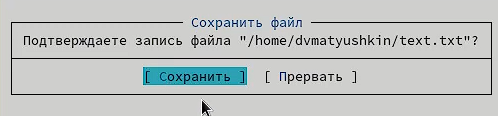{ #fig:014 width=70% }

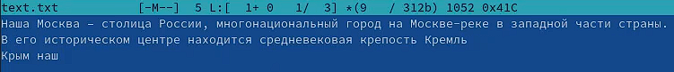{ #fig:015 width=70% }

## 4. Текст на языке С
- Откроем файл с исходным текстом на некотором языке программирования С (рис. [-@fig:016]).

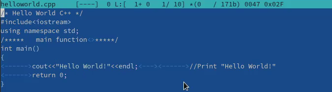{ #fig:016 width=70% }

## 5. Подсветка синтаксиса
- Используя меню редактора, включим подсветку синтаксиса, если она не включена, или выключим, если она включена (рис. [-@fig:017]).

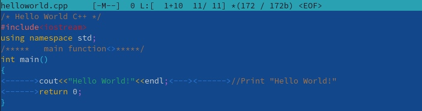{ #fig:017 width=70% }

# Вывод

- В ходе этой лабораторной работы мы освоили основные возможности командной оболочки Midnight Commander. Приобрели навыки практической работы по просмотру каталогов и файлов; манипуляций с ними.

## {.standout}

Спасибо за внимание!

