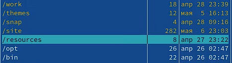
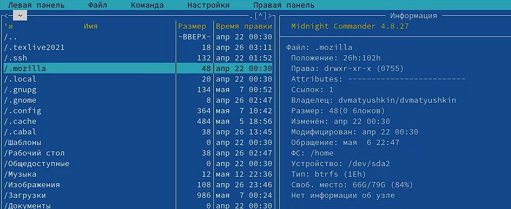
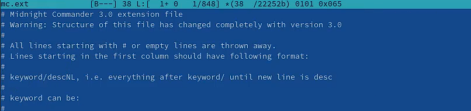
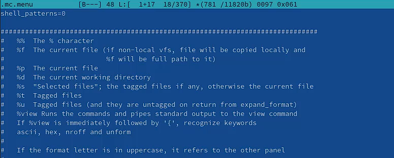
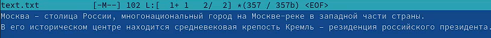
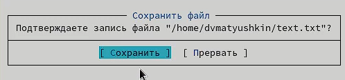

---
## Front matter
title: "Операционные системы"
subtitle: "Лабораторная работа №7"
author: "Матюшкин Денис Владимирович (НПИбд-02-21)"

## Generic otions
lang: ru-RU
toc-title: "Содержание"

## Bibliography
bibliography: bib/cite.bib
csl: pandoc/csl/gost-r-7-0-5-2008-numeric.csl

## Pdf output format
toc: true # Table of contents
toc-depth: 2
fontsize: 12pt
linestretch: 1.5
papersize: a4
documentclass: scrreprt
## I18n polyglossia
polyglossia-lang:
  name: russian
  options:
	- spelling=modern
	- babelshorthands=true
polyglossia-otherlangs:
  name: english
## I18n babel
babel-lang: russian
babel-otherlangs: english
## Fonts
mainfont: PT Serif
romanfont: PT Serif
sansfont: PT Sans
monofont: PT Mono
mainfontoptions: Ligatures=TeX
romanfontoptions: Ligatures=TeX
sansfontoptions: Ligatures=TeX,Scale=MatchLowercase
monofontoptions: Scale=MatchLowercase,Scale=0.9
## Biblatex
biblatex: true
biblio-style: "gost-numeric"
biblatexoptions:
  - parentracker=true
  - backend=biber
  - hyperref=auto
  - language=auto
  - autolang=other*
  - citestyle=gost-numeric
## Pandoc-crossref LaTeX customization
figureTitle: "Рис."
tableTitle: "Таблица"
listingTitle: "Листинг"
lofTitle: "Список иллюстраций"
lotTitle: "Список таблиц"
lolTitle: "Листинги"
## Misc options
indent: true
header-includes:
  - \usepackage{indentfirst}
  - \usepackage{float} # keep figures where there are in the text
  - \floatplacement{figure}{H} # keep figures where there are in the text
---

# Цель работы

- Освоение основных возможностей командной оболочки Midnight Commander. Приобретение навыков практической работы по просмотру каталогов и файлов; манипуляций с ними.

# Ход работы

## Задание по mc

1. Изучим информацию о mc, вызвав в командной строке man mc.

2. Запустим из командной строки mc, изучим его структуру и меню (рис. [-@fig:001]).

{ #fig:001 width=100% }

3. Выполним несколько операций в mc, используя управляющие клавиши (операции с панелями; выделение/отмена выделения файлов (рис. [-@fig:002]), копирование/перемещение файлов (рис. [-@fig:003] и рис. [-@fig:004]), получение информации о размере и правах доступа на файлы и/или каталоги и т.п. (рис. [-@fig:005]))

{ #fig:002 width=100% }

{ #fig:003 width=100% }

{ #fig:004 width=100% }

4. Выполним основные команды меню левой (или правой) панели. Оценим степень подробности вывода информации о файлах (рис. [-@fig:005] и рис. [-@fig:006]).

{ #fig:005 width=100% }

{ #fig:006 width=100% }

5. Используя возможности подменю *Файл*, выполним:
- просмотр содержимого текстового файла и редактирование содержимого текстового файла, без сохранения результатов редактирования (рис. [-@fig:007]).
- создание каталога (рис. [-@fig:008]).
- копирование в файлов в созданный каталог (рис. [-@fig:009]).

{ #fig:007 width=100% }

{ #fig:008 width=100% }

{ #fig:009 width=100% }

6.  С помощью соответствующих средств подменю *Команда* осуществим:
- поиск в файловой системе файла с заданными условиями (например, файла с расширением .c или .cpp, содержащего строку main); (рис. [-@fig:010] и рис. [-@fig:011])
- переход в домашний каталог (рис. [-@fig:012]).
- анализ файла меню и файла расширений (рис. [-@fig:013] и рис. [-@fig:014]).

{ #fig:010 width=100% }

{ #fig:011 width=100% }

{ #fig:012 width=100% }

{ #fig:013 width=100% }

{ #fig:014 width=100% }

7. Вызовим подменю *Настройки*. Освоим операции, определяющие структуру экрана mc (Full screen, Double Width, Show Hidden Files и т.д.) (рис. [-@fig:015]).

{ #fig:015 width=100% }

## Задание по встроенному редактору mc

1. Создадим текстовой файл *text.txt* и откроем этот файл с помощью встроенного в mc редактора (рис. [-@fig:016]).

{ #fig:016 width=100% }

2. Вставим в открытый файл небольшой фрагмент текста, скопированный из любого другого файла или Интернета (рис. [-@fig:017]).

{ #fig:017 width=100% }

3. Проделаем с текстом следующие манипуляции, используя горячие клавиши:

- Удалим строку текста (рис. [-@fig:018]).
- Выделим фрагмент текста (строка 4) и скопируем его на новую строку (рис. [-@fig:019]).
- Выделим фрагмент текста (строка 3) и перенесем его на новую строку (рис. [-@fig:019]).
- Сохраним файл (рис. [-@fig:020]).
- Отменим последнее действие.
- Перейдем в начало и конец файла (нажав комбинацию клавиш) и напишием некоторый текст (рис. [-@fig:021]).
- Сохраним и закроем файл.

{ #fig:018 width=100% }

{ #fig:019 width=100% }

{ #fig:020 width=100% }

{ #fig:021 width=100% }

4. Откроем файл с исходным текстом на некотором языке программирования С (рис. [-@fig:022]).

{ #fig:022 width=100% }

5. Используя меню редактора, включим подсветку синтаксиса, если она не включена, или выключим, если она включена (рис. [-@fig:023]).

{ #fig:023 width=100% }

# Контрольные вопросы

# Вывод

- В ходе этой лабораторной работы мы освоили основные возможности командной оболочки Midnight Commander. Приобрели навыки практической работы по просмотру каталогов и файлов; манипуляций с ними.
