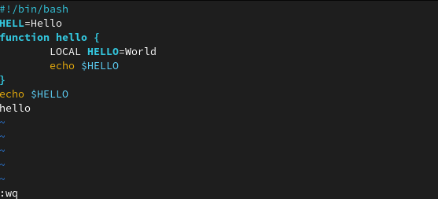

---
## Front matter
lang: ru-RU
title: Лабораторная работа №8
author: Матюшкин Денис Владимирович (НПИбд-02-21)
institute: RUDN University, Moscow, Russian Federation
date: 14.05.2022

## Formatting
toc: false
slide_level: 2
theme: metropolis
header-includes: 
 - \metroset{progressbar=frametitle,sectionpage=progressbar,numbering=fraction}
 - '\makeatletter'
 - '\beamer@ignorenonframefalse'
 - '\makeatother'
aspectratio: 43
section-titles: true
## Pandoc-crossref LaTeX customization
figureTitle: "Рис."
---

# Цель работы

- Познакомиться с операционной системой Linux. Получить практические навыки работы с редактором vi, установленным по умолчанию практически во всех дистрибутивах.

# Ход работы

# Задание 1. Создание нового файла с использованием vi

## 1. Создание каталога
- Создадим каталог с именем *~/work/os/lab06*. Перейдем в созданный каталог. Вызовим *vi* и создадим файл *hello.sh* (рис. [-@fig:001]). 

{ #fig:001 width=70% }

## 2. Редактор vi
- Нажмем клавишу **I** и вводим текст (рис. [-@fig:002]). 

{ #fig:002 width=70% }

## 3. Сохранение файла
- Нажмем клавишу *Esc* для перехода в командный режим после завершения ввода текста. После нажмем : для перехода в режим последней строки и внизу нашего экрана появится приглашение в виде двоеточия. После нажмем w (записать) и q (выйти), а затем нажмем клавишу *Enter* для сохранения нашего текста и завершения работы (рис. [-@fig:003]).

{ #fig:003 width=70% }

## 4. Проверка файла
- Сделаем файл исполняемым и вызовим его (рис. [-@fig:004]).

{ #fig:004 width=70% }

# Задание 2. Редактирование существующего файла

## 1. Редактор vi
- Вызовим наш файл *hello.sh* через редактор vi.

## 2. 
- Установим курсор в конец слова HELL второй строки. Перейдем в режим вставки и заменим на HELLO. Нажмем *Esc* для возврата в командный режим (рис. [-@fig:005]).
- Установим курсор на четвертую строку и сотрите слово LOCAL. Перейдем в режим вставки и наберем следующий текст: local, нажмем Esc для возврата в командный режим (рис. [-@fig:005]).

{ #fig:005 width=70% }

## 3. Редактирование файла
- Установим курсор на последней строке файла. Вставим после неё строку, содержащую следующий текст: echo $HELLO (рис. [-@fig:006]).

{ #fig:006 width=70% }

## 4. Редактирование файла
- Нажмем Esc для перехода в командный режим.
- Удалим последнюю строку. 
- Введем команду отмены изменений u для отмены последней команды (рис. [-@fig:007]).

## 5. Сохранение файла
- Введем символ : для перехода в режим последней строки. Запишем произведённые изменения и выйдем из vi (рис. [-@fig:007]).

{ #fig:007 width=70% }

## 6. Проверка файла
- Проверим текст файла на сохранение (рис. [-@fig:008]).

{ #fig:008 width=70% }

# Вывод

- В ходе этой лабораторной работы мы познакомились с операционной системой Linux. Получили практические навыки работы с редактором vi, установленным по умолчанию практически во всех дистрибутивах.

## {.standout}

Спасибо за внимание!

