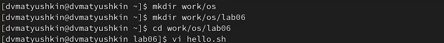
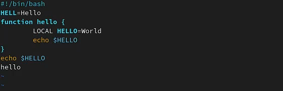
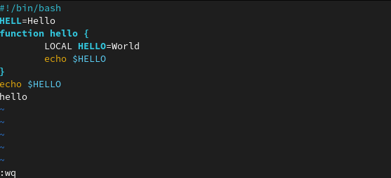
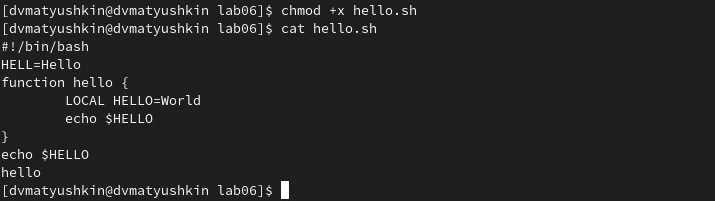
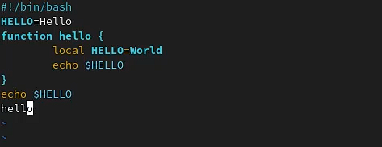
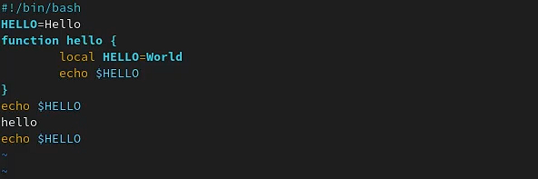
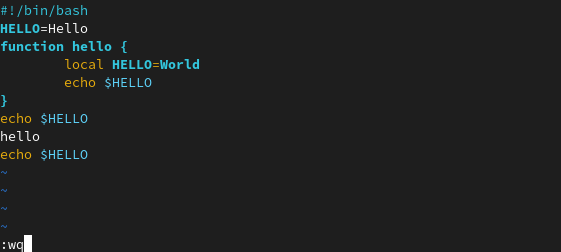
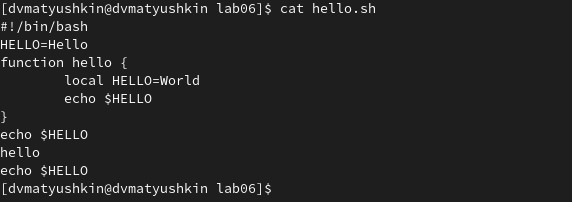

---
## Front matter
title: "Операционные системы"
subtitle: "Лабораторная работа №8"
author: "Матюшкин Денис Владимирович (НПИбд-02-21)"

## Generic otions
lang: ru-RU
toc-title: "Содержание"

## Bibliography
bibliography: bib/cite.bib
csl: pandoc/csl/gost-r-7-0-5-2008-numeric.csl

## Pdf output format
toc: true # Table of contents
toc-depth: 2
fontsize: 12pt
linestretch: 1.5
papersize: a4
documentclass: scrreprt
## I18n polyglossia
polyglossia-lang:
  name: russian
  options:
	- spelling=modern
	- babelshorthands=true
polyglossia-otherlangs:
  name: english
## I18n babel
babel-lang: russian
babel-otherlangs: english
## Fonts
mainfont: PT Serif
romanfont: PT Serif
sansfont: PT Sans
monofont: PT Mono
mainfontoptions: Ligatures=TeX
romanfontoptions: Ligatures=TeX
sansfontoptions: Ligatures=TeX,Scale=MatchLowercase
monofontoptions: Scale=MatchLowercase,Scale=0.9
## Biblatex
biblatex: true
biblio-style: "gost-numeric"
biblatexoptions:
  - parentracker=true
  - backend=biber
  - hyperref=auto
  - language=auto
  - autolang=other*
  - citestyle=gost-numeric
## Pandoc-crossref LaTeX customization
figureTitle: "Рис."
tableTitle: "Таблица"
listingTitle: "Листинг"
lofTitle: "Список иллюстраций"
lotTitle: "Список таблиц"
lolTitle: "Листинги"
## Misc options
indent: true
header-includes:
  - \usepackage{indentfirst}
  - \usepackage{float} # keep figures where there are in the text
  - \floatplacement{figure}{H} # keep figures where there are in the text
---

# Цель работы

- Познакомиться с операционной системой Linux. Получить практические навыки работы с редактором vi, установленным по умолчанию практически во всех дистрибутивах.

# Ход работы

## Задание 1. Создание нового файла с использованием vi

1. Создадим каталог с именем *~/work/os/lab06*. Перейдем в созданный каталог. Вызовим *vi* и создадим файл *hello.sh* (рис. [-@fig:001]). 

{ #fig:001 width=100% }

2. Нажмем клавишу **I** и вводим текст (рис. [-@fig:002]). 

{ #fig:002 width=100% }

3. Нажмем клавишу *Esc* для перехода в командный режим после завершения ввода текста. После нажмем : для перехода в режим последней строки и внизу нашего экрана появится приглашение в виде двоеточия. После нажмем w (записать) и q (выйти), а затем нажмем клавишу *Enter* для сохранения нашего текста и завершения работы (рис. [-@fig:003]).

{ #fig:003 width=100% }

4. Сделаем файл исполняемым и вызовим его (рис. [-@fig:004]).

{ #fig:004 width=100% }

## Задание 2. Редактирование существующего файла

1. Вызовим наш файл *hello.sh* через редактор vi.

2. Установим курсор в конец слова HELL второй строки. Перейдем в режим вставки и заменим на HELLO. Нажмем *Esc* для возврата в командный режим (рис. [-@fig:005]).

3. Установим курсор на четвертую строку и сотрите слово LOCAL. Перейдем в режим вставки и наберем следующий текст: local, нажмем Esc для возврата в командный режим (рис. [-@fig:005]).

{ #fig:005 width=100% }

4. Установим курсор на последней строке файла. Вставим после неё строку, содержащую следующий текст: echo $HELLO (рис. [-@fig:006]).

{ #fig:006 width=100% }

5. Нажмем Esc для перехода в командный режим.

6. Удалим последнюю строку.

7. Введем команду отмены изменений u для отмены последней команды (рис. [-@fig:007]).

8. Введем символ : для перехода в режим последней строки. Запишем произведённые изменения и выйдем из vi (рис. [-@fig:007]).

{ #fig:007 width=100% }

9. Проверим текст файла на сохранение (рис. [-@fig:008]).

{ #fig:008 width=100% }

# Контрольные вопросы

1. Дайте краткую характеристику режимам работы редактора vi.
– командный режим — предназначен для ввода команд редактирования и навигации по редактируемому файлу;
– режим вставки — предназначен для ввода содержания редактируемого файла;
– режим последней (или командной) строки — используется для записи изменений в файл и выхода из редактора.
2. Как выйти из редактора, не сохраняя произведённые изменения? 
Команда q (q!)
3. Назовите и дайте краткую характеристику командам позиционирования. 
 -0  - переход в начало строки; -$  - переход в конец строки;
 -G - переход в конец файла; -nG - переход на строку с номером n.
4. Что для редактора vi является словом? 
При использовании прописных W и B под разделителями понимаются только пробел, табуляция и возврат каретки. При использовании строчных w и b под разделителями понимаются также любые знаки пунктуации.
5. Каким образом из любого места редактируемого файла перейти в начало (конец) файла? 
Нажать G
6. Назовите и дайте краткую характеристику основным группам команд редактирования. 
Вставка/удаление текста, строки
Отмена и повтор произведённых изменений
Копирование текста в буфер
Замена текста
Поиск текста

7. Необходимо заполнить строку символами $. Каковы ваши действия? 
Ответ: c$ $
8. Как отменить некорректное действие, связанное с процессом редактирования?
Нажать клавишу u
9. Назовите и дайте характеристику основным группам команд режима последней строки. 
Копирование и перемещение текста. Запись в файл и выход из редактора
Опции редактора vi позволяют настроить рабочую среду. Для задания опций используется команда set. Если вы хотите отказаться от использования опции, то в команде set перед именем опции надо поставить no.
10. Как определить, не перемещая курсора, позицию, в которой заканчивается строка? 
Использовать клавишу "$"
11. Выполните анализ опций редактора vi (сколько их, как узнать их назначение и т.д.). 
–  set all — вывести полный список опций;
–  set nu — вывести номера строк;
–  set list — вывести невидимые символы;
–  set ic — не учитывать при поиске, является ли символ прописным или строчным.
12. Как определить режим работы редактора vi? 
По состоянию командной строки (видна ли она)
13. Командный режим, режим вставки и режим последней все они взаимосвязаны.

# Вывод

- В ходе этой лабораторной работы мы познакомились с операционной системой Linux. Получили практические навыки работы с редактором vi, установленным по умолчанию практически во всех дистрибутивах.
