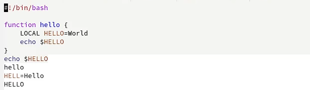
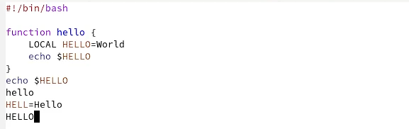
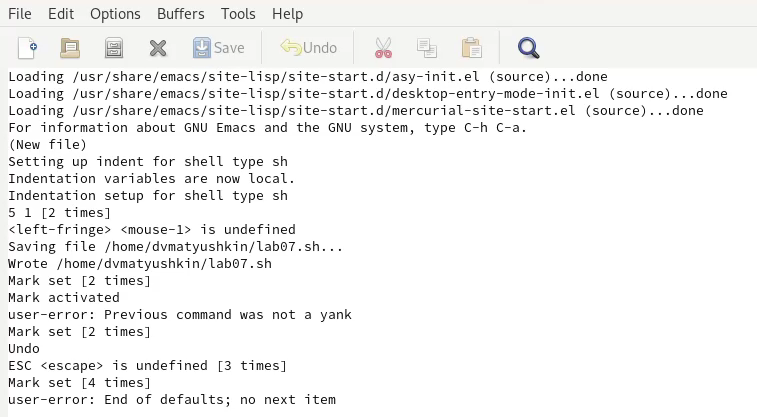
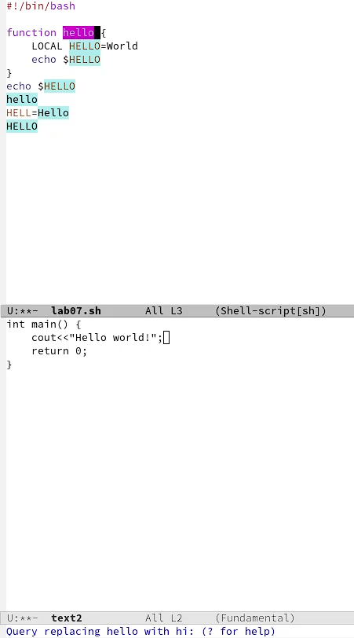
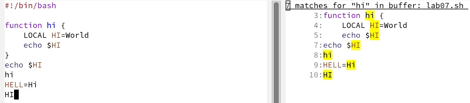

---
## Front matter
lang: ru-RU
title: Лабораторная работа №9
author: Матюшкин Денис Владимирович (НПИбд-02-21)
institute: RUDN University, Moscow, Russian Federation
date: 17.05.2022

## Formatting
toc: false
slide_level: 2
theme: metropolis
header-includes: 
 - \metroset{progressbar=frametitle,sectionpage=progressbar,numbering=fraction}
 - '\makeatletter'
 - '\beamer@ignorenonframefalse'
 - '\makeatother'
aspectratio: 43
section-titles: true
## Pandoc-crossref LaTeX customization
figureTitle: "Рис."
---

# Цель работы

- Познакомиться с операционной системой Linux. Получить практические навыки работы с редактором Emacs.

# Ход работы

## 1. Знакомство с emacs
- Откроем *emacs*, предварительно его скачав (рис. [-@fig:001]). 

{ #fig:001 width=70% }

## 2. Создание файла
- Создадим файл *lab07.sh* с помощью комбинации Ctrl-x Ctrl-f и наберем текст (рис. [-@fig:002]). 

{ #fig:002 width=70% }

## 3. Сохранение созданного файла
- Сохраним файл с помощью комбинации Ctrl-x Ctrl-s.

## 4. Изучение комбинации клавиш для редактрования
- Проделаем с текстом стандартные процедуры редактирования, каждое действие должно осуществляться комбинацией клавиш:

## 4.1) Вырезжем одной командой целую строку (C-k) и вставим эту строку в конец файла (C-y) (рис. [-@fig:003]).

{ #fig:003 width=70% }

## 4.3) Выделим область текста (C-space) (рис. [-@fig:004]).

{ #fig:004 width=70% }

## 4.4) Скопируем область в буфер обмена (M-w) и вставим область в конец файла (рис. [-@fig:005]).

{ #fig:005 width=70% }

## 4.5) Вновь выделим эту область и на этот раз вырезим её (C-w) (рис. [-@fig:006]).

{ #fig:006 width=70% }

## 4.6) Отменим последнее действие (C-/) (рис. [-@fig:007]).

{ #fig:007 width=70% }

## 5. Изучение комбинации клавиш для перемещения курсора
- Научимся использовать команды по перемещению курсора:

## 5.1 Переместим курсор в начало строки (C-a) (рис. [-@fig:008]).

{ #fig:008 width=70% }

## 5.2 Переместим курсор в конец строки (C-e) (рис. [-@fig:009]).

{ #fig:009 width=70% }

## 5.3 Переместим курсор в начало буфера (M-<) (рис. [-@fig:010]).

{ #fig:010 width=70% }

## 5.4 Переместим курсор в конец буфера (M->) (рис. [-@fig:011]).

{ #fig:011 width=70% }

## 6. Изучение комбинации клавиш для управлениями буферами
- Научимся управлять буферами:

## 6.1 Выведим список активных буферов на экран (C-x C-b) (рис. [-@fig:012]).

{ #fig:012 width=70% }

## 6.2 Переместимся во вновь открытое окно *(C-x) o* со списком открытых буферов и переключимся на буфер *Messages* (рис. [-@fig:013]).

{ #fig:013 width=70% }

- 6.3 Закроем это окно (C-x 0).

## 6.4 Теперь вновь переключимся между буферами, но уже без вывода их списка на экран (C-x b). Откроем тот же буфер *Messages* (рис. [-@fig:014]).

{ #fig:014 width=70% }

## 7. Изучение комбинации клавиш для управлениями окнами
- Научимся управлять окнами:

## 7.1 Поделим фрейм на 4 части: разделим фрейм на два окна по вертикали (C-x 3), а затем каждое из этих окон на две части по горизонтали (C-x 2) (рис. [-@fig:015]).

{ #fig:015 width=70% }

## 7.2 Введение текста
- В каждом из четырёх созданных окон откроем новый буфер (файл) и введем несколько строк текста (рис. [-@fig:015]).
 
## 8. Изучение комбинации клавиш для работ с режимами поиска
- Рассмотрим режимы поиска:

## 8.1 Переключимся в режим поиска (C-s) и найдем несколько слов, присутствующих в тексте (рис. [-@fig:016]).

{ #fig:016 width=70% }

- 8.2 Переключаемся между результатами поиска, нажимая C-s.

- 8.3 Выйдем из режима поиска, нажав C-g.

## 8.4 Перейдем в режим поиска и замены (M-%), введем текст, который следует найти и заменить, нажмем Enter , затем введем текст для замены. После того как будут подсвечены результаты поиска, нажмем ! для подтверждения замены (рис. [-@fig:017] и рис. [-@fig:018]).

{ #fig:017 width=50% }

## 8.4 

{ #fig:018 width=70% }

## 8.5 Испробуем другой режим поиска, нажав *M-s o* (рис. [-@fig:019]). 

{ #fig:019 width=70% }

# Вывод

- В ходе этой лабораторной работы мы познакомились с операционной системой Linux. Получили практические навыки работы с редактором Emacs.

## {.standout}

Спасибо за внимание!

