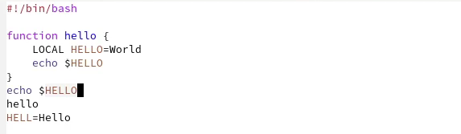

---
## Front matter
title: "Операционные системы"
subtitle: "Лабораторная работа №9"
author: "Матюшкин Денис Владимирович (НПИбд-02-21)"

## Generic otions
lang: ru-RU
toc-title: "Содержание"

## Bibliography
bibliography: bib/cite.bib
csl: pandoc/csl/gost-r-7-0-5-2008-numeric.csl

## Pdf output format
toc: true # Table of contents
toc-depth: 2
fontsize: 12pt
linestretch: 1.5
papersize: a4
documentclass: scrreprt
## I18n polyglossia
polyglossia-lang:
  name: russian
  options:
	- spelling=modern
	- babelshorthands=true
polyglossia-otherlangs:
  name: english
## I18n babel
babel-lang: russian
babel-otherlangs: english
## Fonts
mainfont: PT Serif
romanfont: PT Serif
sansfont: PT Sans
monofont: PT Mono
mainfontoptions: Ligatures=TeX
romanfontoptions: Ligatures=TeX
sansfontoptions: Ligatures=TeX,Scale=MatchLowercase
monofontoptions: Scale=MatchLowercase,Scale=0.9
## Biblatex
biblatex: true
biblio-style: "gost-numeric"
biblatexoptions:
  - parentracker=true
  - backend=biber
  - hyperref=auto
  - language=auto
  - autolang=other*
  - citestyle=gost-numeric
## Pandoc-crossref LaTeX customization
figureTitle: "Рис."
tableTitle: "Таблица"
listingTitle: "Листинг"
lofTitle: "Список иллюстраций"
lotTitle: "Список таблиц"
lolTitle: "Листинги"
## Misc options
indent: true
header-includes:
  - \usepackage{indentfirst}
  - \usepackage{float} # keep figures where there are in the text
  - \floatplacement{figure}{H} # keep figures where there are in the text
---

# Цель работы

- Познакомиться с операционной системой Linux. Получить практические навыки работы с редактором Emacs.

# Ход работы

1. Откроем *emacs*, предварительно его скачав (рис. [-@fig:001]). 

{ #fig:001 width=100% }

2. Создадим файл *lab07.sh* с помощью комбинации Ctrl-x Ctrl-f и наберем текст (рис. [-@fig:002]). 

{ #fig:002 width=100% }

3. Сохраним файл с помощью комбинации Ctrl-x Ctrl-s.

4. Проделаем с текстом стандартные процедуры редактирования, каждое действие должно осуществляться комбинацией клавиш:  

4.1) Вырезжем одной командой целую строку (C-k) (рис. [-@fig:003]).  

4.2) Вставим эту строку в конец файла (C-y) (рис. [-@fig:003]).

{ #fig:003 width=100% }

4.3) Выделим область текста (C-space) (рис. [-@fig:004]).

{ #fig:004 width=100% }

4.4) Скопируем область в буфер обмена (M-w) и вставим область в конец файла (рис. [-@fig:005]).

{ #fig:005 width=100% }

4.5) Вновь выделим эту область и на этот раз вырезим её (C-w) (рис. [-@fig:006]).

{ #fig:006 width=100% }

4.6) Отменим последнее действие (C-/) (рис. [-@fig:007]).

{ #fig:007 width=100% }

5. Научимся использовать команды по перемещению курсора:  

5.1 Переместим курсор в начало строки (C-a) (рис. [-@fig:008]).

{ #fig:008 width=100% }

5.2 Переместим курсор в конец строки (C-e) (рис. [-@fig:009]).

{ #fig:009 width=100% }

5.3 Переместим курсор в начало буфера (M-<) (рис. [-@fig:010]).

{ #fig:010 width=100% }

5.4 Переместим курсор в конец буфера (M->) (рис. [-@fig:011]).

{ #fig:011 width=100% }

6. Управление буферами:  

6.1 Выведим список активных буферов на экран (C-x C-b) (рис. [-@fig:012]).

{ #fig:012 width=100% }

6.2 Переместимся во вновь открытое окно *(C-x) o* со списком открытых буферов и переключимся на буфер *Messages* (рис. [-@fig:013]).

{ #fig:013 width=100% }

6.3 Закроем это окно (C-x 0).

6.4 Теперь вновь переключимся между буферами, но уже без вывода их списка на экран (C-x b). Откроем тот же буфер *Messages* (рис. [-@fig:014]).

{ #fig:014 width=100% }

7. Управление окнами:  

7.1 Поделим фрейм на 4 части: разделим фрейм на два окна по вертикали (C-x 3), а затем каждое из этих окон на две части по горизонтали (C-x 2) (рис. [-@fig:015]).

{ #fig:015 width=100% }

7.2 В каждом из четырёх созданных окон откроем новый буфер (файл) и введем несколько строк текста (рис. [-@fig:015]).
 
8. Режим поиска:  

8.1 Переключимся в режим поиска (C-s) и найдем несколько слов, присутствующих в тексте (рис. [-@fig:016]).

{ #fig:016 width=100% }

8.2 Переключаемся между результатами поиска, нажимая C-s.  

8.3 Выйдем из режима поиска, нажав C-g.  

8.4 Перейдем в режим поиска и замены (M-%), введем текст, который следует найти и заменить, нажмем Enter , затем введем текст для замены. После того как будут подсвечены результаты поиска, нажмем ! для подтверждения замены (рис. [-@fig:017] и рис. [-@fig:018]).

{ #fig:017 width=100% }

{ #fig:018 width=100% }

8.5 Испробуем другой режим поиска, нажав *M-s o* (рис. [-@fig:019]). В отличии от обычного режима создается отдельное окно со строками, где есть слово, которое мы ввели для поиска. Также можно быстро переходить по строкам через клик.

{ #fig:019 width=100% }

# Контрольные вопросы

**1. Кратко охарактеризуйте редактор emacs.**   
Emacs представляет собой мощный экранный редактор текста, написанный на языке высокого уровня Elisp.

**2. Какие особенности данного редактора могут сделать его сложным для освоения новичком?**  
Для новичка может быть трудно сразу привыкнуть к тому, что в редакторе в основном используются комбинации клавиш.

**3. Своими словами опишите, что такое буфер и окно в терминологии emacs’а.**  
Буфер - объект, который представляет какой-то текст.  
Окно - прямоугольная область фрейма, отображающая один из буферов.

**4. Можно ли открыть больше 10 буферов в одном окне?**  
Да, можно.

**5. Какие буферы создаются по умолчанию при запуске emacs?**  
Буферы по умолчанию: GNU Emacs, scratch, Messages, Compile-Log, Quail Completions

**6. Какие клавиши вы нажмёте, чтобы ввести следующую комбинацию C-c | и C-c C-|?**  
Ответ: ctrl-f, ctrl-x

**7. Как поделить текущее окно на две части?**  
Ответ: ctrl-x 3

**8. В каком файле хранятся настройки редактора emacs?**  
Ответ: (~/.emacs)

**9. Какую функцию выполняет клавиша (<-) и можно ли её переназначить?**  
Удаление текста. Да, можно, но для новичка это может показаться трудным.

**10. Какой редактор вам показался удобнее в работе vi или emacs? Поясните почему.**  
Emacs показался мне удобнее. Он более современен и функционален. Так же он гораздо более удобен в использовании. Нет случайных удалений текста как было с vi (из-за незнания). Интерфейс emacs приятнее и интуитивнее, команды более дружелюбны к пользователю.

# Вывод

- В ходе этой лабораторной работы мы познакомились с операционной системой Linux. Получили практические навыки работы с редактором Emacs.
