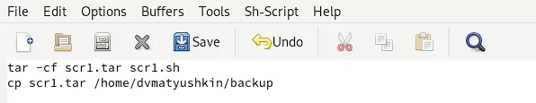
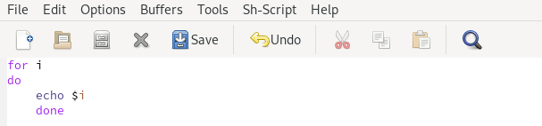
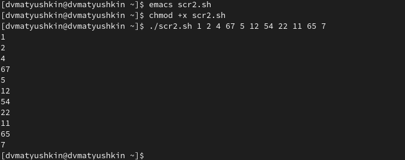
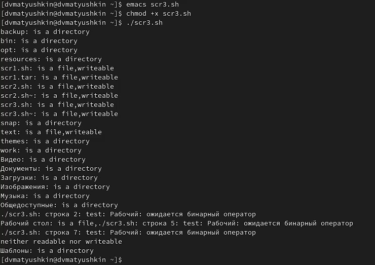
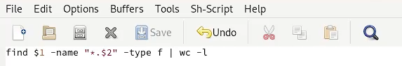

---
## Front matter
lang: ru-RU
title: Лабораторная работа №10
author: Матюшкин Денис Владимирович (НПИбд-02-21)
institute: RUDN University, Moscow, Russian Federation
date: 18.05.2022

## Formatting
toc: false
slide_level: 2
theme: metropolis
header-includes: 
 - \metroset{progressbar=frametitle,sectionpage=progressbar,numbering=fraction}
 - '\makeatletter'
 - '\beamer@ignorenonframefalse'
 - '\makeatother'
aspectratio: 43
section-titles: true
## Pandoc-crossref LaTeX customization
figureTitle: "Рис."
---

# Цель работы

- Изучить основы программирования в оболочке ОС UNIX/Linux. Научиться писать небольшие командные файлы.

# Ход работы

## 1.1. Командный файл копирования файла
-  Напишем скрипт, который при запуске будет делать резервную копию самого себя (то есть файла, в котором содержится его исходный код) в другую директорию backup в вашем домашнем каталоге. При этом файл архивируется архиваторов tar (рис. [-@fig:001]). 

{ #fig:001 width=70% }

## 1.2. Проверим работоспособность скрипта (рис. [-@fig:002]).
{ #fig:002 width=70% }

## 2.1. Командый файл вывода аргументов
- Напишем пример командного файла, обрабатывающего любое произвольное число аргументов командной строки, в том числе превышающее десять. Например, скрипт последовательно печатает значения всех переданных аргументов (рис. [-@fig:003]). Проверим работоспособность скрипта (рис. [-@fig:004]).

{ #fig:003 width=70% }

## 2.2. Проверим работоспособность скрипта (рис. [-@fig:004]).
{ #fig:004 width=70% }

## 3.1. Командный файл вывода информации о каталоге с доп. выводом
- Напишем командный файл — аналог команды ls (без использования самой этой команды и команды dir). Выдает информацию о нужном каталоге и выводит информацию о возможностях доступа к файлам этого каталога (рис. [-@fig:005]). Проверим работоспособность скрипта (рис. [-@fig:006]).

{ #fig:005 width=70% }

## 3.2. Проверим работоспособность скрипта (рис. [-@fig:006]).
{ #fig:006 width=70% }

## 4.1. Командный файл подсчета кол-во файлов формата
- Напишем командный файл, который получает в качестве аргумента командной строки формат файла (.txt, .doc, .jpg, .pdf и т.д.) и вычисляет количество таких файлов в указанной директории. Путь к директории также передаём в виде аргумента командной строки (рис. [-@fig:007]). Проверим работоспособность скрипта (рис. [-@fig:008]).

{ #fig:007 width=70% }

## 4.2. Проверим работоспособность скрипта (рис. [-@fig:008]).
{ #fig:008 width=70% }

# Вывод

- В ходе этой лабораторной работы мы изучили основы программирования в оболочке ОС UNIX/Linux. Научились писать небольшие командные файлы.

## {.standout}

Спасибо за внимание!

