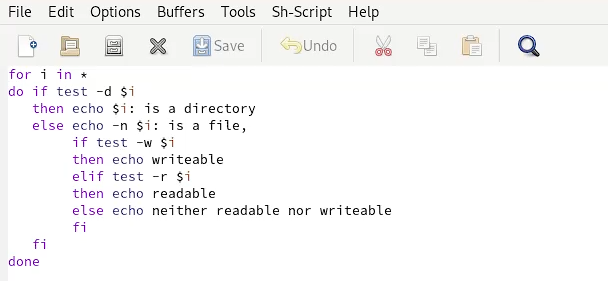

---
## Front matter
title: "Операционные системы"
subtitle: "Лабораторная работа №10"
author: "Матюшкин Денис Владимирович (НПИбд-02-21)"

## Generic otions
lang: ru-RU
toc-title: "Содержание"

## Bibliography
bibliography: bib/cite.bib
csl: pandoc/csl/gost-r-7-0-5-2008-numeric.csl

## Pdf output format
toc: true # Table of contents
toc-depth: 2
fontsize: 12pt
linestretch: 1.5
papersize: a4
documentclass: scrreprt
## I18n polyglossia
polyglossia-lang:
  name: russian
  options:
	- spelling=modern
	- babelshorthands=true
polyglossia-otherlangs:
  name: english
## I18n babel
babel-lang: russian
babel-otherlangs: english
## Fonts
mainfont: PT Serif
romanfont: PT Serif
sansfont: PT Sans
monofont: PT Mono
mainfontoptions: Ligatures=TeX
romanfontoptions: Ligatures=TeX
sansfontoptions: Ligatures=TeX,Scale=MatchLowercase
monofontoptions: Scale=MatchLowercase,Scale=0.9
## Biblatex
biblatex: true
biblio-style: "gost-numeric"
biblatexoptions:
  - parentracker=true
  - backend=biber
  - hyperref=auto
  - language=auto
  - autolang=other*
  - citestyle=gost-numeric
## Pandoc-crossref LaTeX customization
figureTitle: "Рис."
tableTitle: "Таблица"
listingTitle: "Листинг"
lofTitle: "Список иллюстраций"
lotTitle: "Список таблиц"
lolTitle: "Листинги"
## Misc options
indent: true
header-includes:
  - \usepackage{indentfirst}
  - \usepackage{float} # keep figures where there are in the text
  - \floatplacement{figure}{H} # keep figures where there are in the text
---

# Цель работы

- Изучить основы программирования в оболочке ОС UNIX/Linux. Научиться писать небольшие командные файлы.

# Ход работы

1. Напишем скрипт, который при запуске будет делать резервную копию самого себя (то есть файла, в котором содержится его исходный код) в другую директорию backup в вашем домашнем каталоге. При этом файл архивируется архиваторов tar (рис. [-@fig:001]). Проверим работоспособность скрипта (рис. [-@fig:002]).

{ #fig:001 width=100% }

{ #fig:002 width=100% }

2. Напишем пример командного файла, обрабатывающего любое произвольное число аргументов командной строки, в том числе превышающее десять. Например, скрипт последовательно печатает значения всех переданных аргументов (рис. [-@fig:003]). Проверим работоспособность скрипта (рис. [-@fig:004]).

{ #fig:003 width=100% }

{ #fig:004 width=100% }

3. Напишем командный файл — аналог команды ls (без использования самой этой команды и команды dir). Выдает информацию о нужном каталоге и выводит информацию о возможностях доступа к файлам этого каталога (рис. [-@fig:005]). Проверим работоспособность скрипта (рис. [-@fig:006]).

{ #fig:005 width=100% }

{ #fig:006 width=100% }

4. Напишем командный файл, который получает в качестве аргумента командной строки формат файла (.txt, .doc, .jpg, .pdf и т.д.) и вычисляет количество таких файлов в указанной директории. Путь к директории также передаём в виде аргумента командной строки (рис. [-@fig:007]). Проверим работоспособность скрипта (рис. [-@fig:008]).

{ #fig:007 width=100% }

{ #fig:008 width=100% }

# Контрольные вопросы

**1. Объясните понятие командной оболочки. Приведите примеры командных оболочек. Чем они отличаются?**  
Программа, позволяющая пользователю взаимодействовать с операционной системой компьютера.  
Оболочка Борна - стандартная командная оболочка UNIX/Linux, содержащая базовый, но при этом полный набор функций.  
С-оболочка - надстройка над оболочкой Борна, использующая С-подобный синтаксис команд с возможностью сохранения истории выполнения команд.  
Оболочка Корна - напоминает оболочку С, но операторы управления программой совместимы с операторами оболочки Борна.  
BASH - сокращение от Bourne Again Shell, в основе своей совмещает свойства оболочек С и Корна.

**2. Что такое POSIX?**  
Набор стандартов описания интерфейсов взаимодействия операционной системы и прикладных программ.

**3. Как определяются переменные и массивы в языке программирования bash?**

- Переменная/=значение.

- set  -A (переменная), (список значений)

**4. Каково назначение операторов let и read?**

- let - берет два операнда и присваивает их переменной.

- read - чтение значения переменных со стандартного ввода.

**5. Какие арифметические операции можно применять в языке программирования bash?**  
Операции логики, умножение, деление, сложение, вычитание.

**6. Что означает операция (( ))?**  
Условия оболочки bash.

**7. Какие стандартные имена переменных Вам известны?**  
PATH, IFS, MAIL, TERM, LOGNAME.

**8. Что такое метасимволы?**  
Символы ' < > * ? | \ " &, являются метасимволами и имеют для командного процессора отличный от обычных символом смысл (они технически влияют на поведение программы).

**9. Как экранировать метасимволы?**  
Экранирование может быть осуществлено с помощью предшествующего метасимволу символа \, который, в свою очередь, является метасимволом. Для экранирования группы метасимволов нужно заключить её в одинарные кавычки. Строка, заключённая в двойные кавычки, экранирует все метасимволы, кроме $, ' , \, ".

**10. Как создавать и запускать командные файлы?**  
    1. bash <командный_файл> [аргументы]  
    2. chmod +x <командный_файл>  
    3. ./командный_файл
    
**11. Как определяются функции в языке программирования bash?**  
Ключевое слово function <fun_name>{тело функции}

**12. Каким образом можно выяснить, является файл каталогом или обычным файлом?**  
– test -d file — истина, если file является каталогом, ложь - является файлом.

**13. Каково назначение команд set, typeset и unset?**  
Оболочка bash позволяет работать с массивами. Для создания массива используется команда set с флагом -A typeset является встроенной инструкцией  и предназначена для наложения ограничений на переменные.  
С помощью команды unset можно изъять переменную из программы.

**14. Как передаются параметры в командные файлы?**  
При вызове командного файла на выполнение параметры ему могут быть переданы точно таким же образом, как и выполняемой программе. С точки зрения командного файла эти параметры являются позиционными. Символ $ является метасимволом командного процессора. Он используется, в частности, для ссылки на параметры, точнее, для получения их значений в командном файле. В командный файл можно передать до девяти параметров. При использовании где-либо в командном файле комбинации символов $i, где 0 < i < 10, вместо неё будет осуществлена подстановка значения параметра с порядковым номером i, т.е. аргумента командного файла с порядковым номером i. Использование комбинации символов $0 приводит к подстановке вместо неё имени данного командного файла.

**15. Назовите специальные переменные языка bash и их назначение.**

- $* — отображается вся командная строка или параметры оболочки; 

- $? — код завершения последней выполненной команды; 

- $$ — уникальный идентификатор процесса, в рамках которого выполняется командный процессор;

- $! — номер процесса, в рамках которого выполняется последняя вызванная на выполнение в командном режиме команда;
 
- $- — значение флагов командного процессора;

- ${#*} — возвращает целое число — количество слов, которые были результатом $*;

- ${#name} — возвращает целое значение длины строки в переменной name;

- ${name[n]} — обращение к n-му элементу массива; 

- ${name[*]} — перечисляет все элементы массива, разделённые пробелом;

- ${name[@]} — то же самое, но позволяет учитывать символы пробелы в самих переменных; 

- ${name:-value} — если значение переменной name не определено, то оно будет заменено на указанное value;

- ${name:value} — проверяется факт существования переменной;

- ${name=value} — если name не определено, то ему присваивается значение value;

- ${name?value} — останавливает выполнение, если имя переменной не определено, и выводит value как сообщение об ошибке; 

- ${name+value} — это выражение работает противоположно ${name-value}. Если переменная определена, то подставляется value; 

- ${name#pattern} — представляет значение переменной name с удалённым самым коротким левым образцом (pattern); 

- ${#name[*]} и ${#name[@]} — эти выражения возвращают количество элементов в массиве name.

# Вывод

- В ходе этой лабораторной работы мы изучили основы программирования в оболочке ОС UNIX/Linux. Научились писать небольшие командные файлы.
