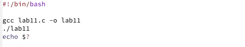
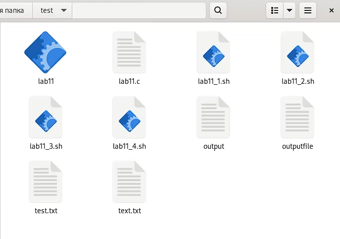

---
## Front matter
lang: ru-RU
title: Лабораторная работа №11
author: Матюшкин Денис Владимирович (НПИбд-02-21)
institute: RUDN University, Moscow, Russian Federation
date: 26.05.2022

## Formatting
toc: false
slide_level: 2
theme: metropolis
header-includes: 
 - \metroset{progressbar=frametitle,sectionpage=progressbar,numbering=fraction}
 - '\makeatletter'
 - '\beamer@ignorenonframefalse'
 - '\makeatother'
aspectratio: 43
section-titles: true
## Pandoc-crossref LaTeX customization
figureTitle: "Рис."
---

# Цель работы

- Изучить основы программирования в оболочке ОС UNIX. Научится писать более сложные командные файлы с использованием логических управляющих конструкций и циклов.

# Ход работы

## 1.1. Командный файл, который анализирует командную строку
- Используя команды getopts grep, напишем командный файл, который анализирует командную строку с ключами:  
– -iinputfile — прочитать данные из указанного файла;  
– -ooutputfile — вывести данные в указанный файл;  
– -pшаблон — указать шаблон для поиска;  
– -C — различать большие и малые буквы;  
– -n — выдавать номера строк.  
а затем ищет в указанном файле нужные строки, определяемые ключом -p (рис. [-@fig:001]). Проверим написанный командный файл (рис. [-@fig:002]).

{ #fig:001 width=40% }

## 1.2. Проверка
{ #fig:002 width=70% }

## 2.1. Программа на Си
- Напишем на языке Си программу, которая вводит число и определяет, является ли оно больше нуля, меньше нуля или равно нулю. Затем программа завершается с помощью функции exit(n), передавая информацию в о коде завершения в оболочку. Командный файл вызывает эту программу и, проанализировав с помощью команды $?, выдает сообщение о том, какое число было введено (рис. [-@fig:003] и рис. [-@fig:004]). Проверим написанный командный файл (рис. [-@fig:005]).

{ #fig:003 width=70% }

## 2.2. Проверка
{ #fig:004 width=70% }

{ #fig:005 width=70% }

## 3.1. Командный файл, который создает указанное число файлов
- Напишем командный файл, создающий указанное число файлов, пронумерованных последовательно от 1 до N (например 1.tmp, 2.tmp, 3.tmp,4.tmp и т.д.). Число файлов, которые создается, передаётся в аргументы командной строки. Этот же командный файл удаляет все созданные им файлы (если они существуют) (рис. [-@fig:006]). Проверим написанный командный файл (рис. [-@fig:007]).

{ #fig:006 width=70% }

## 3.2. Проверка
{ #fig:007 width=70% }

## 4.1. Командный файл архиватор
- Напишем командный файл, который с помощью команды tar запаковывает в архив все файлы в указанной директории. Модифицируем его так, чтобы запаковывались только те файлы, которые были изменены менее недели тому назад (используем команду find) (рис. [-@fig:008]). Проверим написанный командный файл (рис. [-@fig:009] и рис. [-@fig:010]).

{ #fig:008 width=70% }

## 4.2. Проверка
{ #fig:009 width=70% }

{ #fig:010 width=30% }

# Вывод

- В ходе этой лабораторной работы мы изучили основы программирования в оболочке ОС UNIX. Научились писать более сложные командные файлы с использованием логических управляющих конструкций и циклов.

## {.standout}

Спасибо за внимание!

