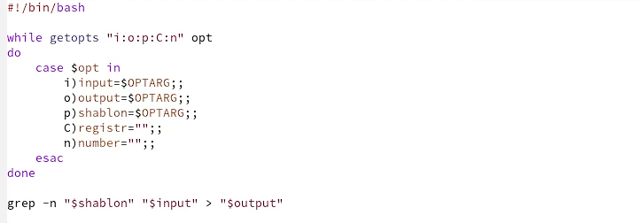
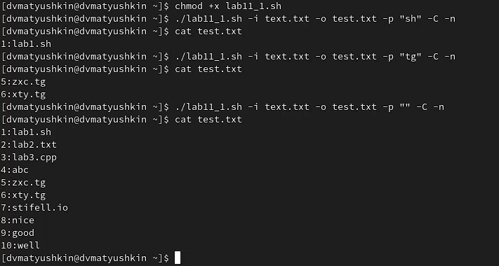
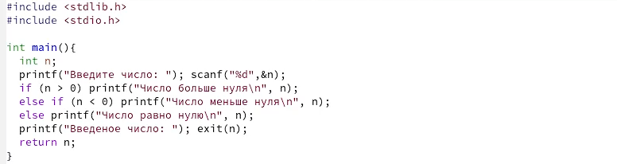
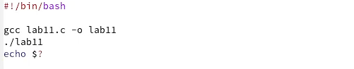
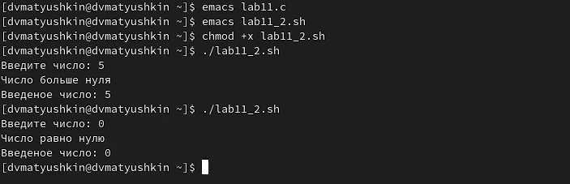
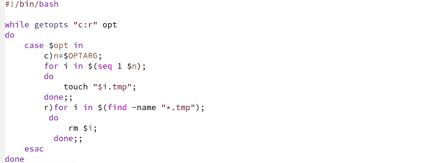
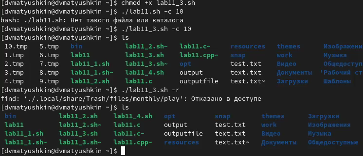
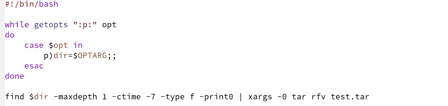
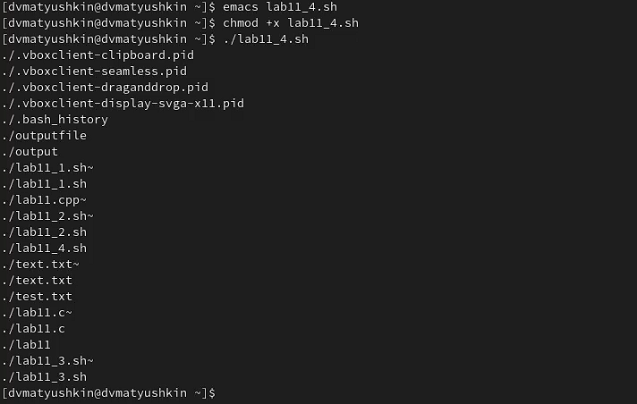
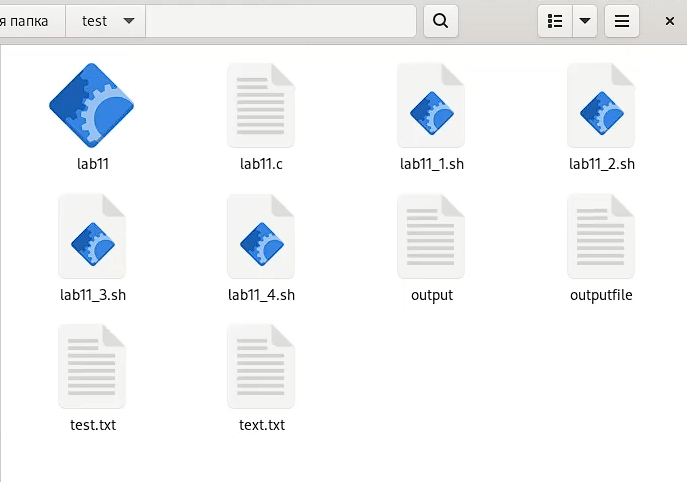

---
## Front matter
title: "Операционные системы"
subtitle: "Лабораторная работа №11"
author: "Матюшкин Денис Владимирович (НПИбд-02-21)"

## Generic otions
lang: ru-RU
toc-title: "Содержание"

## Bibliography
bibliography: bib/cite.bib
csl: pandoc/csl/gost-r-7-0-5-2008-numeric.csl

## Pdf output format
toc: true # Table of contents
toc-depth: 2
fontsize: 12pt
linestretch: 1.5
papersize: a4
documentclass: scrreprt
## I18n polyglossia
polyglossia-lang:
  name: russian
  options:
	- spelling=modern
	- babelshorthands=true
polyglossia-otherlangs:
  name: english
## I18n babel
babel-lang: russian
babel-otherlangs: english
## Fonts
mainfont: PT Serif
romanfont: PT Serif
sansfont: PT Sans
monofont: PT Mono
mainfontoptions: Ligatures=TeX
romanfontoptions: Ligatures=TeX
sansfontoptions: Ligatures=TeX,Scale=MatchLowercase
monofontoptions: Scale=MatchLowercase,Scale=0.9
## Biblatex
biblatex: true
biblio-style: "gost-numeric"
biblatexoptions:
  - parentracker=true
  - backend=biber
  - hyperref=auto
  - language=auto
  - autolang=other*
  - citestyle=gost-numeric
## Pandoc-crossref LaTeX customization
figureTitle: "Рис."
tableTitle: "Таблица"
listingTitle: "Листинг"
lofTitle: "Список иллюстраций"
lotTitle: "Список таблиц"
lolTitle: "Листинги"
## Misc options
indent: true
header-includes:
  - \usepackage{indentfirst}
  - \usepackage{float} # keep figures where there are in the text
  - \floatplacement{figure}{H} # keep figures where there are in the text
---

# Цель работы

- Изучить основы программирования в оболочке ОС UNIX. Научится писать более сложные командные файлы с использованием логических управляющих конструкций и циклов.

# Ход работы

1. Используя команды getopts grep, напишем командный файл, который анализирует командную строку с ключами:  
– -iinputfile — прочитать данные из указанного файла;  
– -ooutputfile — вывести данные в указанный файл;  
– -pшаблон — указать шаблон для поиска;  
– -C — различать большие и малые буквы;  
– -n — выдавать номера строк.  
а затем ищет в указанном файле нужные строки, определяемые ключом -p (рис. [-@fig:001]). Проверим написанный командный файл (рис. [-@fig:002]).

{ #fig:001 width=100% }

{ #fig:002 width=100% }

2. Напишем на языке Си программу, которая вводит число и определяет, является ли оно больше нуля, меньше нуля или равно нулю. Затем программа завершается с помощью функции exit(n), передавая информацию в о коде завершения в оболочку. Командный файл вызывает эту программу и, проанализировав с помощью команды $?, выдает сообщение о том, какое число было введено (рис. [-@fig:003] и рис. [-@fig:004]). Проверим написанный командный файл (рис. [-@fig:005]).

{ #fig:003 width=100% }

{ #fig:004 width=100% }

{ #fig:005 width=100% }

3. Напишем командный файл, создающий указанное число файлов, пронумерованных последовательно от 1 до N (например 1.tmp, 2.tmp, 3.tmp,4.tmp и т.д.). Число файлов, которые создается, передаётся в аргументы командной строки. Этот же командный файл удаляет все созданные им файлы (если они существуют) (рис. [-@fig:006]). Проверим написанный командный файл (рис. [-@fig:007]).

{ #fig:006 width=100% }

{ #fig:007 width=100% }

4. Напишем командный файл, который с помощью команды tar запаковывает в архив все файлы в указанной директории. Модифицируем его так, чтобы запаковывались только те файлы, которые были изменены менее недели тому назад (используем команду find) (рис. [-@fig:008]). Проверим написанный командный файл (рис. [-@fig:009] и рис. [-@fig:010]).

{ #fig:008 width=100% }

{ #fig:009 width=100% }

{ #fig:010 width=100% }

# Контрольные вопросы

**1. Каково предназначение команды getopts?**  
Команда getopts используется для разбора параметров и проверки опций на допустимость.  Осуществляет синтаксический анализ командной строки, выделяя флаги, и используется для объявления переменных.

**2. Какое отношение метасимволы имеют к генерации имён файлов?**  
Метасимволы отвечают за параметры выдачи файлов, а следовательно могут вносить иной смысл, нежели прямое значение как символа. Например:  
    • * — соответствует произвольной, в том числе и пустой строке;  
    • ? — соответствует любому одному символу;  
    • [c1-c1] — соответствует любому символу, лексикографически на ходящемуся между символами c1 и с2.  
    • echo * — выведет имена всех файлов текущего каталога, что представляет собой простейший аналог команды ls;  
    • ls *.c — выведет все файлы с последними двумя символами, равными .c.  
    • echo prog.? — выдаст все файлы, состоящие из пяти или шести символов, первыми пятью символами которых являются prog. .  
    • [a-z]* — соответствует произвольному имени файла в текущем каталоге, начинающемуся с любой строчной буквы латинского алфавита.

**3. Какие операторы управления действиями вы знаете?**  
Ответ: for, break , while, until, case ,continue, if, else.

**4. Какие операторы используются для прерывания цикла?**  
Ответ: break

**5. Для чего нужны команды false и true?**  
Это логические значения (0 и 1 соответственно). Можно использовать как более понятный вариант.

6. Ответ: условие существование файла man$s/$i.$s

**7. Объясните различия между конструкциями while и until.**  
while - проверка условия затем выполнение тела цикла.  
until - выполнение тела цикла затем проверка условия.

# Вывод

- В ходе этой лабораторной работы мы изучили основы программирования в оболочке ОС UNIX. Научились писать более сложные командные файлы с использованием логических управляющих конструкций и циклов.
