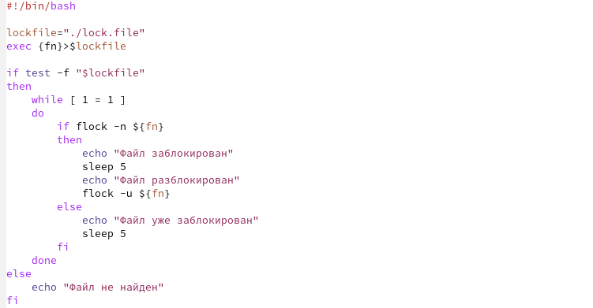
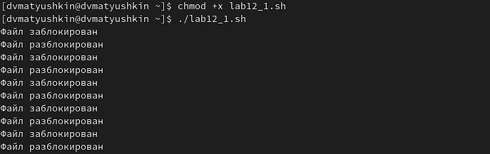
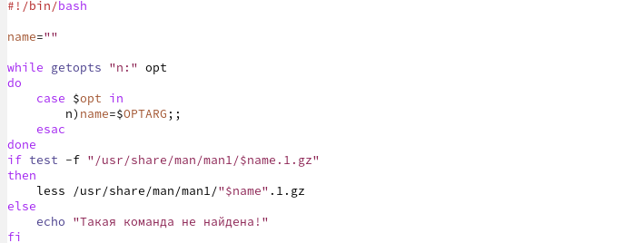
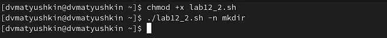
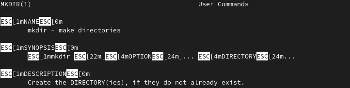
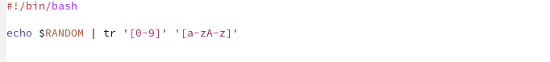
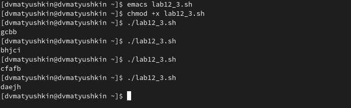

---
## Front matter
lang: ru-RU
title: Лабораторная работа №12
author: Матюшкин Денис Владимирович (НПИбд-02-21)
institute: RUDN University, Moscow, Russian Federation
date: 26.05.2022

## Formatting
toc: false
slide_level: 2
theme: metropolis
header-includes: 
 - \metroset{progressbar=frametitle,sectionpage=progressbar,numbering=fraction}
 - '\makeatletter'
 - '\beamer@ignorenonframefalse'
 - '\makeatother'
aspectratio: 43
section-titles: true
## Pandoc-crossref LaTeX customization
figureTitle: "Рис."
---

# Цель работы

- Изучить основы программирования в оболочке ОС UNIX. Научиться писать более сложные командные файлы с использованием логических управляющих конструкций и циклов.

# Ход работы

## 1.1. Командный файл
- Напишем командный файл, реализующий упрощённый механизм семафоров. Командный файл в течение некоторого времени t1 дожидается освобождения ресурса, выдавая об этом сообщение, а дождавшись его освобождения, использует его в течение некоторого времени t2<>t1 (рис. [-@fig:001]). Проверим написанный командный файл (рис. [-@fig:002]).

{ #fig:001 width=70% }

## 1.2. Проверка
{ #fig:002 width=70% }

## 2.1. Команда man
-  Реализуем команду man с помощью командного файла. Изучим содержимое каталога /usr/share/man/man1. Командный файл получает в виде аргумента командной строки название команды и в виде результата выдает справку об этой команде или сообщение об отсутствии справки, если соответствующего файла нет в каталоге man1 (рис. [-@fig:003]). Проверим написанный командный файл (рис. [-@fig:004] и рис. [-@fig:005]).

{ #fig:003 width=70% }

## 2.2. Проверка
{ #fig:004 width=70% }

{ #fig:005 width=70% }

## 3.1. Random
- Используя встроенную переменную $RANDOM, напишем командный файл, генерирующий случайную последовательность букв латинского алфавита. Учтем, что $RANDOM выдаёт псевдослучайные числа в диапазоне от 0 до 32767 (рис. [-@fig:006]). Проверим написанный командный файл (рис. [-@fig:007]).

{ #fig:006 width=70% }

## 3.2. Проверка
{ #fig:007 width=70% }

# Вывод

- В ходе этой лабораторной работы мы изучили основы программирования в оболочке ОС UNIX. Научились писать более сложные командные файлы с использованием логических управляющих конструкций и циклов.

## {.standout}

Спасибо за внимание!

