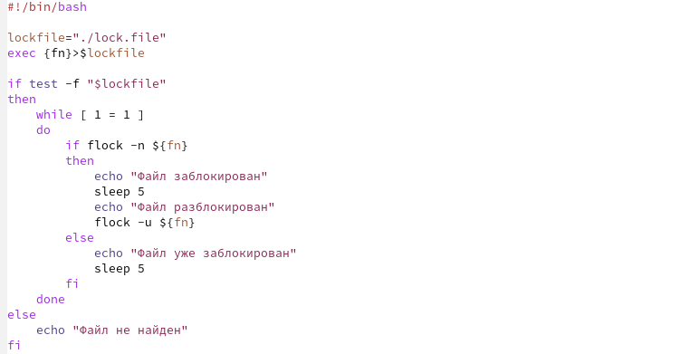
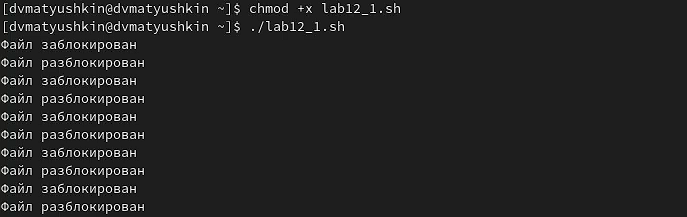

---
## Front matter
title: "Операционные системы"
subtitle: "Лабораторная работа №12"
author: "Матюшкин Денис Владимирович (НПИбд-02-21)"

## Generic otions
lang: ru-RU
toc-title: "Содержание"

## Bibliography
bibliography: bib/cite.bib
csl: pandoc/csl/gost-r-7-0-5-2008-numeric.csl

## Pdf output format
toc: true # Table of contents
toc-depth: 2
fontsize: 12pt
linestretch: 1.5
papersize: a4
documentclass: scrreprt
## I18n polyglossia
polyglossia-lang:
  name: russian
  options:
	- spelling=modern
	- babelshorthands=true
polyglossia-otherlangs:
  name: english
## I18n babel
babel-lang: russian
babel-otherlangs: english
## Fonts
mainfont: PT Serif
romanfont: PT Serif
sansfont: PT Sans
monofont: PT Mono
mainfontoptions: Ligatures=TeX
romanfontoptions: Ligatures=TeX
sansfontoptions: Ligatures=TeX,Scale=MatchLowercase
monofontoptions: Scale=MatchLowercase,Scale=0.9
## Biblatex
biblatex: true
biblio-style: "gost-numeric"
biblatexoptions:
  - parentracker=true
  - backend=biber
  - hyperref=auto
  - language=auto
  - autolang=other*
  - citestyle=gost-numeric
## Pandoc-crossref LaTeX customization
figureTitle: "Рис."
tableTitle: "Таблица"
listingTitle: "Листинг"
lofTitle: "Список иллюстраций"
lotTitle: "Список таблиц"
lolTitle: "Листинги"
## Misc options
indent: true
header-includes:
  - \usepackage{indentfirst}
  - \usepackage{float} # keep figures where there are in the text
  - \floatplacement{figure}{H} # keep figures where there are in the text
---

# Цель работы

- Изучить основы программирования в оболочке ОС UNIX. Научиться писать более сложные командные файлы с использованием логических управляющих конструкций и циклов.

# Ход работы

1. Напишем командный файл, реализующий упрощённый механизм семафоров. Командный файл в течение некоторого времени t1 дожидается освобождения ресурса, выдавая об этом сообщение, а дождавшись его освобождения, использует его в течение некоторого времени t2<>t1, также выдавая информацию о том, что ресурс используется соответствующим командным файлом (процессом). Запустим командный файл в одном виртуальном терминале в фоновом режиме, перенаправив его вывод в другой (> /dev/tty#, где # — номер терминала куда перенаправляется вывод), в котором также запущен этот файл, но не фоновом, а в привилегированном режиме. Доработаем программу так, чтобы имелась возможность взаимодействия трёх и более процессов (рис. [-@fig:001]). Проверим написанный командный файл (рис. [-@fig:002]).

{ #fig:001 width=100% }

{ #fig:002 width=100% }

2. Реализуем команду man с помощью командного файла. Изучим содержимое каталога /usr/share/man/man1. В нем находятся архивы текстовых файлов, содержащих справку по большинству установленных в системе программ и команд. Каждый архив можно открыть командой less сразу же просмотрев содержимое справки. Командный файл получает в виде аргумента командной строки название команды и в виде результата выдает справку об этой команде или сообщение об отсутствии справки, если соответствующего файла нет в каталоге man1 (рис. [-@fig:003]). Проверим написанный командный файл (рис. [-@fig:004] и рис. [-@fig:005]).

{ #fig:003 width=100% }

{ #fig:004 width=100% }

{ #fig:005 width=100% }

3. Используя встроенную переменную $RANDOM, напишем командный файл, генерирующий случайную последовательность букв латинского алфавита. Учтем, что $RANDOM выдаёт псевдослучайные числа в диапазоне от 0 до 32767 (рис. [-@fig:006]). Проверим написанный командный файл (рис. [-@fig:007]).

{ #fig:006 width=100% }

{ #fig:007 width=100% }

# Контрольные вопросы

**1. Найдите синтаксическую ошибку в следующей строке: while [$1 != "exit"]**  
Ответ: $1. Так же между скобками должны быть пробелы. В противном случае скобки и рядом стоящие символы будут восприниматься как одно целое

**2. Как объединить (конкатенация) несколько строк в одну?**  
cat file.txt | xargs | sed ...

**3. Найдите информацию об утилите seq. Какими иными способами можно реализовать её функционал при программировании на bash?**  
seq - выдает последовательность чисел.  
Реализовать ее функционал можно командой:

```C++
for n in {1..5}  
do <КОМАНДА>  
done  
```

**4. Какой результат даст вычисление выражения $((10/3))?**  
Ответ: 3

**5. Укажите кратко основные отличия командной оболочки zsh от bash.**   
Zsh очень сильно упрощает работу. Но существуют различия. Например, в zsh после for обязательно вставлять пробел, нумерация массивов в zsh начинается с 1 (что не особо удобно на самом деле).  
Если вы собираетесь писать скрипт, который легко будет запускать множество разработчиков, то я рекомендуется Bash. Если скрипты вам не нужны - Zsh (более простая работа с файлами, например).  

**6. Проверьте, верен ли синтаксис данной конструкции for ((a=1; a <= LIMIT; a++))**  
Ответ: Верен.

**7. Сравните язык bash с какими-либо языками программирования. Какие преимущества у bash по сравнению с ними? Какие недостатки?**  
Bash позволяет очень легко работать с файловой системой без лишних конструкций (в отличи от обычного языка программирования). Но относительно обычных языков программирования bash очень сжат. Тот же Си имеет гораздо более широкие возможности для разработчика.

# Вывод

- В ходе этой лабораторной работы мы изучили основы программирования в оболочке ОС UNIX. Научились писать более сложные командные файлы с использованием логических управляющих конструкций и циклов.
