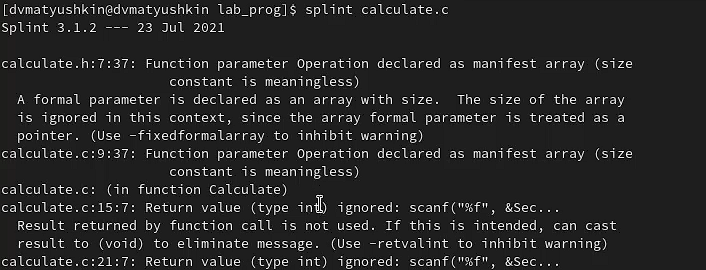

---
## Front matter
lang: ru-RU
title: Лабораторная работа №13
author: Матюшкин Денис Владимирович (НПИбд-02-21)
institute: RUDN University, Moscow, Russian Federation
date: 31.05.2022

## Formatting
toc: false
slide_level: 2
theme: metropolis
header-includes: 
 - \metroset{progressbar=frametitle,sectionpage=progressbar,numbering=fraction}
 - '\makeatletter'
 - '\beamer@ignorenonframefalse'
 - '\makeatother'
aspectratio: 43
section-titles: true
## Pandoc-crossref LaTeX customization
figureTitle: "Рис."
---

# Цель работы

- Приобрести простейшие навыки разработки, анализа, тестирования и отладки приложений в ОС типа UNIX/Linux на примере создания на языке программирования С калькулятора с простейшими функциями.

# Ход работы

## 1. Создание файлов
- В домашнем каталоге создадим подкаталог ~/work/os/lab_prog. Создадим в нём файлы: calculate.h, calculate.c, main.c (рис. [-@fig:001]).

{ #fig:001 width=70% }

## 2. Редактирование файлов
- Это будет примитивнейший калькулятор, способный складывать, вычитать, умножать и делить, возводить число в степень, брать квадратный корень, вычислять sin, cos, tan. При запуске он будет запрашивать первое число, операцию, второе число. После этого программа выведет результат и остановится. Реализация функций калькулятора в файле calculate.с (рис. [-@fig:002]). Интерфейсный файл calculate.h, описывающий формат вызова функции-калькулятора (рис. [-@fig:003]). Основной файл main.c, реализующий интерфейс пользователя к калькулятору (рис. [-@fig:004]).

## 2.1
{ #fig:002 width=50% }

## 2.2
{ #fig:003 width=50% }

{ #fig:004 width=50% }

## 3. Компиляция
- Выполним компиляцию программы посредством gcc (рис. [-@fig:005]).

{ #fig:005 width=70% }

## 4. Makefile
- Создадим Makefile со следующим содержанием (рис. [-@fig:006]). В этом файле мы создаем переменные CC, CFLAGS, LIBS. Инициализируем их. Создаем блоки, в которых прописываем какие команды будут выполняться. При этом подставляя значение нами созданных переменных.

##

{ #fig:006 width=70% }

## 5. Отладка
- С помощью gdb выполним отладку программы calcul (перед использованием gdb исправим Makefile) (рис. [-@fig:007]).

{ #fig:007 width=50% }

## 5.1. Запуск отладки
- Запустим отладчик GDB, загрузив в него программу для отладки (рис. [-@fig:008]).

{ #fig:008 width=70% }

## 5.2. Работа с отладкой
- Для запуска программы внутри отладчика введем команду run. Для постраничного (по 9 строк) просмотра исходного код используем команду list (рис. [-@fig:009]).

{ #fig:009 width=70% }

## 5.3. Работа с отладкой
- Для просмотра строк с 12 по 15 основного файла используем list с параметрами. Для просмотра определённых строк не основного файла используем list с параметрами (рис. [-@fig:010]).

{ #fig:010 width=70% }

## 5.4. Работа с отладкой
- Установим точку останова в файле calculate.c на строке номер 21. Выведем информацию об имеющихся в проекте точка останова (рис. [-@fig:011]).

{ #fig:011 width=70% }

## 5.5. Работа с отладкой
- Запустим программу внутри отладчика и убедимся, что программа остановится в момент прохождения точки останова (рис. [-@fig:012]). Отладчик выдаст следующую информацию:

```
#0 Calculate (Numeral=5, Operation=0x7fffffffd280 "-")
at calculate.c:21
#1 0x0000000000400b2b in main () at main.c:17
```
##

{ #fig:012 width=70% }

## 5.6. Работа с отладкой
- Посмотрим, чему равно на этом этапе значение переменной Numeral. Сравним с результатом вывода на экран после использования команды. Уберем точки останова (рис. [-@fig:013]).

{ #fig:013 width=70% }

## 6. Утилита splint
- С помощью утилиты splint проанализируем коды файлов calculate.c и main.c (рис. [-@fig:014] и рис. [-@fig:015]). Здесь мы можем увидеть что утилита splint выводит информацию о коде программы. Например то, что возвращаемое значение функции scanf() игнорируется .

{ #fig:014 width=50% }

## 

{ #fig:015 width=70% }

# Вывод

- В ходе этой лабораторной работы мы приобрели простейшие навыки разработки, анализа, тестирования и отладки приложений в ОС типа UNIX/Linux на примере создания на языке программирования С калькулятора с простейшими функциями.

## {.standout}

Спасибо за внимание!


