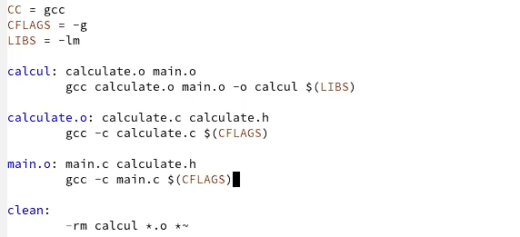
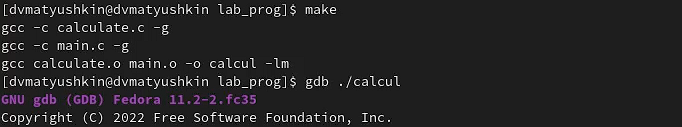
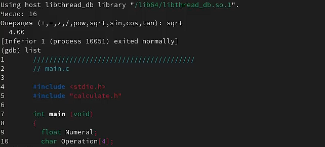
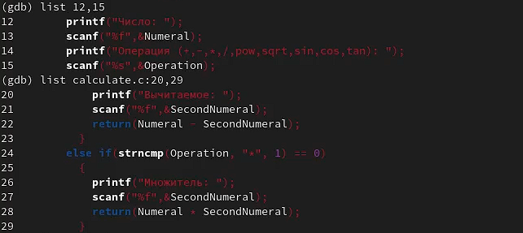
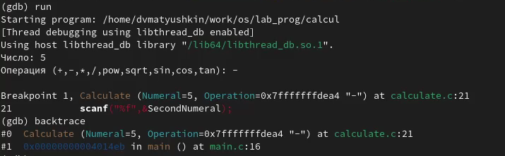
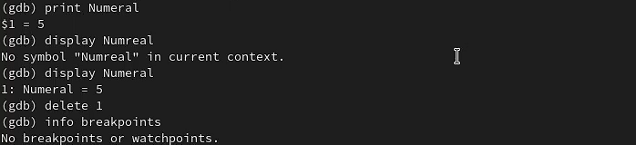
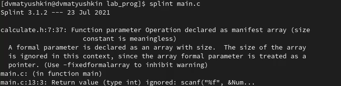

---
## Front matter
title: "Операционные системы"
subtitle: "Лабораторная работа №13"
author: "Матюшкин Денис Владимирович (НПИбд-02-21)"

## Generic otions
lang: ru-RU
toc-title: "Содержание"

## Bibliography
bibliography: bib/cite.bib
csl: pandoc/csl/gost-r-7-0-5-2008-numeric.csl

## Pdf output format
toc: true # Table of contents
toc-depth: 2
fontsize: 12pt
linestretch: 1.5
papersize: a4
documentclass: scrreprt
## I18n polyglossia
polyglossia-lang:
  name: russian
  options:
	- spelling=modern
	- babelshorthands=true
polyglossia-otherlangs:
  name: english
## I18n babel
babel-lang: russian
babel-otherlangs: english
## Fonts
mainfont: PT Serif
romanfont: PT Serif
sansfont: PT Sans
monofont: PT Mono
mainfontoptions: Ligatures=TeX
romanfontoptions: Ligatures=TeX
sansfontoptions: Ligatures=TeX,Scale=MatchLowercase
monofontoptions: Scale=MatchLowercase,Scale=0.9
## Biblatex
biblatex: true
biblio-style: "gost-numeric"
biblatexoptions:
  - parentracker=true
  - backend=biber
  - hyperref=auto
  - language=auto
  - autolang=other*
  - citestyle=gost-numeric
## Pandoc-crossref LaTeX customization
figureTitle: "Рис."
tableTitle: "Таблица"
listingTitle: "Листинг"
lofTitle: "Список иллюстраций"
lotTitle: "Список таблиц"
lolTitle: "Листинги"
## Misc options
indent: true
header-includes:
  - \usepackage{indentfirst}
  - \usepackage{float} # keep figures where there are in the text
  - \floatplacement{figure}{H} # keep figures where there are in the text
---

# Цель работы

- Приобрести простейшие навыки разработки, анализа, тестирования и отладки приложений в ОС типа UNIX/Linux на примере создания на языке программирования С калькулятора с простейшими функциями.

# Ход работы

1. В домашнем каталоге создадим подкаталог ~/work/os/lab_prog. Создадим в нём файлы: calculate.h, calculate.c, main.c (рис. [-@fig:001]).

{ #fig:001 width=100% }

2. Это будет примитивнейший калькулятор, способный складывать, вычитать, умножать и делить, возводить число в степень, брать квадратный корень, вычислять sin, cos, tan. При запуске он будет запрашивать первое число, операцию, второе число. После этого программа выведет результат и остановится. Реализация функций калькулятора в файле calculate.с (рис. [-@fig:002]). Интерфейсный файл calculate.h, описывающий формат вызова функции-калькулятора (рис. [-@fig:003]). Основной файл main.c, реализующий интерфейс пользователя к калькулятору (рис. [-@fig:004]).

{ #fig:002 width=100% }

{ #fig:003 width=100% }

{ #fig:004 width=100% }

3. Выполним компиляцию программы посредством gcc (рис. [-@fig:005]).

{ #fig:005 width=100% }

4. Исправим некоторые синтаксические ошибки.

5. Создадим Makefile со следующим содержанием (рис. [-@fig:006]). В этом файле мы создаем переменные CC, CFLAGS, LIBS. Инициализируем их. Создаем блоки, в которых прописываем какие команды будут выполняться. При этом подставляя значение нами созданных переменных.

{ #fig:006 width=100% }

6. С помощью gdb выполним отладку программы calcul (перед использованием gdb исправим Makefile) (рис. [-@fig:007]).

{ #fig:007 width=100% }

6.1. Запустим отладчик GDB, загрузив в него программу для отладки (рис. [-@fig:008]).

{ #fig:008 width=100% }

6.2. Для запуска программы внутри отладчика введем команду run. Для постраничного (по 9 строк) просмотра исходного код используем команду list (рис. [-@fig:009]).

{ #fig:009 width=100% }

6.3. Для просмотра строк с 12 по 15 основного файла используем list с параметрами. Для просмотра определённых строк не основного файла используем list с параметрами (рис. [-@fig:010]).

{ #fig:010 width=100% }

6.4. Установим точку останова в файле calculate.c на строке номер 21. Выведем информацию об имеющихся в проекте точка останова (рис. [-@fig:011]).

{ #fig:011 width=100% }

6.5. Запустим программу внутри отладчика и убедимся, что программа остановится в момент прохождения точки останова (рис. [-@fig:012]). Отладчик выдаст следующую информацию:

```
#0 Calculate (Numeral=5, Operation=0x7fffffffd280 "-")
at calculate.c:21
#1 0x0000000000400b2b in main () at main.c:17
```

{ #fig:012 width=100% }

6.6. Посмотрим, чему равно на этом этапе значение переменной Numeral. Сравним с результатом вывода на экран после использования команды. Уберем точки останова (рис. [-@fig:013]).

{ #fig:013 width=100% }

7. С помощью утилиты splint проанализируем коды файлов calculate.c и main.c (рис. [-@fig:014] и рис. [-@fig:015]). Здесь мы можем увидеть что утилита splint выводит информацию о коде программы. Например то, что возвращаемое значение функции scanf() игнорируется .

{ #fig:014 width=100% }

{ #fig:015 width=100% }

# Контрольные вопросы

**1. Как получить информацию о возможностях программ gcc, make, gdb и др.?**  
Воспользоваться интернетом, воспользоваться командой man, info

**2. Назовите и дайте краткую характеристику основным этапам разработки приложений в UNIX.**  
Unix поддерживает следующие основные этапы разработки приложений:  
- создание исходного кода программы;  
- охранение различных вариантов исходного текста;  
- анализ исходного текста; Необходимо отслеживать изменения исходного кода, а также при работе более двух программистов над проектом программы нужно, чтобы они не делали изменений кода в одно время;  
- компиляция исходного текста и построение исполняемого модуля;  
- тестирование и отладка;  
- сохранение всех изменений, выполняемых при тестировании и отладке.  

**3. Что такое суффикс в контексте языка программирования? Приведите примеры использования.**  
Использование суффикса ".с" для имени файла с программой на языке Си отражает удобное и полезное соглашение, принятое в ОС UNIX. Для любого имени входного файла суффикс определяет какая компиляция требуется. Суффиксы и префиксы указывают тип объекта. Одно из полезных свойств компилятора Си — его способность по суффиксам определять типы файлов. По суффиксу .c компилятор распознает, что файл abcd.c должен компилироваться, а по суффиксу .o, что файл abcd.о является объектным модулем и для получения исполняемой программы необходимо выполнить редактирование связей. Простейший пример командной строки для компиляции программы abcd.c и построения исполняемого модуля abcd имеет вид: gcc -o abcd abcd.c.

**4. Каково основное назначение компилятора языка С в UNIX?**  
В компиляции всей программы в целом и получении исполняемого модуля.

**5. Для чего предназначена утилита make?**  
Для упрощения и автоматизации работы пользователя с командной строкой

**6. Приведите пример структуры Makefile. Дайте характеристику основным элементам этого файла.**  
Текст, следующий за точкой с запятой, и все последующие строки, начинающиеся с литеры табуляции, являются командами OC UNIX, которые необходимо выполнить для обновления целевого файла. Таким образом, спецификация взаимосвязей имеет формат:
```
target1 [ target2...]: [:] [dependment1...]
[(tab)commands]
[#commentary]
[(tab)commands]
[#commentary],
```

где # — специфицирует начало комментария; : — последовательность команд ОС UNIX должна содержаться в одной строке make-файла (файла описаний), есть возможность переноса команд (\), но она считается как одна строка; :: — последовательность команд ОС UNIX может содержаться в нескольких последовательных строках файла описаний.

**7. Назовите основное свойство, присущее всем программам отладки. Что необходимо сделать, чтобы его можно было использовать?**  
Все программы отладки позволяют отслеживать состояние программы на любом из этапов ее исполнения. Для того чтобы эту возможность использовать необходимо изучить документацию по использованию определенного отладчика. Понять общие принципы отладки.


**8. Назовите и дайте основную характеристику основным командам отладчика gdb.**  

- backtrace – выводит весь путь к текущей точке останова, то есть названия всех функций, начиная от main(); иными словами, выводит весь стек функций;

- break – устанавливает точку останова; параметром может быть номер строки или название функции;

- clear – удаляет все точки останова на текущем уровне стека (то есть в текущей функции);

- continue – продолжает выполнение программы от текущей точки до конца;

- delete – удаляет точку останова или контрольное выражение;

- display – добавляет выражение в список выражений, значения которых отображаются каждый раз при остановке программы;

- finish – выполняет программу до выхода из текущей функции; отображает возвращаемое значение,если такое имеется;

- info breakpoints – выводит список всех имеющихся точек останова;

- info watchpoints – выводит список всех имеющихся контрольных выражений;

- list – выводит исходный код; в качестве параметра передаются название файла исходного кода, затем, через двоеточие, номер начальной и конечной строки;

- next – пошаговое выполнение программы, но, в отличие от команды step, не выполняет пошагово вызываемые функции;

- print – выводит значение какого-либо выражения (выражение передаётся в качестве параметра);

- run – запускает программу на выполнение;

- set – устанавливает новое значение переменной;

- step – пошаговое выполнение программы;

- watch – устанавливает контрольное выражение, программа остановится, как только значение контрольного выражения изменится;

**9. Опишите по шагам схему отладки программы, которую Вы использовали при выполнении лабораторной работы.**  
Сначала я запустил отладчик для моей программы. Установил интересующую меня точку остановки. Запустил программу ожидая, что программа остановится на точке остановки. Узнал необходимые данные моей программы на текущем этапе ее исполнения путем ввода команд. Отобразил данные. Завершил программу, снял точки остановки. 

**10. Прокомментируйте реакцию компилятора на синтаксические ошибки в программе при его первом запуске.**  
В моем случае не было синтаксических ошибок. Были ошибки семантические. Компилятор начал жаловаться на то, что программа по смыслу принимает указатель на char массив. В то время как я вводил не указатель, а прямое значение. Ошибка была исправлена.

**11. Назовите основные средства, повышающие понимание исходного кода программы.**  
 
- cscope - исследование функций, содержащихся в программе;

- lint - критическая проверка программ, написанных на языке Си.

**12. Каковы основные задачи, решаемые программой splint?**  
Splint - инструмент для статической проверки C-программ на наличие уязвимостей и ошибок

# Вывод

- В ходе этой лабораторной работы мы приобрели простейшие навыки разработки, анализа, тестирования и отладки приложений в ОС типа UNIX/Linux на примере создания на языке программирования С калькулятора с простейшими функциями.
