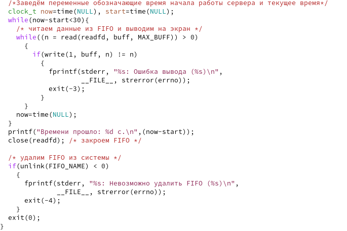
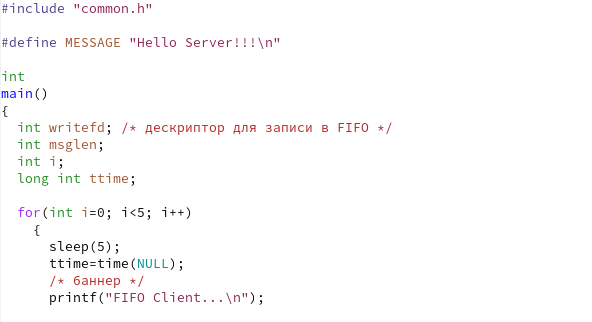
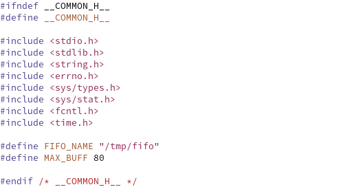
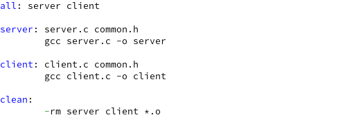
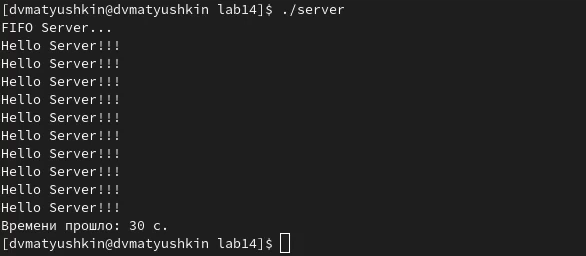

---
## Front matter
lang: ru-RU
title: Лабораторная работа №14
author: Матюшкин Денис Владимирович (НПИбд-02-21)
institute: RUDN University, Moscow, Russian Federation
date: 01.06.2022

## Formatting
toc: false
slide_level: 2
theme: metropolis
header-includes: 
 - \metroset{progressbar=frametitle,sectionpage=progressbar,numbering=fraction}
 - '\makeatletter'
 - '\beamer@ignorenonframefalse'
 - '\makeatother'
aspectratio: 43
section-titles: true
## Pandoc-crossref LaTeX customization
figureTitle: "Рис."
---

# Цель работы

- Приобретение практических навыков работы с именованными каналами.

# Ход работы

## 1.1. Написание программ
- Изучим приведённые в тексте программы server.c и client.c. Взяв данные примеры за образец, напишем аналогичные программы, внеся следующие изменения:

1. Работает не 1 клиент, а несколько (например, два).

2. Клиенты передают текущее время с некоторой периодичностью (раз в пять секунд). Используем функцию sleep() для приостановки работы клиента.

3. Сервер работает не бесконечно, а прекращает работу через некоторое время (30 сек). Используем не функцию clock(), а взятие unixTime (time(NULL)). Дело в том, что clock() не засчитывает такты sleep. С методом time() работает все хорошо. Если сервер завершит свою работу, не закрыв канал, то при повторном запуске сервера будет выводить ошибку: "Невозможно создать FIFO". 

## 1.2. Иллюстрация работы

- Измененный файл server.c (рис. [-@fig:001] и рис. [-@fig:002]).

- Измененный файл client.c (рис. [-@fig:003] и рис. [-@fig:004]).

- Файл common.h (рис. [-@fig:005]).

- Файл Makefile (рис. [-@fig:006]).

##

{ #fig:001 width=50% }

{ #fig:002 width=50% }

##

{ #fig:003 width=50% }

{ #fig:004 width=50% }

##

{ #fig:005 width=70% }

{ #fig:006 width=70% }

## 2. Создание файлов
- Пропишем make в консоль, в итоге у нас должны создаться исполняемые файлы (рис. [-@fig:007]).

{ #fig:007 width=70% }

## 3. Проверка файлов
- Проверим работу файлов (рис. [-@fig:008] и рис. [-@fig:009]).

{ #fig:008 width=70% }

{ #fig:009 width=70% }

# Вывод

- В ходе этой лабораторной работы мы приобрели практические навыки работы с именованными каналами.

## {.standout}

Спасибо за внимание!

