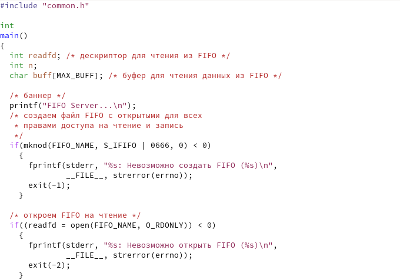
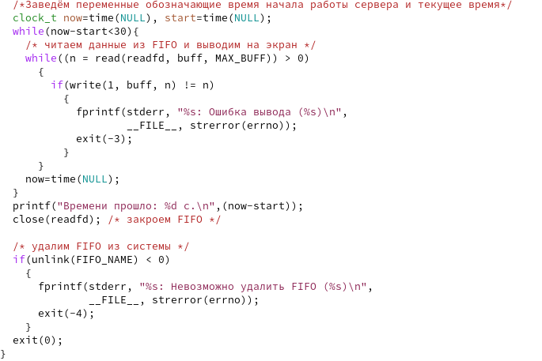
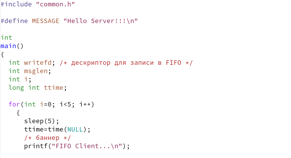
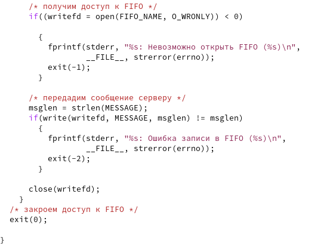
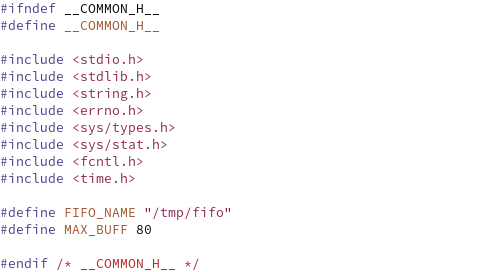
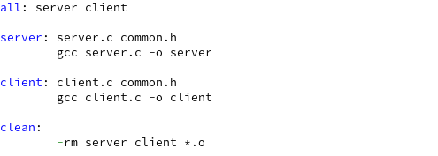
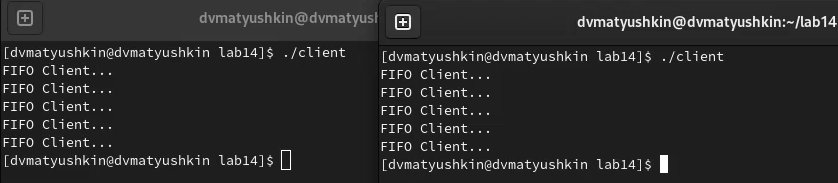

---
## Front matter
title: "Операционные системы"
subtitle: "Лабораторная работа №14"
author: "Матюшкин Денис Владимирович (НПИбд-02-21)"

## Generic otions
lang: ru-RU
toc-title: "Содержание"

## Bibliography
bibliography: bib/cite.bib
csl: pandoc/csl/gost-r-7-0-5-2008-numeric.csl

## Pdf output format
toc: true # Table of contents
toc-depth: 2
fontsize: 12pt
linestretch: 1.5
papersize: a4
documentclass: scrreprt
## I18n polyglossia
polyglossia-lang:
  name: russian
  options:
	- spelling=modern
	- babelshorthands=true
polyglossia-otherlangs:
  name: english
## I18n babel
babel-lang: russian
babel-otherlangs: english
## Fonts
mainfont: PT Serif
romanfont: PT Serif
sansfont: PT Sans
monofont: PT Mono
mainfontoptions: Ligatures=TeX
romanfontoptions: Ligatures=TeX
sansfontoptions: Ligatures=TeX,Scale=MatchLowercase
monofontoptions: Scale=MatchLowercase,Scale=0.9
## Biblatex
biblatex: true
biblio-style: "gost-numeric"
biblatexoptions:
  - parentracker=true
  - backend=biber
  - hyperref=auto
  - language=auto
  - autolang=other*
  - citestyle=gost-numeric
## Pandoc-crossref LaTeX customization
figureTitle: "Рис."
tableTitle: "Таблица"
listingTitle: "Листинг"
lofTitle: "Список иллюстраций"
lotTitle: "Список таблиц"
lolTitle: "Листинги"
## Misc options
indent: true
header-includes:
  - \usepackage{indentfirst}
  - \usepackage{float} # keep figures where there are in the text
  - \floatplacement{figure}{H} # keep figures where there are in the text
---

# Цель работы

- Приобретение практических навыков работы с именованными каналами.

# Ход работы

1. Изучим приведённые в тексте программы server.c и client.c. Взяв данные примеры за образец, напишем аналогичные программы, внеся следующие изменения:

- Работает не 1 клиент, а несколько (например, два).

- Клиенты передают текущее время с некоторой периодичностью (раз в пять секунд). Используем функцию sleep() для приостановки работы клиента.

- Сервер работает не бесконечно, а прекращает работу через некоторое время (30 сек). Используем не функцию clock(), а взятие unixTime (time(NULL)). Дело в том, что clock() не засчитывает такты sleep. С методом time() работает все хорошо. Если сервер завершит свою работу, не закрыв канал, то при повторном запуске сервера будет выводить ошибку: "Невозможно создать FIFO". 

	Измененный файл server.c (рис. [-@fig:001] и рис. [-@fig:002]).  
	Измененный файл client.c (рис. [-@fig:003] и рис. [-@fig:004]).  
	Файл common.h (рис. [-@fig:005]).  
	Файл Makefile (рис. [-@fig:006]).

{ #fig:001 width=70% }

{ #fig:002 width=70% }

{ #fig:003 width=70% }

{ #fig:004 width=70% }

{ #fig:005 width=70% }

{ #fig:006 width=70% }

2. Пропишем make в консоль, в итоге у нас должны создаться исполняемые файлы (рис. [-@fig:007]).

{ #fig:007 width=100% }

3. Проверим работу файлов (рис. [-@fig:008] и рис. [-@fig:009]).

{ #fig:008 width=100% }

{ #fig:009 width=100% }

# Контрольные вопросы

**1. В чем ключевое отличие именованных каналов от неименованных?**  
Именованные каналы отличаются от неименованных наличием идентификатора канала, который представлен как специальный файл (соответственно имя именованного канала — это имя файла).

**2. Возможно ли создание неименованного канала из командной строки?**  
Для создания неименованного канала используется системный вызов pipe. Массив из двух целых чисел является выходным параметром этого системного вызова.

**3. Возможно ли создание именованного канала из командной строки?**  
Да

**4. Опишите функцию языка С, создающую неименованный канал.**

	int read(int pipe_fd, void *area, int cnt);
	int write(int pipe_fd, void *area, int cnt);
	
Первый аргумент этих вызовов - дескриптор канала, второй - указатель на область памяти, с которой происходит обмен, третий - количество байт. Оба вызова возвращают число переданных байт (или -1 - при ошибке).

**5. Опишите функцию языка С, создающую именованный канал.**

	int mkfifo (const char *pathname, mode_t mode);
	
Первый параметр — имя файла, идентифицирующего канал, второй параметр маска прав доступа к файлу. Вызов функции mkfifo() создаёт файл канала (с именем, заданным макросом FIFO_NAME):  
mkfifo(FIFO_NAME, 0600);

**6. Что будет в случае прочтения из fifo меньшего числа байтов, чем находится в канале? Большего числа байтов?**  
При чтении меньшего числа байтов, возвращается требуемое число байтов, остаток сохраняется для следующих чтений.  
При чтении большего числа байтов, возвращается доступное число байтов

**7. Аналогично, что будет в случае записи в fifo меньшего числа байтов, чем позволяет буфер? Большего числа байтов?**
При записи большего числа байтов, вызов write(2) блокируется до освобождения требуемого места. При этом атомарность операции не гарантируется. Если процесс пытается записать данные в канал, не открытый ни одним процессом на чтение, процессу генерируется сигнал.  
Запись числа байтов, меньшего емкости, гарантированно атомарно. Это означает, что в случае, когда несколько процессов одновременно записывают в канал, данные будут записывать отдельно и не будут "повреждать" структуру файла.

**8. Могут ли два и более процессов читать или записывать в канал?**
Могут

**9. Опишите функцию write (тип возвращаемого значения, аргументы и логику работы). Что означает 1 (единица) в вызове этой функции в программе server.c (строка 42)?**  
Функция записывает length байтов из буфера buffer в файл, определенный дескриптором файла fd. Эта операция двоичная  без буферизации. Реализуется как непосредственный вызов DOS. С помощью функции write мы посылаем сигнал клиенту или серверу

**10. Опишите функцию strerror.**  
Строковая функция strerror - функция языков C/C++, транслирующая код ошибки, который обычно хранится в глобальной переменной errno, в сообщение об ошибке, понятном человеку.

# Вывод

- В ходе этой лабораторной работы мы приобрели практические навыки работы с именованными каналами.
