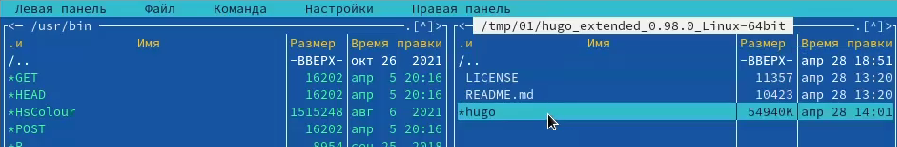
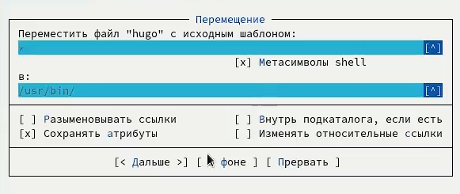
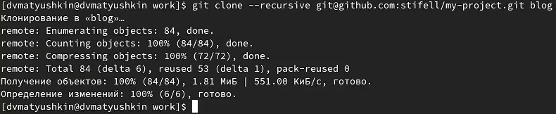
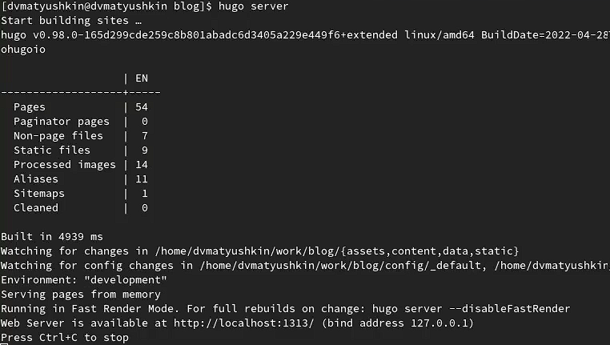
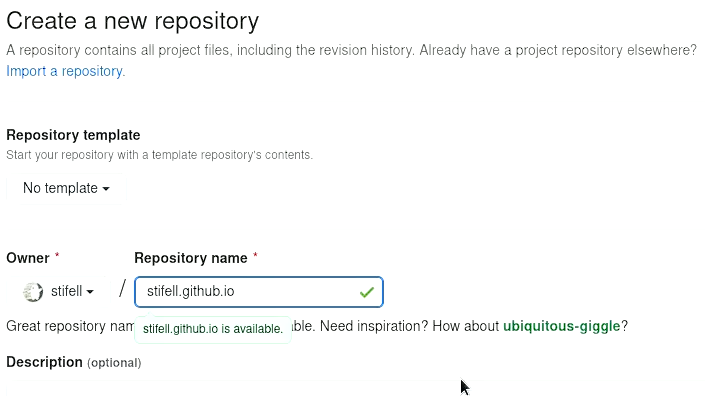
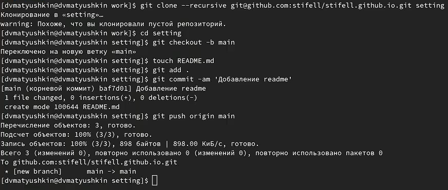
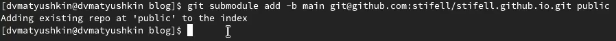
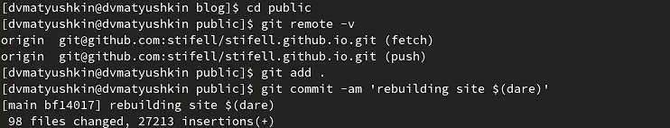
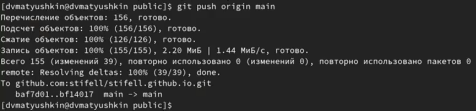
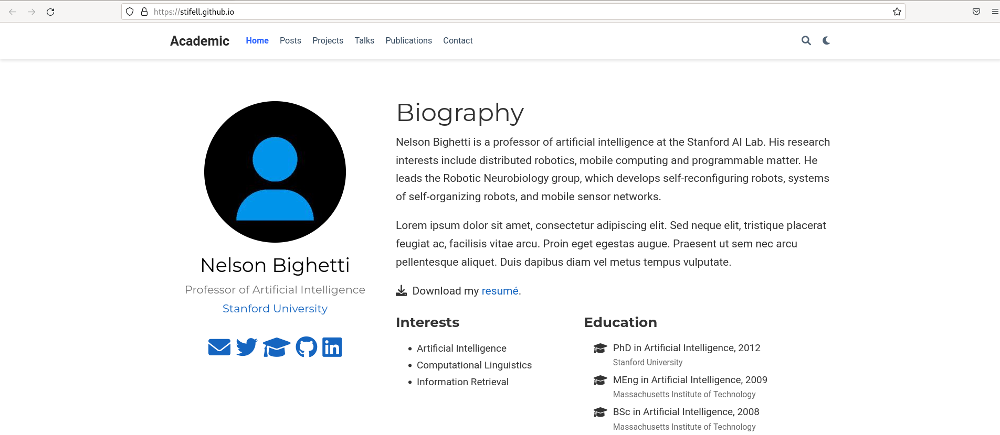

---
## Front matter
lang: ru-RU
title: Индивидуальный проект, часть 1
author: Матюшкин Денис Владимирович (НПИбд-02-21)
institute: RUDN University, Moscow, Russian Federation
date: 30.04.2022

## Formatting
toc: false
slide_level: 2
theme: metropolis
header-includes: 
 - \metroset{progressbar=frametitle,sectionpage=progressbar,numbering=fraction}
 - '\makeatletter'
 - '\beamer@ignorenonframefalse'
 - '\makeatother'
aspectratio: 43
section-titles: true
## Pandoc-crossref LaTeX customization
figureTitle: "Рис."
---

# Цель работы

- Размещение на *Github Pages* заготовки для персонального сайта.

# Ход работы

## 1. Установка Hugo

- Скачаем генератор статического html Hugo. Поскольку hugo использует модули goland, скачаем и его (рис. [-@fig:001]).

{ #fig:001 width=70% }

## 2.1 Ручное обновление Hugo

- Поскольку нам нужна версия Hugo не ниже 0.95 скачаем его в ручную и установим (рис. [-@fig:002]). Перекинем разорхивированный файл в каталог */usr/bin* (рис. [-@fig:003] и рис. [-@fig:004]).

{ #fig:002 width=70% }

## 2.2 Ручное обновление Hugo

{ #fig:003 width=70% }

{ #fig:004 width=70% }

## 3. Ознакомление с шаблоном

- Скачаем шаблон сайта [Hugo Academic](https://github.com/wowchemy/starter-hugo-academic) в новый репозиторий (рис. [-@fig:005]).

{ #fig:005 width=70% }

## 4. Скачивание шаблона

- Наш сохраненный шаблон скачаем в новый каталог *blog* (рис. [-@fig:006]).

{ #fig:006 width=70% }

## 5. Запуск сайта

- Зайдем в созданный каталон и сгенерируем наш сайт командой *hugo server* (рис. [-@fig:007]).

{ #fig:007 width=70% }

## 6. Открытие сайта 

- Созданный локальный сайт откроем в бразуере (ранее удалив зеленый фон) (рис. [-@fig:008]).

{ #fig:008 width=70% }

## 7. Создание репозитория для сайта

- Теперь наш созданный сайт нужно загрузить на *Github Pages*. Для этого создадим репозиторий, назовем его именем моего аккаунта, добавив еще github.io - *stifell.github.io* (рис. [-@fig:009]).

{ #fig:009 width=70% }

## 8. Настройка репозитория

- Настроим этот репозиторий: переключимся на новую ветку *main*, создадим файл для выгрузки и выгрузим файл на Github (рис. [-@fig:010]).

{ #fig:010 width=70% }

## 9. Создание каталога для файлов сайта

- Свяжем наш репозиторий с новый каталогом *public*. В ходе выдало ошибку из-за содержимого в файле *.gitignore*. Чтобы исправить ошибку закомментируем в файле слово *public/* (рис. [-@fig:011]). После комментирования повторим команду (рис. [-@fig:012]).

{ #fig:011 width=70% }

{ #fig:012 width=70% }

## 10. Генерация сайта

- Сгенерируем наш сайт командой *hugo* (рис. [-@fig:013]). В каталоге *public* появятся файлы нашего сайта.

{ #fig:013 width=70% }

## 11. Перенос файлов в репозиторий

- Файлы в каталоге *public* выгрузим в созданный наш репозиторий (рис. [-@fig:014] и рис. [-@fig:015]).

{ #fig:014 width=70% }

{ #fig:015 width=70% }

## 12. Открытие сайта с Github

Откроем наш загруженный репозиторий (рис. [-@fig:016]) и перейдем на сайт (рис. [-@fig:017])

{ #fig:016 width=70% }

{ #fig:017 width=70% }

# Заключение 

В ходе этой лабораторной работы мы разместили на *Github Pages* заготовки для персонального сайта.

