---
## Front matter
title: "Операционные системы"
subtitle: "Индивидуальный проект, часть 1"
author: "Матюшкин Денис Владимирович (НПИбд-02-21)"

## Generic otions
lang: ru-RU
toc-title: "Содержание"

## Bibliography
bibliography: bib/cite.bib
csl: pandoc/csl/gost-r-7-0-5-2008-numeric.csl

## Pdf output format
toc: true # Table of contents
toc-depth: 2
fontsize: 12pt
linestretch: 1.5
papersize: a4
documentclass: scrreprt
## I18n polyglossia
polyglossia-lang:
  name: russian
  options:
	- spelling=modern
	- babelshorthands=true
polyglossia-otherlangs:
  name: english
## I18n babel
babel-lang: russian
babel-otherlangs: english
## Fonts
mainfont: PT Serif
romanfont: PT Serif
sansfont: PT Sans
monofont: PT Mono
mainfontoptions: Ligatures=TeX
romanfontoptions: Ligatures=TeX
sansfontoptions: Ligatures=TeX,Scale=MatchLowercase
monofontoptions: Scale=MatchLowercase,Scale=0.9
## Biblatex
biblatex: true
biblio-style: "gost-numeric"
biblatexoptions:
  - parentracker=true
  - backend=biber
  - hyperref=auto
  - language=auto
  - autolang=other*
  - citestyle=gost-numeric
## Pandoc-crossref LaTeX customization
figureTitle: "Рис."
tableTitle: "Таблица"
listingTitle: "Листинг"
lofTitle: "Список иллюстраций"
lotTitle: "Список таблиц"
lolTitle: "Листинги"
## Misc options
indent: true
header-includes:
  - \usepackage{indentfirst}
  - \usepackage{float} # keep figures where there are in the text
  - \floatplacement{figure}{H} # keep figures where there are in the text
---

# Цель работы

Размещение на *Github Pages* заготовки для персонального сайта.

# Ход работы

1. Скачаем генератор статического html Hugo. Поскольку hugo использует модули goland, скачаем и его (рис. [-@fig:001]).

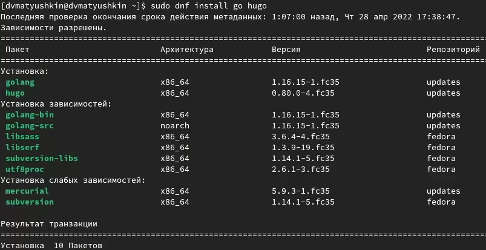{ #fig:001 width=70% }

2. Поскольку нам нужна версия Hugo не ниже 0.95 скачаем его в ручную и установим (рис. [-@fig:002]). Перекинем разорхивированный файл в каталог */usr/bin* (рис. [-@fig:003] и рис. [-@fig:004]).

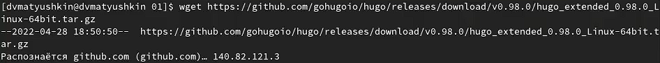{ #fig:002 width=70% }

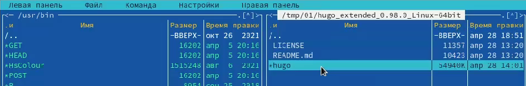{ #fig:003 width=70% }

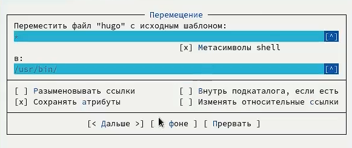{ #fig:004 width=70% }

3. Скачаем шаблон сайта [Hugo Academic](https://github.com/wowchemy/starter-hugo-academic) в новый репозиторий (рис. [-@fig:005]).

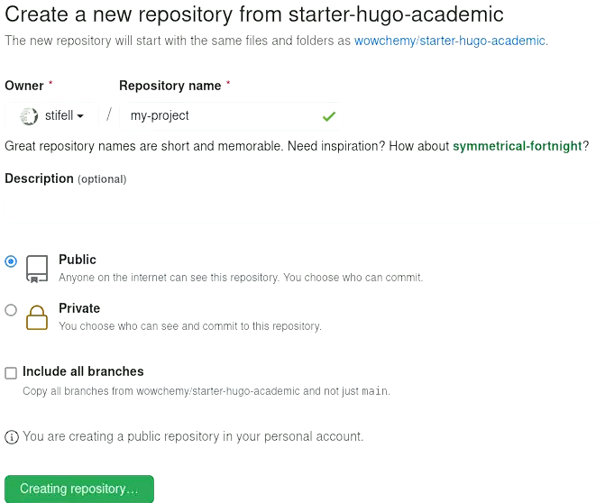{ #fig:005 width=70% }

4. Наш сохраненный шаблон скачаем в новый каталог *blog* (рис. [-@fig:006]).

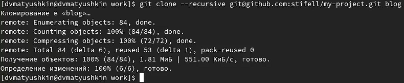{ #fig:006 width=70% }

5. Зайдем в созданный каталон и сгенерируем наш сайт командой *hugo server* (рис. [-@fig:007]).

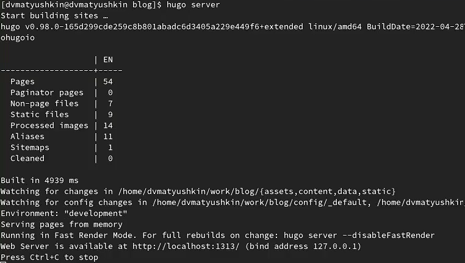{ #fig:007 width=70% }

6. Созданный локальный сайт откроем в бразуере (ранее удалив зеленый фон) (рис. [-@fig:008]).

{ #fig:008 width=70% }

7. Теперь наш созданный сайт нужно загрузить на *Github Pages*. Для этого создадим репозиторий, назовем его именем моего аккаунта, добавив еще github.io - *stifell.github.io* (рис. [-@fig:009]).

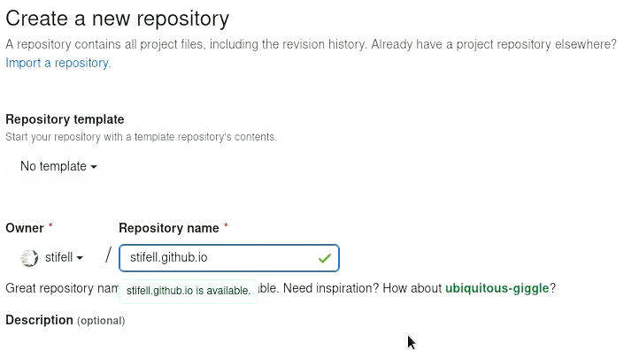{ #fig:009 width=70% }

8. Настроим этот репозиторий: переключимся на новую ветку *main*, создадим файл для выгрузки и выгрузим файл на Github (рис. [-@fig:010]).

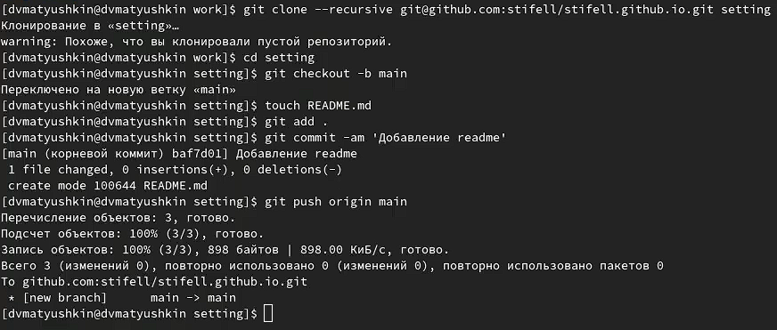{ #fig:010 width=70% }

9. Свяжем наш репозиторий с новый каталогом *public*. В ходе выдало ошибку из-за содержимого в файле *.gitignore*. Чтобы исправить ошибку закомментируем в файле слово *public/* (рис. [-@fig:011]). После комментирования повторим команду (рис. [-@fig:012]).

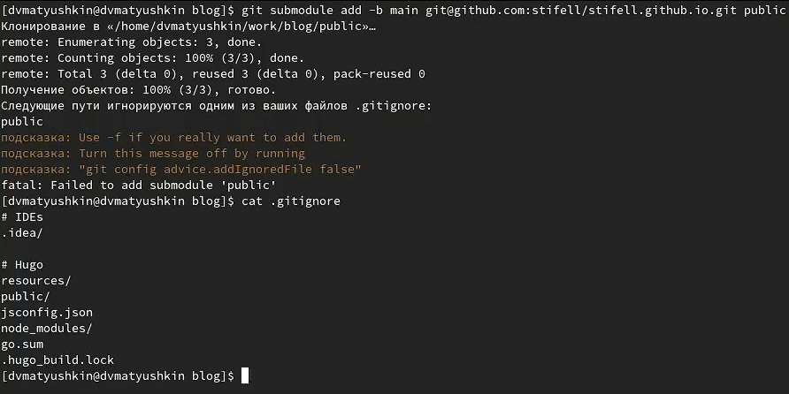{ #fig:011 width=70% }

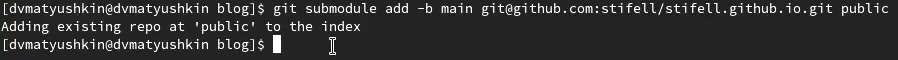{ #fig:012 width=70% }

10. Сгенерируем наш сайт командой *hugo* (рис. [-@fig:013]). В каталоге *public* появятся файлы нашего сайта.

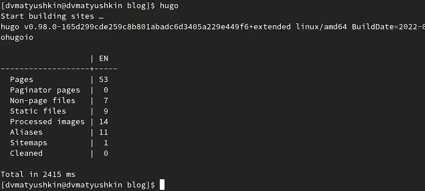{ #fig:013 width=70% }

11. Файлы в каталоге *public* выгрузим в созданный наш репозиторий (рис. [-@fig:014] и рис. [-@fig:015]).

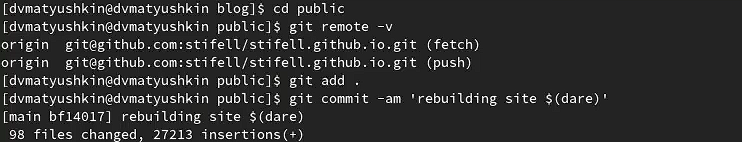{ #fig:014 width=70% }

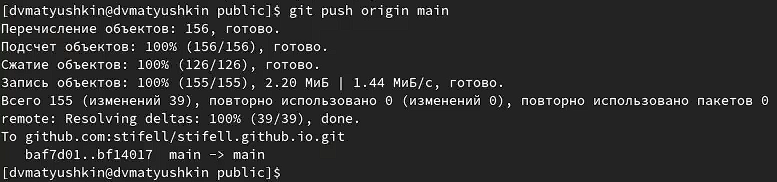{ #fig:015 width=70% }

12. Откроем наш загруженный репозиторий (рис. [-@fig:016]) и перейдем на сайт (рис. [-@fig:017])

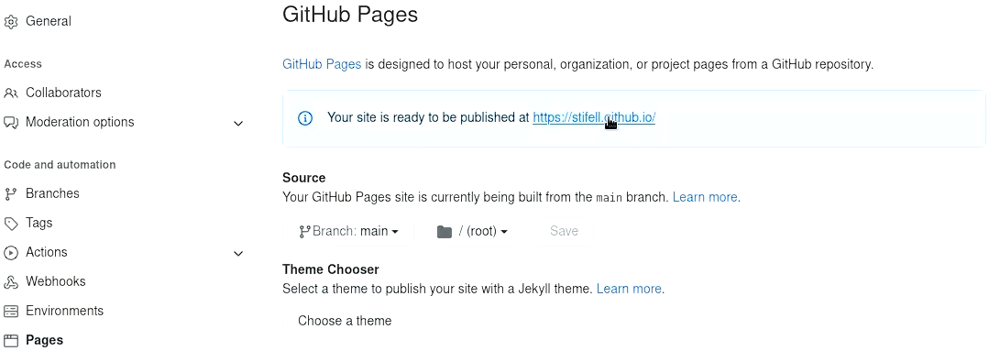{ #fig:016 width=70% }

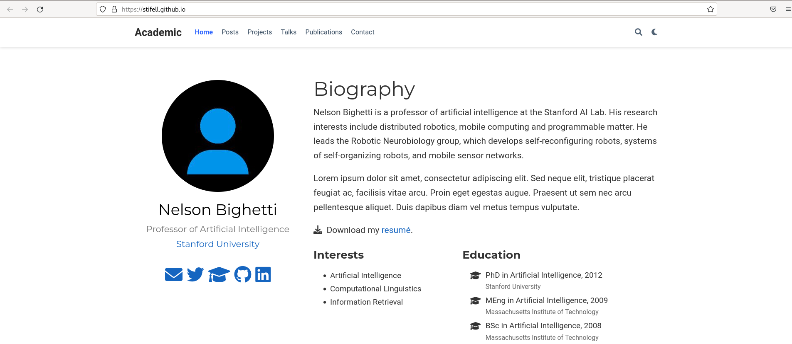{ #fig:017 width=70% }

# Заключение 

В ходе этой лабораторной работы мы разместили на *Github Pages* заготовки для персонального сайта.

