---
## Front matter
lang: ru-RU
title: Индивидуальный проект, часть 2
author: Матюшкин Денис Владимирович (НПИбд-02-21)
institute: RUDN University, Moscow, Russian Federation
date: 06.05.2022

## Formatting
toc: false
slide_level: 2
theme: metropolis
header-includes: 
 - \metroset{progressbar=frametitle,sectionpage=progressbar,numbering=fraction}
 - '\makeatletter'
 - '\beamer@ignorenonframefalse'
 - '\makeatother'
aspectratio: 43
section-titles: true
## Pandoc-crossref LaTeX customization
figureTitle: "Рис."
---

# Цель работы

- Добавить к сайту данные о себе.

# Ход работы

## 1. Переход в нужный каталог
- Для добавления данных о владельце сайта необходимо перейти к каталогу сайта. После перейдем в *content/authors/admin* для редактирования главной страницы сайта (рис. [-@fig:001]).

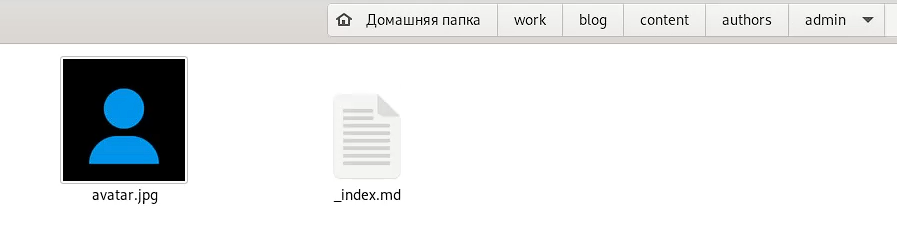{ #fig:001 width=70% }

## 2. Добавление данных
- Откроем файл _index.md и добавим данные о себе: 1) ФИО, жизненное положение, сайт университета, краткая биография (рис. [-@fig:002]); 2) интересы, образование (рис. [-@fig:003]); 3) email и биографию (рис. [-@fig:004]).

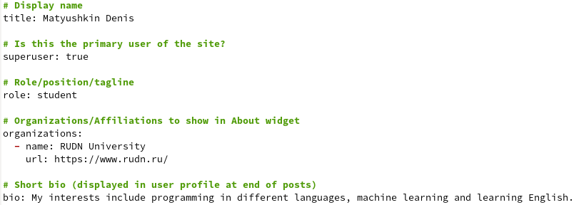{ #fig:002 width=70% }

## 2.1 Добавление данных

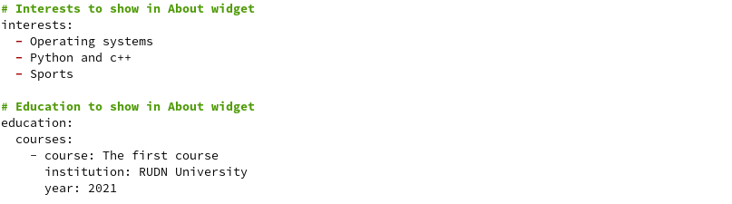{ #fig:003 width=70% }

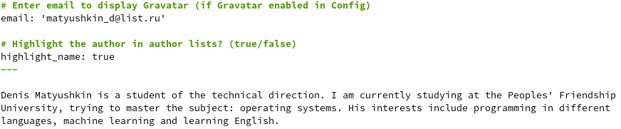{ #fig:004 width=70% }

## 3. Добавление аватарки
- Поменяем аватарку в нашем сайте, для этого загруженную картинку нужно назвать *avatar.jpg/png* (рис. [-@fig:005]).

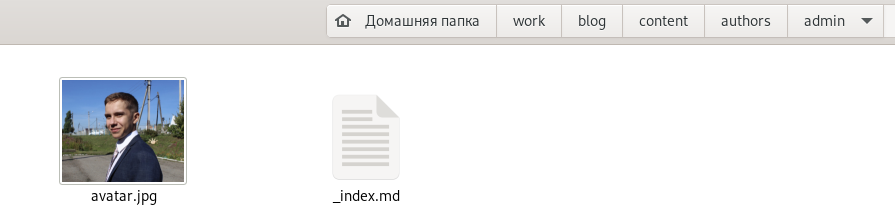{ #fig:005 width=70% }

## 4. Создание постов
- Далее нам необходимо создать два новых поста, для этого перейдем в *content/post* и создадим две папки (рис. [-@fig:006]).

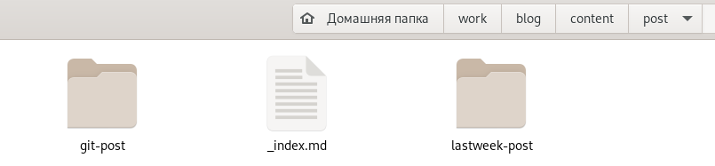{ #fig:006 width=70% }

## 5. Работа с постом
- Создадим в папке файл *index.md* и для красоты добавим картинку (рис. [-@fig:007]).

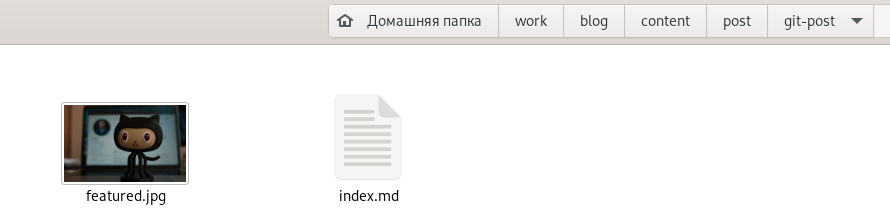{ #fig:007 width=70% }

## 6. Редактирование поста
- Откроем файл *index.md* и начнем заполнять данные о посте (рис. [-@fig:008]).

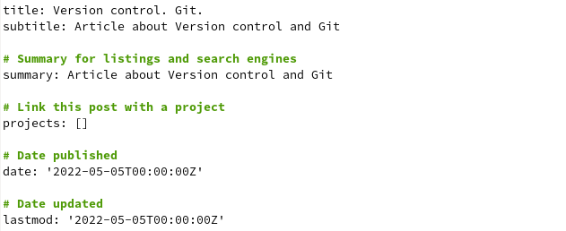{ #fig:008 width=70% }

## 7. Повторные действия со вторым постом
- Аналогичные действия совершим со вторым постом (рис. [-@fig:009] и рис. [-@fig:010]).

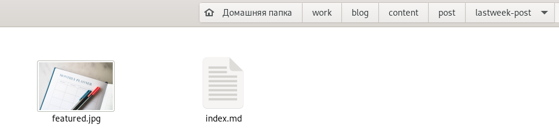{ #fig:009 width=70% }

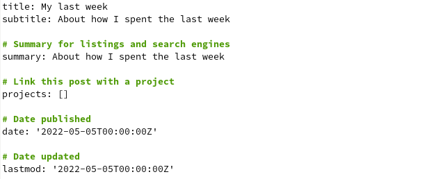{ #fig:010 width=70% }

## 8. Выгрузка сайта на Git
- Закончили заполнение данных. Сгенерируем наш сайт через консоль, перейдем в каталог *public* и выгрузим изменения в репозиторий Github (рис. [-@fig:011]).

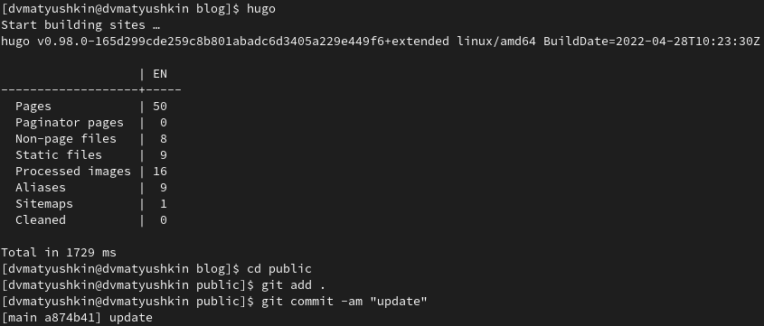{ #fig:011 width=70% }

## 9. Проверка сайта
- Перейдем в наш обновленный сайт и смотрим на изменения (рис. [-@fig:012]).

{ #fig:012 width=70% }

# Заключение 

- В ходе этой лабораторной работы мы добавили к сайту данные о себе.

## {.standout}

Спасибо за внимание!

