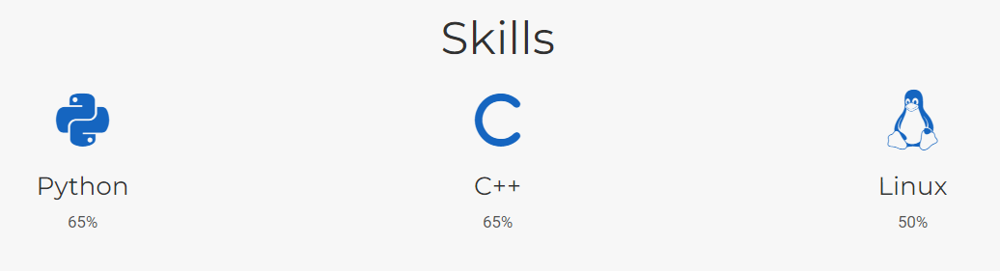
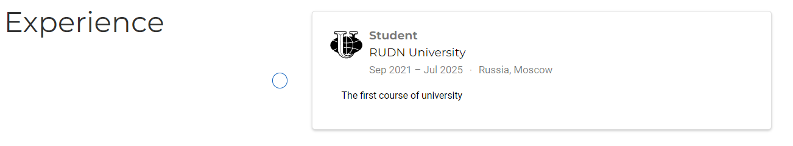
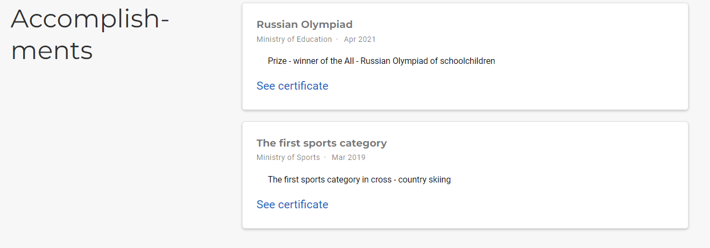
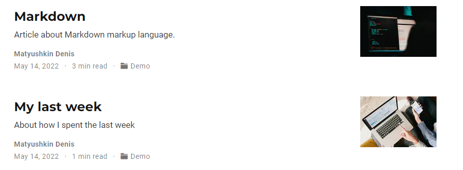

---
## Front matter
lang: ru-RU
title: Проект часть 3
author: Матюшкин Денис Владимирович (НПИбд-02-21)
institute: RUDN University, Moscow, Russian Federation
date: 14.05.2022

## Formatting
toc: false
slide_level: 2
theme: metropolis
header-includes: 
 - \metroset{progressbar=frametitle,sectionpage=progressbar,numbering=fraction}
 - '\makeatletter'
 - '\beamer@ignorenonframefalse'
 - '\makeatother'
aspectratio: 43
section-titles: true
## Pandoc-crossref LaTeX customization
figureTitle: "Рис."
---

# Цель работы

Добавить к сайту достижения.

# Ход работы

## 1. Информация о навыках
- Для добавления данных о навыках необходимо перейти к каталогу сайта. После перейдем в *content/home/skills*. Запишем все свои умения, если ничего не знаем, то просто придумаем (рис. [-@fig:001]).

{ #fig:001 width=70% }

## 2. Информация об опыте
- В том же каталоге откроем файл *experitnce* и добавим информацию об опыте (рис. [-@fig:002]).

{ #fig:002 width=70% }

## 3. Информация о достижениях
- В том же каталоге откроем файл *accomplishments* и добавим информацию о достижениях (рис. [-@fig:003]).

{ #fig:003 width=70% }

## 4. Добавление двух постов
- Сделаем пост по прошедей неделе, а также добавим пост на тему: язык разметки Markdown (рис. [-@fig:004]).

{ #fig:004 width=70% }

# Заключение 

В ходе этой лабораторной работы мы добавили к сайту достижения.

## {.standout}

Спасибо за внимание!

