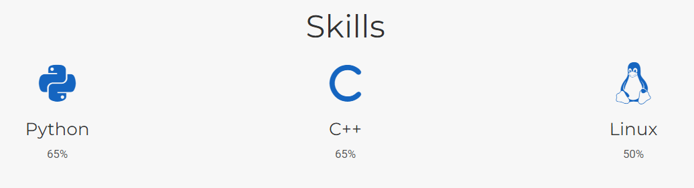
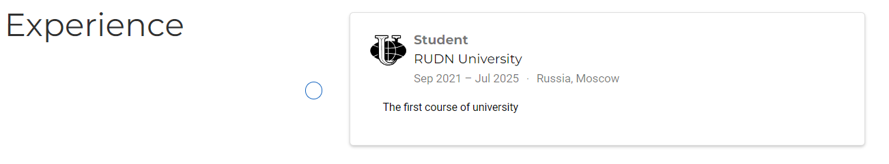

---
## Front matter
title: "Операционные системы"
subtitle: "Индивидуальный проект, часть 3"
author: "Матюшкин Денис Владимирович (НПИбд-02-21)"

## Generic otions
lang: ru-RU
toc-title: "Содержание"

## Bibliography
bibliography: bib/cite.bib
csl: pandoc/csl/gost-r-7-0-5-2008-numeric.csl

## Pdf output format
toc: true # Table of contents
toc-depth: 2
fontsize: 12pt
linestretch: 1.5
papersize: a4
documentclass: scrreprt
## I18n polyglossia
polyglossia-lang:
  name: russian
  options:
	- spelling=modern
	- babelshorthands=true
polyglossia-otherlangs:
  name: english
## I18n babel
babel-lang: russian
babel-otherlangs: english
## Fonts
mainfont: PT Serif
romanfont: PT Serif
sansfont: PT Sans
monofont: PT Mono
mainfontoptions: Ligatures=TeX
romanfontoptions: Ligatures=TeX
sansfontoptions: Ligatures=TeX,Scale=MatchLowercase
monofontoptions: Scale=MatchLowercase,Scale=0.9
## Biblatex
biblatex: true
biblio-style: "gost-numeric"
biblatexoptions:
  - parentracker=true
  - backend=biber
  - hyperref=auto
  - language=auto
  - autolang=other*
  - citestyle=gost-numeric
## Pandoc-crossref LaTeX customization
figureTitle: "Рис."
tableTitle: "Таблица"
listingTitle: "Листинг"
lofTitle: "Список иллюстраций"
lotTitle: "Список таблиц"
lolTitle: "Листинги"
## Misc options
indent: true
header-includes:
  - \usepackage{indentfirst}
  - \usepackage{float} # keep figures where there are in the text
  - \floatplacement{figure}{H} # keep figures where there are in the text
---

# Цель работы

Добавить к сайту достижения.

# Ход работы

1. Для добавления данных о навыках необходимо перейти к каталогу сайта. После перейдем в *content/home/skills*. Запишем все свои умения, если ничего не знаем, то просто придумаем (рис. [-@fig:001]).

{ #fig:001 width=100% }

2. В том же каталоге откроем файл *experitnce* и добавим информацию об опыте (рис. [-@fig:002]).

{ #fig:002 width=100% }

3. В том же каталоге откроем файл *accomplishments* и добавим информацию о достижениях (рис. [-@fig:003]).

{ #fig:003 width=100% }

4. Сделаем пост по прошедей неделе, а также добавим пост на тему: язык разметки Markdown (рис. [-@fig:004]).

{ #fig:004 width=100% }

# Заключение 

В ходе этой лабораторной работы мы добавили к сайту достижения.

