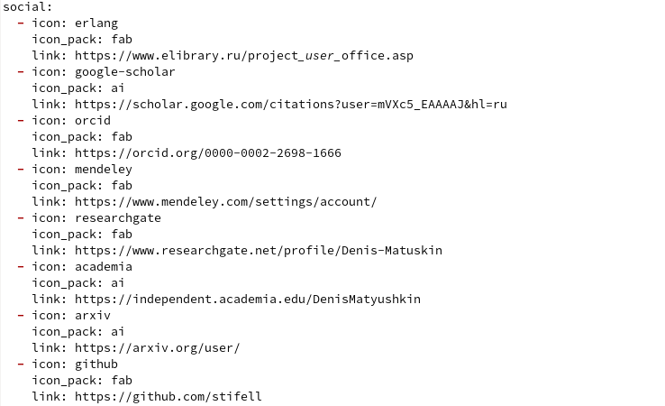
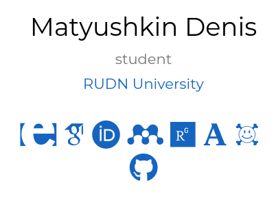
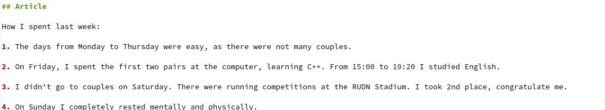
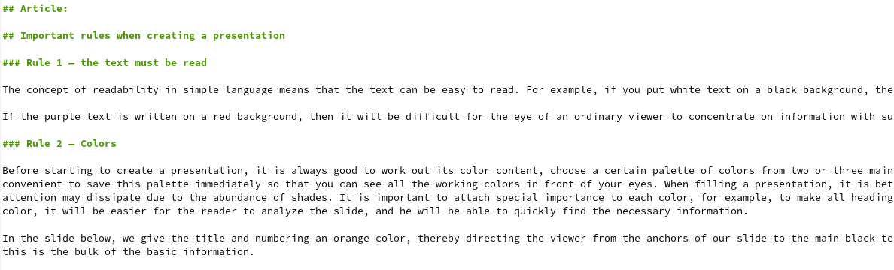
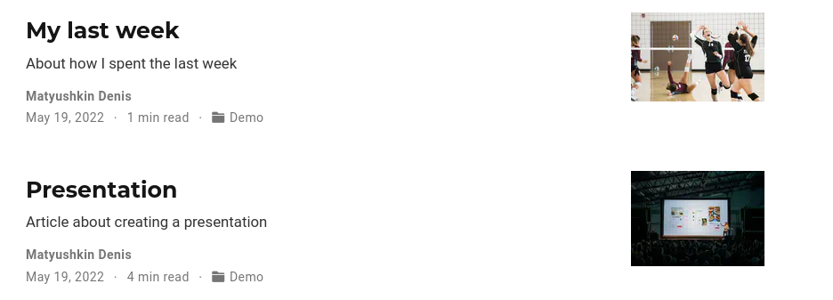

---
## Front matter
lang: ru-RU
title: Проект часть 4
author: Матюшкин Денис Владимирович (НПИбд-02-21)
institute: RUDN University, Moscow, Russian Federation
date: 19.05.2022

## Formatting
toc: false
slide_level: 2
theme: metropolis
header-includes: 
 - \metroset{progressbar=frametitle,sectionpage=progressbar,numbering=fraction}
 - '\makeatletter'
 - '\beamer@ignorenonframefalse'
 - '\makeatother'
aspectratio: 43
section-titles: true
## Pandoc-crossref LaTeX customization
figureTitle: "Рис."
---

# Цель работы

Добавить к сайту ссылки на научные и библиометрические ресурсы.

# Ход работы

## 1.1. Добавление ссылок
- Для добавления ссылок необходимо перейти к каталогу сайта. После перейдем в *content/authors/admin*. Добавим все ссылки сайтов, в которых мы зарегистрировались (рис. [-@fig:001]). Зайдем в наш сайт и проверим изменения (рис. [-@fig:002]).

{ #fig:001 width=70% }

## 1.2.
{ #fig:002 width=40% }

## 2. Пост по прошедшей неделе
- Создадим пост по прошедей неделе в каталоге *content/post* (рис. [-@fig:003]).

{ #fig:003 width=70% }

## 3. Пост о презентации
- Создадим пост о создании презентации в том же каталоге (рис. [-@fig:004]).

{ #fig:004 width=70% }

## 4. Зайдем в наш сайт и проверим изменения (рис. [-@fig:005]).

{ #fig:005 width=70% }

# Заключение 

В ходе этой лабораторной работы мы добавили к сайту ссылки на научные и библиометрические ресурсы.

## {.standout}

Спасибо за внимание!

