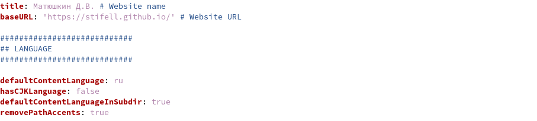
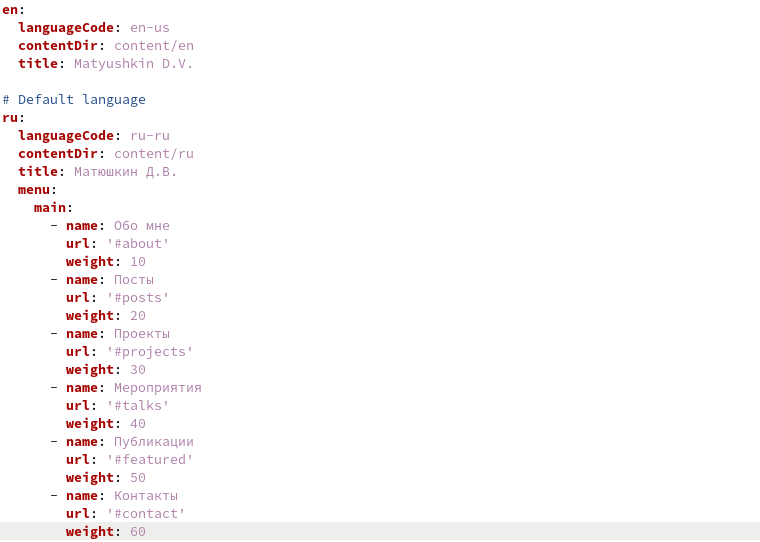
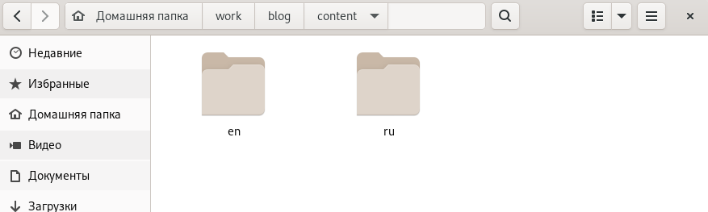
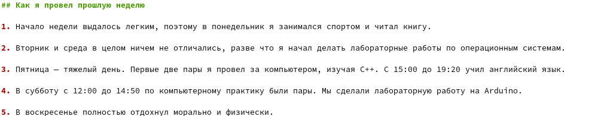
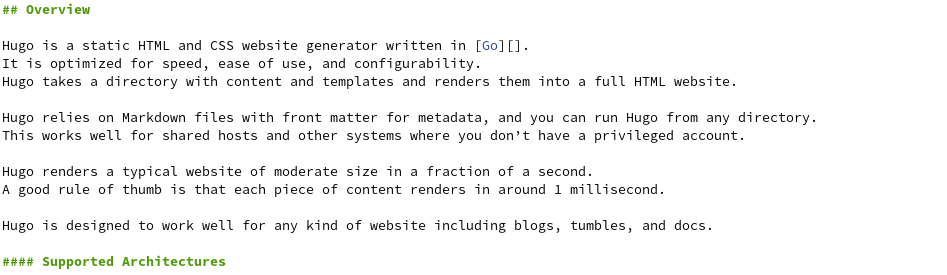
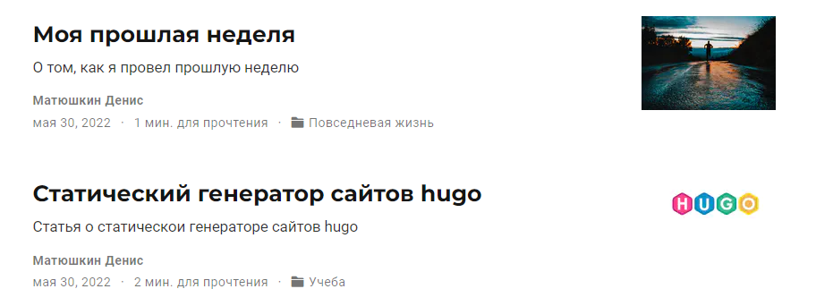
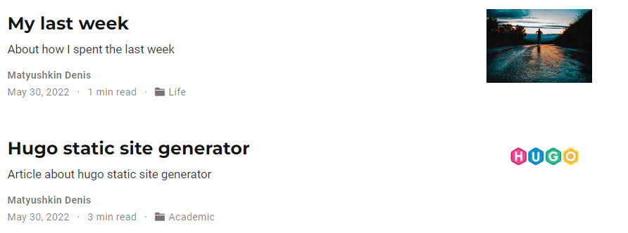

---
## Front matter
lang: ru-RU
title: Проект часть 6
author: Матюшкин Денис Владимирович (НПИбд-02-21)
institute: RUDN University, Moscow, Russian Federation
date: 30.05.2022

## Formatting
toc: false
slide_level: 2
theme: metropolis
header-includes: 
 - \metroset{progressbar=frametitle,sectionpage=progressbar,numbering=fraction}
 - '\makeatletter'
 - '\beamer@ignorenonframefalse'
 - '\makeatother'
aspectratio: 43
section-titles: true
## Pandoc-crossref LaTeX customization
figureTitle: "Рис."
---

# Цель работы

- Размещение двуязычного сайта на Github.

# Ход работы

## 1. Редактирование конфига
- Для добавления нового языка сайта необходимо перейти к каталогу сайта. После перейдем в config/_default/. Откроем файл config.yaml и разрешим добавление второго языка (defaultContentLanguageInSubdir: true), еще сделаем язык сайта по умолчанию русским, чтобы при заходе открывался русский сайт, а также изменим имя сайта, чтобы не было потом проблем при добавлении заголовка в файле *languages.yaml* (рис. [-@fig:001]).

{ #fig:001 width=70% }

## 2. Добавление заголовок для русского языка
- В том же каталоге откроем файл *languages.yaml* и добавим менюшку для русского языка, а также загаловок в виде имени автора (рис. [-@fig:002]).

{ #fig:002 width=70% }

## 3. Создание папок для языков 
- В каталоге *content* добавим 2 папки для разных языков соответственно. Так как все это время заполнял сайт на анлгийском, пришлось все посты и данные переводить на русский язык (рис. [-@fig:003]).

{ #fig:003 width=70% }

## 4. Создание поста по прешедшей неделе
- Создадим пост по прошедшей неделе на двух языках (рис. [-@fig:004] и рис. [-@fig:005]).

{ #fig:004 width=70% }

{ #fig:005 width=70% }

## 5. Создание поста на выбор
- Создадим пост на тему: "статический генератор сайтов hugo" на двух языках (рис. [-@fig:006] и рис. [-@fig:007]).

{ #fig:006 width=70% }

{ #fig:007 width=70% }

## 6. Проверка постов на сайте
- Зайдем в наш сайт и проверим изменения (рис. [-@fig:008] и рис. [-@fig:009]).

{ #fig:008 width=50% }

{ #fig:009 width=50% }

# Заключение 

В ходе этой лабораторной работы мы разместили двуязычный сайта на Github.

## {.standout}

Спасибо за внимание!

