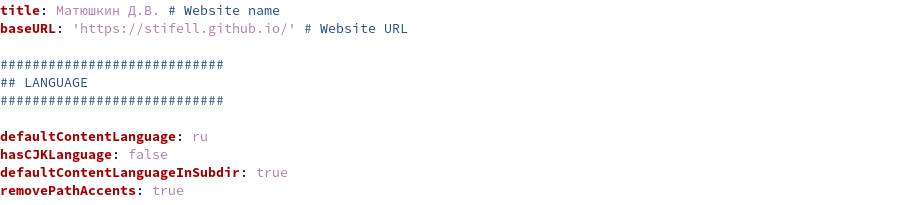
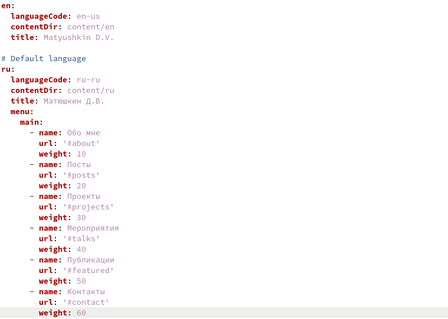
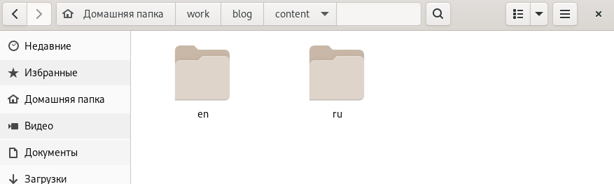
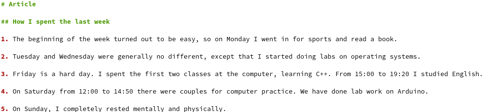
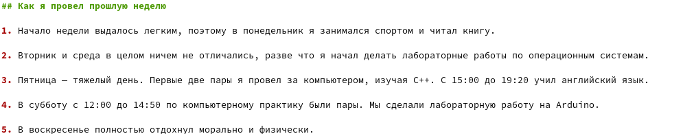
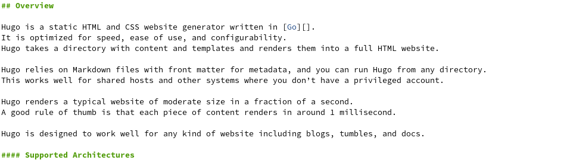
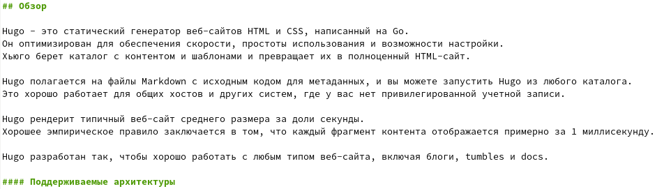
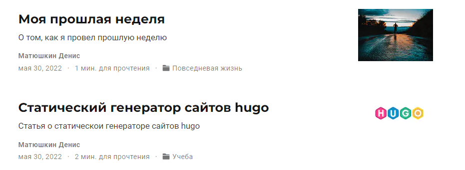
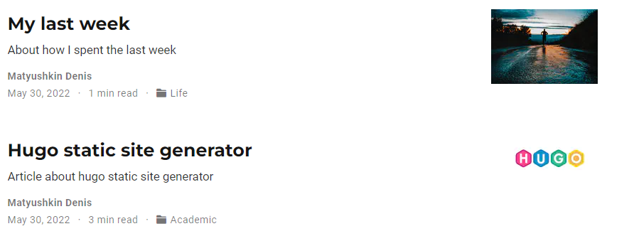

---
## Front matter
title: "Операционные системы"
subtitle: "Индивидуальный проект, часть 6"
author: "Матюшкин Денис Владимирович (НПИбд-02-21)"

## Generic otions
lang: ru-RU
toc-title: "Содержание"

## Bibliography
bibliography: bib/cite.bib
csl: pandoc/csl/gost-r-7-0-5-2008-numeric.csl

## Pdf output format
toc: true # Table of contents
toc-depth: 2
fontsize: 12pt
linestretch: 1.5
papersize: a4
documentclass: scrreprt
## I18n polyglossia
polyglossia-lang:
  name: russian
  options:
	- spelling=modern
	- babelshorthands=true
polyglossia-otherlangs:
  name: english
## I18n babel
babel-lang: russian
babel-otherlangs: english
## Fonts
mainfont: PT Serif
romanfont: PT Serif
sansfont: PT Sans
monofont: PT Mono
mainfontoptions: Ligatures=TeX
romanfontoptions: Ligatures=TeX
sansfontoptions: Ligatures=TeX,Scale=MatchLowercase
monofontoptions: Scale=MatchLowercase,Scale=0.9
## Biblatex
biblatex: true
biblio-style: "gost-numeric"
biblatexoptions:
  - parentracker=true
  - backend=biber
  - hyperref=auto
  - language=auto
  - autolang=other*
  - citestyle=gost-numeric
## Pandoc-crossref LaTeX customization
figureTitle: "Рис."
tableTitle: "Таблица"
listingTitle: "Листинг"
lofTitle: "Список иллюстраций"
lotTitle: "Список таблиц"
lolTitle: "Листинги"
## Misc options
indent: true
header-includes:
  - \usepackage{indentfirst}
  - \usepackage{float} # keep figures where there are in the text
  - \floatplacement{figure}{H} # keep figures where there are in the text
---

# Цель работы

- Размещение двуязычного сайта на Github.

# Ход работы

1. Для добавления нового языка сайта необходимо перейти к каталогу сайта. После перейдем в config/_default/. Откроем файл config.yaml и разрешим добавление второго языка (defaultContentLanguageInSubdir: true), еще сделаем язык сайта по умолчанию русским, чтобы при заходе открывался русский сайт, а также изменим имя сайта, чтобы не было потом проблем при добавлении заголовка в файле *languages.yaml* (рис. [-@fig:001]).

{ #fig:001 width=100% }

2. В том же каталоге откроем файл *languages.yaml* и добавим менюшку для русского языка, а также загаловок в виде имени автора (рис. [-@fig:002]).

{ #fig:002 width=100% }

3. В каталоге *content* добавим 2 папки для разных языков соответственно. Так как все это время заполнял сайт на анлгийском, пришлось все посты и данные переводить на русский язык (рис. [-@fig:003]).

{ #fig:003 width=100% }

4. Создадим пост по прошедшей неделе на двух языках (рис. [-@fig:004] и рис. [-@fig:005]).

{ #fig:004 width=100% }

{ #fig:005 width=100% }

5. Создадим пост на тему: "статический генератор сайтов hugo" на двух языках (рис. [-@fig:006] и рис. [-@fig:007]).

{ #fig:006 width=100% }

{ #fig:007 width=100% }

6. Зайдем в наш сайт и проверим изменения (рис. [-@fig:008] и рис. [-@fig:009]).

{ #fig:008 width=70% }

{ #fig:009 width=70% }

# Заключение 

В ходе этой лабораторной работы мы разместили двуязычный сайта на Github.

